## 1 Introduction

This is the fifth and final how-to in this series on creating an employee directory in the Web Modeler. In this how-to, you will learn how to add a microflow to the app and edit it in the Desktop Modeler.

**This how-to will teach you how to do the following:**

* Create a microflow
* Open the app in the Desktop Modeler
* Edit the microflow in the Desktop Modeler

## 2 Prerequisites

Before starting with this how-to, make sure you have completed the following prerequisite:

* Complete the fourth how-to in this series: [How to Start with a Blank App Step 4: Add Pages to the User Interface](start-with-a-blank-app-3-publish-and-view-your-app)

## 3 Adding a Promote Button to the User Interface

Business logic is the part of the app that encodes real-world business rules that determine how data can be created, stored, and changed.

Microflows allow you to express the business logic of your application. A microflow can perform actions such as creating and updating objects, showing pages, and making choices.

### 3.1 Setting Up the UI to Trigger a Microflow

In pages, microflows are triggered by action buttons. To set up an action button to trigger a microflow, follow these steps:  

1. Open the **Employee** page to edit it.
2. Open **Toolbox** > **Widgets** > **Data Containers** and drag a **Data View** to the top of the page.
3. In the **Properties** of the data view, set the **Entity** to **Employee**.
4. Search for "pageheader" in the **Toolbox** and drag the **Pageheader Controls** building block into the **DATA VIEW CONTENT** area:

    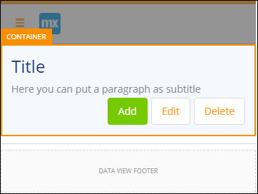

5. Select the **ROW** of the layout grid that contains this building block:

    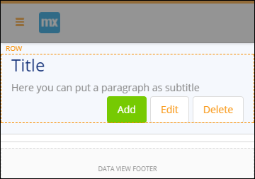

6. Change the **Row Layout** to *large left column & small right column* for all profiles:

    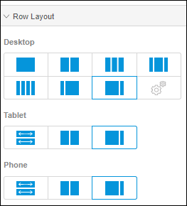

7. Highlight the **TEXT** widget with the title and change the **Content** to *Employee*.
8. Delete the following elements from the data view: 
    a. Delete the **TEXT** widget with the subtitle. 
    b. The **Add** button. 
    c. The **Delete** button.
9.  Change the following properties of the **Edit** button: 
    a. Set the **Caption** to **Promote**. 
    b. Set the **Style** to **Info**. 
    c. Set the **On Click Action** to **Microflow**. 
    d. Click **Select microflow** and create a new microflow named *Promote_Employee*.

    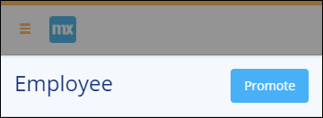

Great, you've created your first microflow. In the next section, you will continue to learn how to extend the employee entity in the domain model.

### 3.2 Extending the Domain Model for Promoting the Employee Level

In the previous steps, you created the employee entity and its attributes from different widgets. So, you must be thinking, how do I edit the entities and attributes in case I want to change something? Don't worry, you can view and edit your entities in the domain model.

To extend the structure of the **Employee** entity, follow these steps:

1. Click the **Domain Models** icon in the left menu:

    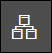

2. Select **MyFirstModule** and check how your entity looks at this point:

    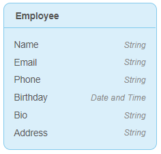

3. Select the **Employee** entity and do the following: 
    a. Click the **New attribute** button below the entity. 
    b. Set the **Name** to *Level*. 
    c. Set the **Type** to **Enumeration**. 
    d. Click **Select enumeration**. 
    e. Click **New** to create a new enumeration.  
    f. Enter *EmployeeLevel* for the **Name**. 
    g. Click **Add item** and enter *Junior* for the **Caption** and **Name**. 
    h. Repeat the step above to create the **Medior** and **Senior** items. 
    i. Click **Create** to close the dialog box and to create the new enumeration.  
    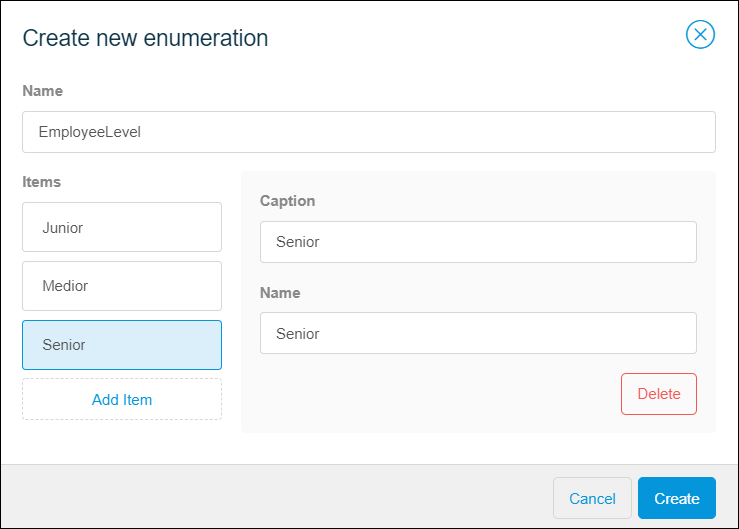
    j. In the **Create New Attribute** dialog window, click **Create** to create the new attribute.  

    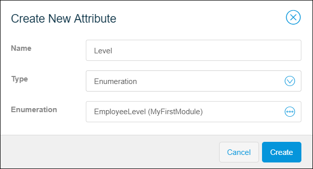

4. Select the **Level** attribute in the **Employee** entity and set the **Default Value** property to **Junior**.

All set? Continue below to learn how to edit the microflow you created earlier in the Desktop Modeler.

### 3.3 Opening and Syncing the App in the Desktop Modeler

The Desktop Modeler is used to add complex logic and build sophisticated integrations to your app.

To open your app in the Desktop Modeler, follow these steps:

1.  Make sure you have downloaded the latest Desktop Modeler [here](https://appstore.home.mendix.com/link/modelers/) and installed it. Note that this tutorial was created with Mendix Desktop Modeler 7.5.0.

2.  Go back to the **Buzz** page of the app in the Mendix Portal:

    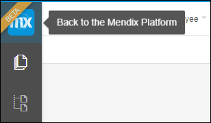

3.  Click the drop-down arrow on **Edit App** and select **Edit in Desktop Modeler** to open your app in the Desktop Modeler:

    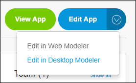

4.  Update the local version of your app by clicking **Sync with Web Modeler** in the **Changes** pane of the Desktop Modeler. If the project requires it, commit the project first using the **Commit** button.

    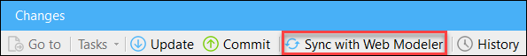

5.  After synchronizing the project, you can inspect the changes in the **Changes** pane. Click **Finish sync with Web Modeler** to complete the synchronization.

    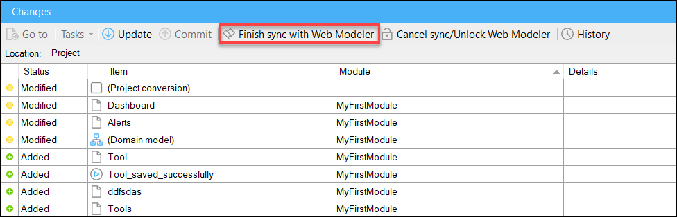

At this point, the local version of your app is in sync with the version in the Web Modeler. Continue with the next step to edit a microflow in the Desktop Modeler.

### 3.4 Implementing the Logic to Promote an Employee

Microflows consist of microflow actions. To implement the promote requirement, you need to determine the level of the employee and promote them accordingly.

To edit a microflow so that it promotes employees, follow these steps:

1.  Open the **Promote_Employee** microflow from the **Project Explorer**.
2.  Right-click the microflow arrow, select **Insert** > **Exclusive Split**, and do the following: 
    a. Double-click the exclusive split to open its properties. 
    b. Set the caption to **Level**. 
    c. Click **Expression wizard** to open the wizard. 
    d. For the **Variable**, select **Employee**, and for the **Attribute**, select **Level**. 
    e. Click **OK** to close the dialog boxes. 

    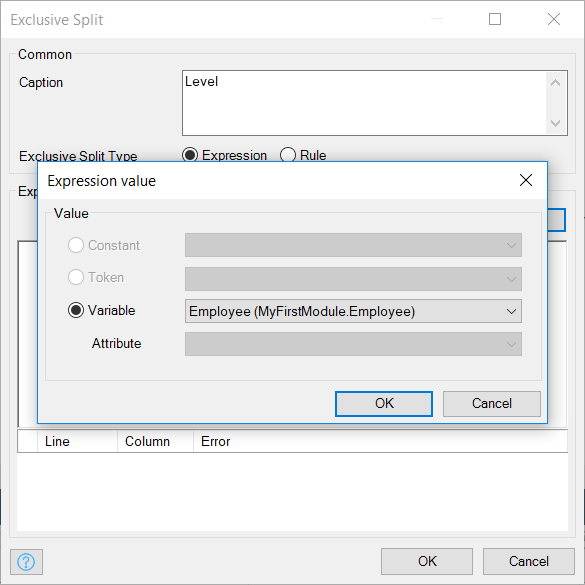

3. Right-click the arrow that is now red, and select **Condition value** > **Senior**. 
4. Hover over the exclusive split with your mouse pointer, drag an arrow down from one of the white circles on the exclusive split, and select **End event**.
5. Repeat the step above two more times so that you have three new (red) arrows.
6. Set the remaining condition values on these arrows to **Junior**, **Medior**, and **(empty)**:

    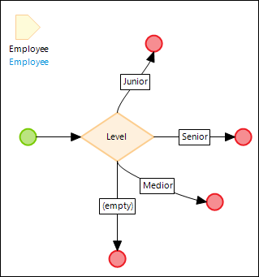

7.  Insert an **Activity** of the **Change object** type to the arrow with the **Junior** conditon and do the following: 
    b. Set the **Variable** to **Employee**. 
    c. Set **Commit** to **Yes**. 
    d. Set **Refresh in client** to **Yes**. 
    e. Click **New** and set **Level** for the **Member**. 
    f. Click the **Generate** button and set the **Constant** to **Medior**. 
    g. Click **OK** to close the dialog boxes.

    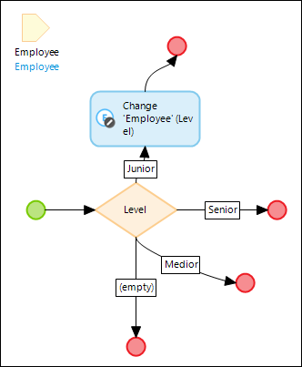

8. Insert an **Activity** of the **Show message** type above the change object activity and do the following: 
    a. Enter *{1} is promoted to Medior!* for the **Template**. 
    b. Click **New** to add a parameter and set it to `$Employee/Name`. 

    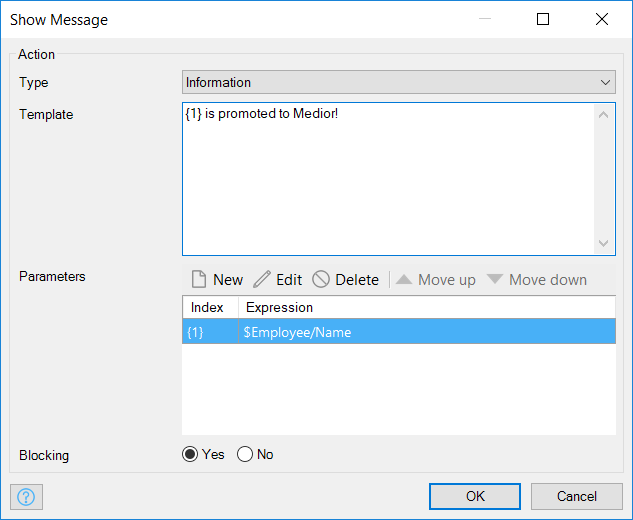

9.  Using the scenario above, complete the microflow with the following requirements:
    * Employees with the **Medior** level can be promoted to the **Senior** level
    * Employees with the **Senior** level should only receive a message that **Senior** is the highest level

    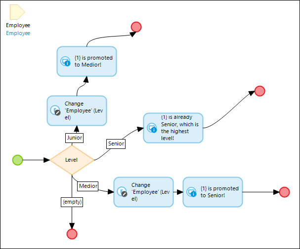

10. Commit your changes via the **Commit** button in the **Changes** pane.
11. Sync your changes back to the Web Modeler via the **Sync with Web Modeler** and **Finish sync with Web Modeler** buttons.

Fantastic, you've created your first business logic! Can't wait to find out if this is working as expected? Return to the Web Modeler to extend the UI and view your app.

### 3.5 Adding the Employee Level to the UI

The microflow should function correctly at this point, so let's add the employee level to the UI.

To add a drop-down menu to the **Employee** page to verify the employee level change, follow these steps:

1. Open the **Employee** page in the Web Modeler.
2. Select **Toolbox** > **Widgets** > **Input Elements** > **Drop Down** and drag it between the **Name** and **Phone** input boxes.
3. Click **Select an attribute** for the new drop-down menu and select **Level**.

Yes! Now you're ready to view the app.

## 4 Viewing Your App

Update and view your app, just like you did in [How to Start with a Blank App Step 3: Publish and View Your App](start-with-a-blank-app-3-publish-and-view-your-app).

You can now promote your employees!

This is the end of the tutorial. Please tell us how you liked it as well as any suggestions for improval by sharing feedback in the [How to Start with a Blank App Survey](https://www.surveymonkey.com/r/XY258CP).

You are also perfectly lined up to continue with [another Mendix tutorial](index) or the [Become a Rapid Developer Learning Path](https://learn.mendix.com/), so check those out!

## 5 Related Content

* [How to Start with a Blank App Step 1: Create the App](start-with-a-blank-app-1-create-the-app)
* [How to Start with a Blank App Step 2: Build a Dashboard Page](start-with-a-blank-app-2-build-a-dashboard-page)
* [How to Start with a Blank App Step 3: Publish and View Your App](start-with-a-blank-app-3-publish-and-view-your-app)
* [How to Start with a Blank App Step 4: Add Pages to the User Interface](start-with-a-blank-app-4-add-pages-to-the-user-interface)
