## 1 Introduction

This is the second how-to in this series on how to create an employee directory app in the Web Modeler. In this how-to, you will learn how to build pages to manage the employees in your app.

**This how-to will teach you how to do the following:**

* Change the page layout for multiple devices 
* Use building blocks
* Use the theme customizer
* Create a domain model

{}

## 2 Prerequisites

Before starting with this how-to, make sure you have completed the following prerequisite:

* Complete the first how-to in this series: [Start Your First App Step 1: Create the App](start-your-first-app-1-create-the-app)

## 3 Building Up a Dashboard Page

Pages define the user interface of your Mendix app. Each page consists of widgets such as buttons, list views, data grids and input elements. For example, the default home page comes with a header and a layout grid.

### 3.1 Changing the Page Layout

You can change the layout of the page by editing the layout grid. To change the layout grid to influence the look and feel for different devices, follow these steps:

1. Select the **COLUMN**:

    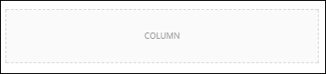

2. Change the **Row Layout** to a four-column layout:

    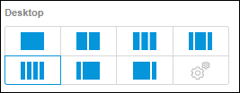

3. See how this influences the behavior on a phone, tablet, and desktop devices by changing the device icons on top of view of your page:
    
    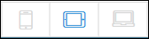 

4. For the phone device, the columns now have a full widget. Change the **Phone** **Row Layout** to the 2x2 layout and view how this changes the layout for the different devices:
    
    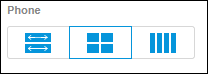

### 3.2 Using Building Blocks

A building block in Atlas UI is a combination of widgets. Using building blocks greatly speeds up your app development.

To fill up the column placeholders to create a dashboard menu, follow these steps:

1. Open the **Toolbox** tab and make sure **Building Blocks** is selected:
    
    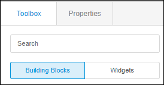 

2. Scroll down and open the **Cards** section to find the **Card Action** building block:

    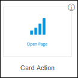

3. Drag a **Card Action** building block into every column.
4. Now that you've gotten the hang of it using building blocks, you will replace the current header with **HeroHeader1**. Locate this in the **Header** building blocks section:
    
    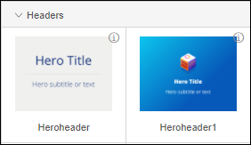

5. Drag the **HeroHeader1** building block and drop it just below the top header:
    
    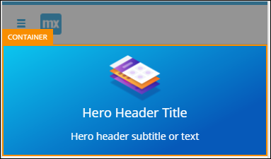

6. Select the **Hero Header Title** text widget and change the text in the **Content** field to *My First App* in the Properties.
7. Select the **subtitle** text widget and rename the content to *An Employee Directory App*.
8. Select the **LAYOUT GRID** of the default header and click **Delete** in the bottom-right of the page to remove it:

    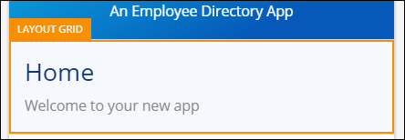
    
10. Also delete the remaining **container**.

### 3.3 Changing the Look and Feel with the Theme Customizer

On the **Theme Customizer** page, you can quickly update the look and feel of your application. You can even upload your own logo so that a color palette is generated for your app.

To make a small change to the look and feel of your app, follow these steps:

1. Open the **Theme Customizer** by clicking the paintbrush icon at the bottom of the left menu bar.

    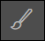

2. You can play around with the different configuration options, like **Brand Colors**, **UI Customization**, and **Typography**.
3. Make a change that will have significant impact by setting the **Primary** color in the **Brand Colors** section to orange.
4. At the bottom-right of the screen, click **Apply Style** to confirm the changes:

    

    This will take you back to the main window of the Web Modeler, where you can see your new styling:
 
    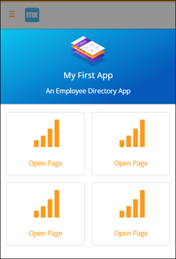
 
    Clicking **Reset Style** in **Theme Customizer** will undo the changes.
     
Well done! Continue with [How to Start Your First App Step 3: Publish and View Your App](start-your-first-app-3-publish-and-view-your-app).

## 4 Related Content

* [How to Start Your First App Step 1: Create the App](start-your-first-app-1-create-the-app)
* [How to Start Your First App Step 3: Publish and View Your App](start-your-first-app-3-publish-and-view-your-app)
* [How to Start Your First App Step 4: Add Pages to the User Interface](start-your-first-app-4-add-pages-to-the-user-interface)
* [How to Start Your First App Step 5: Add Employee Promotion Logic](start-your-first-app-5-add-employee-promotion-logic)
