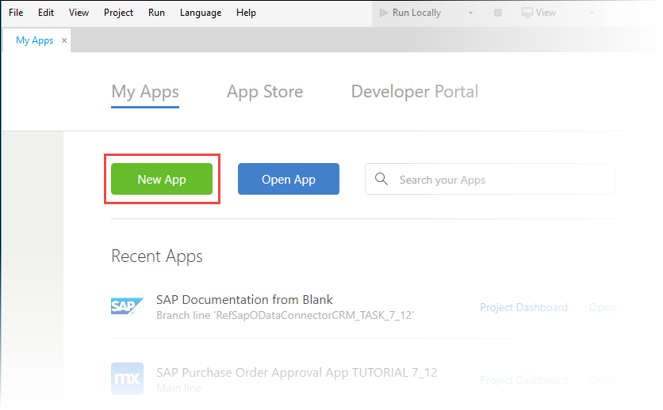
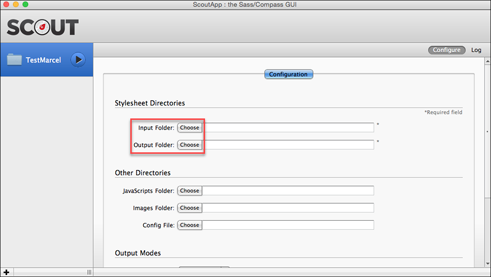
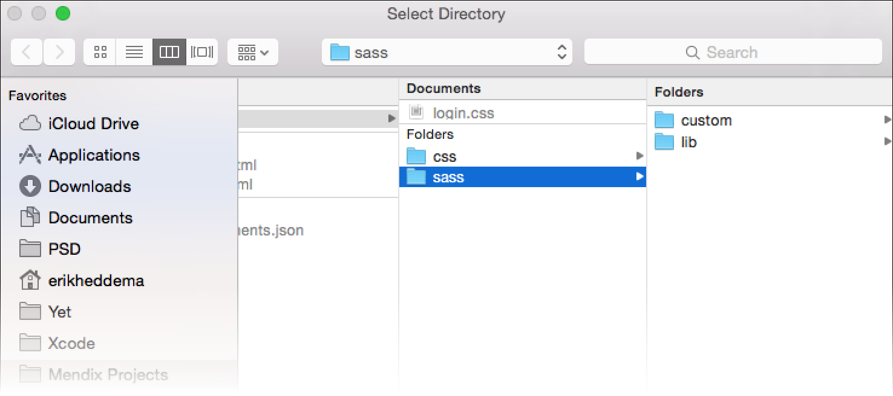
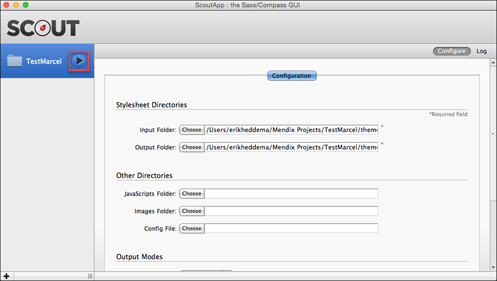
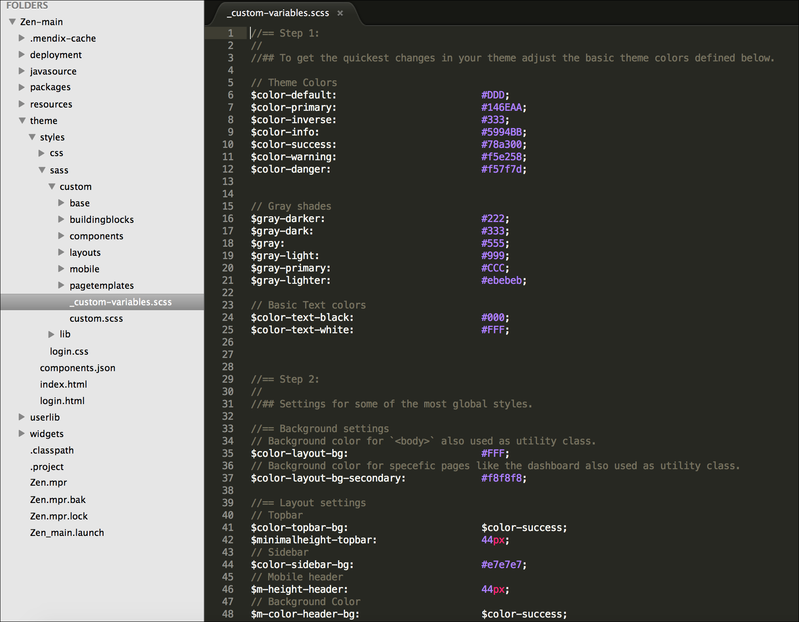
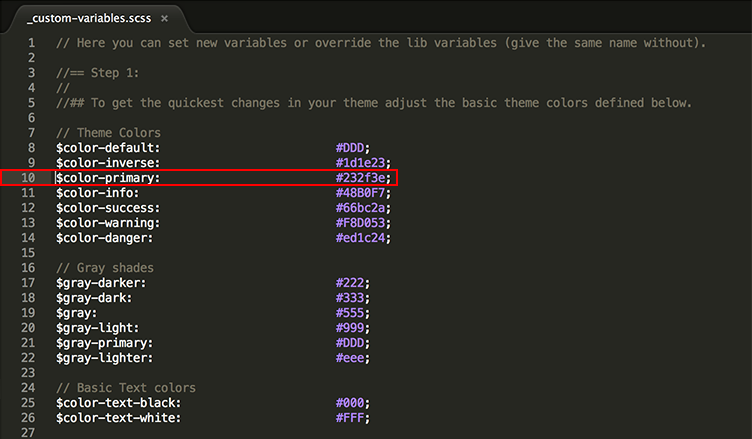

## 1 Introduction

This how-to presents creating a custom theme with the Mendix UI Framework. The Amazon website will be used as an example.

**This how-to will teach you how to do the following:**

* Create a new app
* Set up [Scout](https://github.com/scout-app/scout-app) and the [Mendix UI Framework](https://ux.mendix.com/)
* Change the custom variables
* Create a custom theme based on [Amazon](https://www.amazon.com/)

## 2 Prerequisites

Before starting with this how-to, make sure you have completed the following prerequisites:

* Download the latest [Mendix Business Modeler](https://appstore.mendix.com/) (5.18.0 or later)
* Download [Scout](http://mhs.github.io/scout-app/) (or use a different compiler, such as [Sass](http://sass-lang.com/install))
* Download your preferred text editor (such as [Sublime Text](http://www.sublimetext.com/))

## 3 Creating a New App in the Mendix Business Modeler

To create a new app and select a theme from the **New App** selector, follow these steps:

1. Open the Mendix Modeler.
2. On the **My Apps** screen, click **New App**:
    
3. Select the Mendix theme for your app:
    
4.  You can now deploy your app (press the F5 key):
     

## 4 Configuring Scout

**To configure Scout, Windows 10 users need to use the workaround described in [How to Perform the Scout and Windows 10 Workaround](scout-and-windows-10-workaround).**

To be able to make changes to the theme, Mendix suggests using [Sass](http://sass-lang.com/) instead of traditional CSS. The Mendix UI Framework uses Sass, which relies on Ruby. However, you can install Scout to run Sass in a self-contained Ruby environment, letting you effortlessly manage all of your Sass projects with a handful of clicks. This way you don't have to worry about using the terminal (although you can still do this if you are familiar with Sass and the terminal).

To configure Scout, follow these steps:

1. Open your app's project folder in Scout by clicking the plus ("+") button in the bottom-left corner of the screen:
    
2. Select the project directory from your newly created app:
    
3. Choose the **Input Folder** and **Output Folder** by clicking **Choose**:
    
4. Select the **styles/sass** folder for your **Input** folder. The input path should be: *C:\Mendix Projects\Mendix-App\theme\styles\sass*:
     
5. Select the **styles/css** folder for your **Output** folder. The input path should be: *C:\Mendix Projects\Mendix-App\theme\styles\css*:
     
6. After selecting the input and output folders, press the play button in the left sidebar next to your project folder name. Scout is now set to compile the changes, so we can create a custom theme.
     

## 5 Configuring Your Text Editor

1. Open the project directory from your app in your desired text editor:
    
2. The **theme** folder is where you can find the theme that was selected when creating a new app. The  **theme\styles\custom** folder will be used to make our changes.
3. Open the **_custom-variables.scss** file, which contains the default variables we can use to easily change the basic colors of the app (think of variables as a way to store information that you want to reuse throughout your stylesheet):
    * **Step 1** contains the default colors such as primary, success, and danger, which are used for buttons, labels, links, text, and other elements
    * **Step 2** contains the colors and heights for your navigation bar, sidebar, and layout
    * **Step 3** contains the default layout spacing
    
    Below these three steps, there are topics such as **Typography**, **Forms**, **Buttons**, **Grids**, **Tabs**, **Mobile**, and other sections.
      

## 6 Creating a Custom Theme

In this section, you are going to create a custom theme based on the [Amazon](https://www.amazon.com/) website.

### 6.1 Changing the the Color-Primary to Modify the Topbar and Buttons

To change the topbar background-color and primary buttons, adjust the following line in the *_custom-variables.scss* file that can be found in *theme\styles\custom*: `$color-primary: #4280cb;` (line 10). Why do we want to change this color, and how do we know this color is used for the topbar, primary buttons, and other CSS elements? For example, when you search for `color-primary` in the *_custom-variables.scss* file, you will find these two lines:

* `$color-topbar-bg: $color-primary;` (line 42)
* `$color-btn-bg-primary: $color-primary;` (line 231)

If you look in your *_custom-variables.scss* file, you will notice that other CSS elements use the `$color-primary` variable. All of these elements will also be changed, because when you change one variable, you are able to modify other elements in your theme, which saves a lot of time in maintaining your theme.

In our app, `color-primary` has the color blue, while the Amazon primary color is dark blue. You can now adjust `$color-primary` on line 10 to the Amazon color, which is `#232f3e`.

 

When you save your file after changing `color-primary`, you will see a change in Scout similar to this example:

 

Scout detected a change to the *_custom-variables.scss* file and compiled the CSS files. If you don't want to use Sass, you can use these CSS files.

Re-deploy your app, which will now look like this:

As you see, the background color for the topbar and primary buttons has been changed.

### 6.2 Changing the Secondary Background Color

Your custom app has a gray background, but the Amazon website has a white background. We can easily change this by editing a line in the *_custom-variables.scss* file.

This is the background color for specific pages such as the dashboard (also used as a utility class): `$color-layout-bg-secondary: #EFF4F7;` (line 38). The `$color-layout-bg-secondary` variable is used for several page templates. For example, in the *theme\styles\sass\pagetemplates\responsive\_page-dashboard.scss*  file, `$color-layout-bg-secondary` is used as the default background color for all of the dashboard templates. With this variable, you can easily change all of your background colors to white.

You can now adjust `$color-layout-bg-secondary` (line 38) to the `#FFF` background color:

  

### 6.3 Changing the Sidebar and Navigation Colors

You can adjust your sidebar and navigation in a similar way. Your app is now very dark, so it would be wise to change the sidebar background color. You can use the gray background color that Amazon uses on their homepage.

This is the sidebar: `$color-sidebar-bg: $color-inverse;` (line 45). Change this to `$color-sidebar-bg: #f9f9f9;`:

Now, when you search for `$color-sidebar-bg`, the navigation part will show in the *_custom-variables.scss* file. Because the navigation gets the same variable as the background color (`$color-sidebar-bg`), you won't have to change the background color here.

Re-deploy your app, which will now look like this:

You now have a different background color, but the navigation text is impossible to read because it is also white. You are going to make the text color, text hover color, text active color, and sub-text item color darker by using the `$color-inverse` variable. The color inverse is usually the darkest variable in a theme(but you could also choose a different hover color).

These are the text colors:

* `$color-navsidebar-text:  $color-text-white-secondary;` (line 396)
* `$color-navsidebar-text-hover:  $color-text-white;` (line 397)
* `$color-navsidebar-text-active:  $color-text-white;` (line 398)

Change the above variables as well as the `sub-text` variables to `$color-inverse`:

Re-deploy your app, which will now look like this:

This should give you a better understanding of how variables work and of the theme structure. In the next section, we will change the logo in the Modeler and make a small theming adjustment.

### 6.4 Changing the Logo in the Modeler

Use this logo to replace "Company Name" in the topbar:

In the Modeler, go to the **Sidebar_Full_Responsive** layout and replace the image. Leave the caption blank because the caption "amazon" is in the new image.

Re-deploy your app to see the shiny new logo:

## 7 Related Content

* [How to Configure Scout with the Windows 10 Workaround](scout-and-windows-10-workaround)
* [How to Layouts and Snippets](layouts-and-snippets)
* [How to Filter Data on an Overview Page](filtering-data-on-an-overview-page)
* [How to Set Up Mendix UI Framework with Just CSS](setup-mendix-ui-framework-with-just-css)
* [How to Set Up the Navigation Structure](setting-up-the-navigation-structure)
* [How to Set Up the Mendix UI Framework](setup-mendix-ui-framework)
* [How to Set Up the Mendix UI Framework with Koala](setup-mendix-ui-framework-with-koala)
* [How to Create Your First Two Overview and Detail Pages](create-your-first-two-overview-and-detail-pages)
* [How to Find the Root Cause of Runtime Errors](../monitoring-troubleshooting/finding-the-root-cause-of-runtime-errors)
