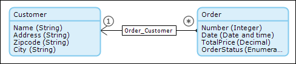
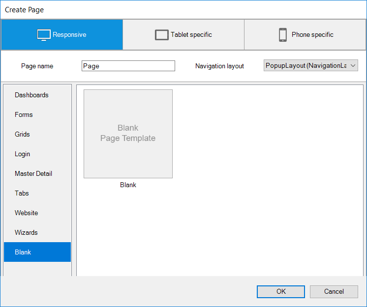
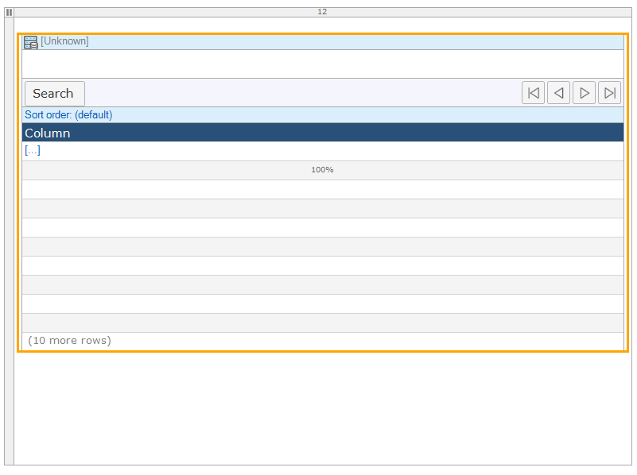
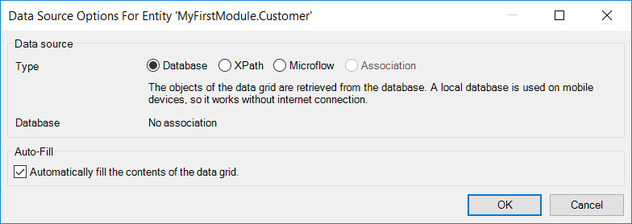
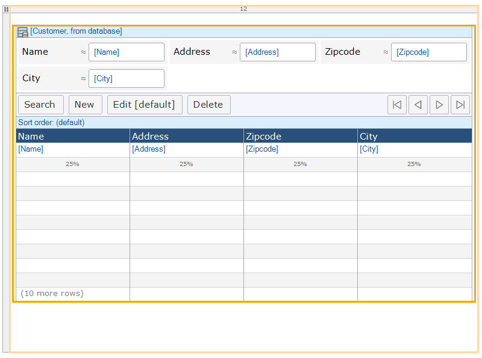
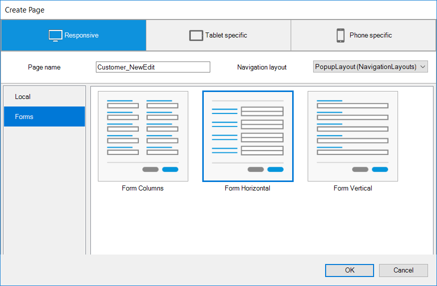
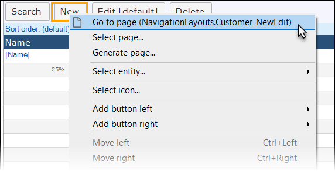

## 1 Introduction

This how-to explains how you can create overview and detail pages in Mendix. 

**This how-to will teach you how to do the following:**

* Create overview and detail pages
* Configure navigation and security

## 2 Prerequisites

Before starting with this how-to, make sure you have completed the following prerequisite:

*  Set up a basic data structure by reading [How to Create a Basic Data Layer](../data-models/create-a-basic-data-layer):
    
    

## 3 Creating an Overview Page

To create a new overview page and add it to your project, follow these steps:

1.  Right-click the module and select **Add** > **Page**.
2. Click **Responsive**.
3. Enter *CustomerOverview* in **Page name**.
4. Select _Sidebar_Full_Responsive_ as the navigation layout.
5.  Click **Blank**, then select the **Blank** page template** and click **OK**:

    

6.  Click **Data Grid** in the menu bar of the page builder to select the data grid widget:

    

7.  Click inside the page editor to create the data grid widget:

    

8.  Right-click the data grid and select **Select Entity**.
9.  Select the **Customer** entity in the **Select Data Source** pop-up window and click **Select**:

    

10. Click **OK** to auto-fill the data grid with search fields and columns:

    

You should now have an overview page with a data grid like this:

## 3 Creating a Detail Page

1.  Right-click **New** on the data grid on the overview page and select **Generate page**.
2.  Select **PopupLayout** as the **Navigation layout**.
3.  Select **Form horizontal** and then click **OK**:

     

4.  Right-click **New** on the data grid on the overview page again and select **Go to page**:

    

    You should now have a detail page like this:

    

## 4 Navigation and Security

1. Now create a navigation item for your overview page to start using it. For details on how to set up the navigation structure, see [How to Set Up the Navigation Structure](setting-up-the-navigation-structure).
2. If you switched on security for this application, you need to configure page access on both the overview and detail pages. For more information on configuring page access, see [How to Create a Secure App](../security/create-a-secure-app).

## 5 Related content

* [How to Configure Scout and the Windows 10 Workaround](scout-and-windows-10-workaround)
* [How to Use Layouts and Snippets](layouts-and-snippets)
* [How to Filter Data on an Overview Page](filtering-data-on-an-overview-page)
* [How to Set Up the Mendix UI Framework with Just CSS](setup-mendix-ui-framework-with-just-css)
* [How to Set Up the Navigation Structure](setting-up-the-navigation-structure)
* [How to Set Up the Mendix UI Framework](setup-mendix-ui-framework)
* [How to Set Up the Mendix UI Framework with Koala](setup-mendix-ui-framework-with-koala)
* [How to Find the Root Cause of Runtime Errors](../monitoring-troubleshooting/finding-the-root-cause-of-runtime-errors)
* [Page](/refguide7/page)
