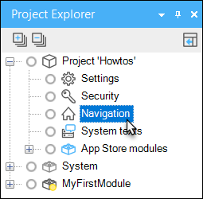
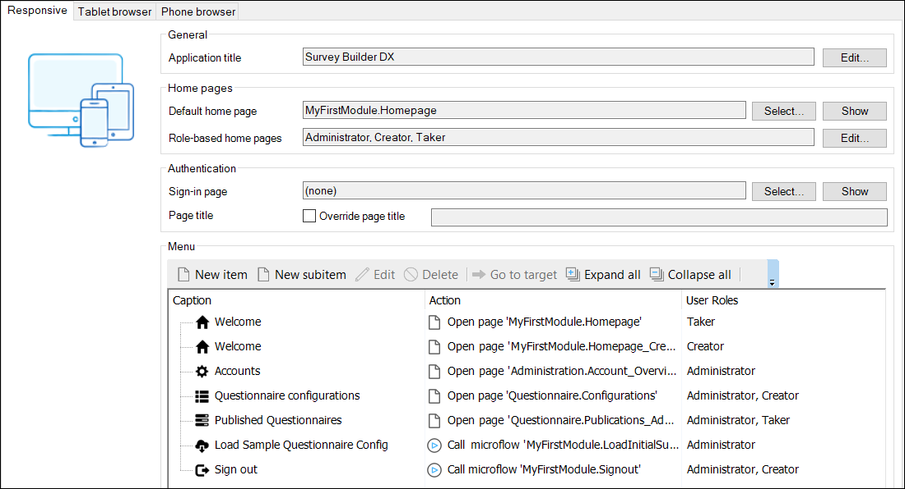
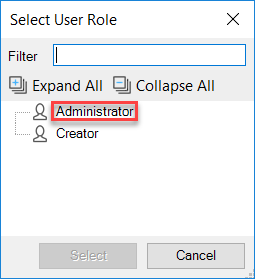
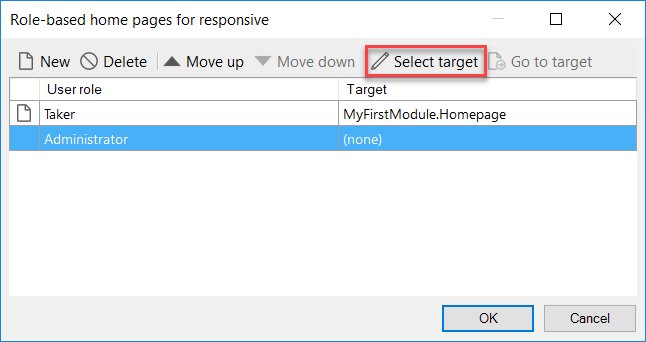
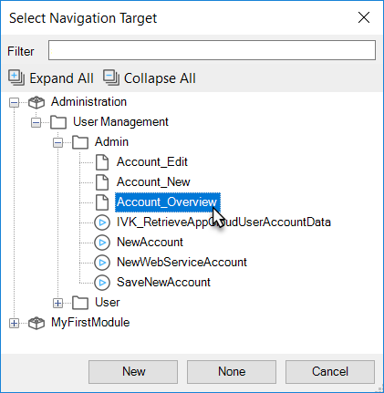
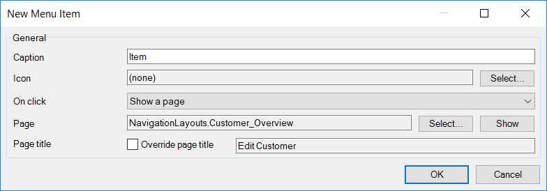
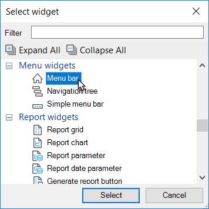
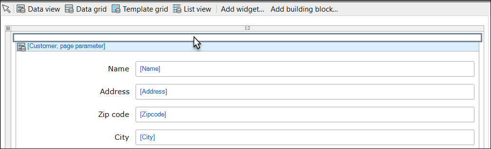

Once you've created some pages you want to give users the ability to access them. The easiest way to do this is by using a navigation menu. The navigation editor of the Desktop Modeler allows you define navigation menus for desktop, tablet and phone interfaces. It also allows you to define which page is shown as a default home page depending on the user role.

## 1\. Preparation

Before starting this how-to make sure you have completed the following prerequisites:

*   [Creating a basic data layer](../data-models/create-a-basic-data-layer)
*   [Creating your first two Overview and Detail pages](create-your-first-two-overview-and-detail-pages)

## 2\. Setting a Default Home Page

This section will explain how to set the default home page. Please note that this setting is overridden by the role based home page if you decide to configure that.

1.  Open the **Navigation** editor.
    
    
2.  Select either **Desktop**, **Tablet**, or **Phone** navigation, depending on the device interface you're working on.
3.  Click **Select...** to select a default home page.
     
4.  Select the page you want to use as default home page. In this case, we use _Homepage._
    
5.  Click **Select**.

    {}

    You can also select a microflow as default home page. Make sure that the microflow contains a 'Show Form' activity, otherwise the user won't see anything.

    {}

    Now every time a user signs in to the application, the selected page/microflow is shown/triggered.

## 3\. Setting a Role Based Home Page

In many cases you want users with different roles to see different home pages. This can be easily achieved with Mendix by use of Role-based home pages. You don't need to configure home pages for every role, because the default home page works as a fall-back mechanism. This section will explain how to set role based home pages.

1.  Open the **Navigation** editor.
2.  Select either **Desktop**, **Tablet**, or **Phone** navigation, depending on the device interface you're working on.
3.  Locate the **Role-based home pages** setting and click **Edit...**
    
4.  In the overview click **New**.
     
5.  Select a user role to create a new setting. In this case, we select **Administrator**.
    
6.  Click **Select**.
7.  Select the role-based home page and click on **Select target**.
    
8.  Select the page _Account_Overview _and click **Select**.
    

    Now every time a user with the **Administrator** user role signs in to the application, the corresponding page 'Account_Overview' is shown. Users with different roles will be redirected to the default home page.

## 4\. Creating menu items

This section will explain how to create menu items.

1.  Open the **Navigation** editor.
2.  Select either **Desktop**, **Tablet,** or **Phone** navigation, depending on the device interface you're working on.
3.  Locate the Menu section.
4.  Click **New Item** to create a top level menu item.
    

    {}

    You can also select an existing menu item and click New subitem to create a sub menu item.

    {}
5.  Enter a **caption**. In this case, we enter _Customer Overview_.

6.  Select a page or microflow as target. In this case, we select the page _CustomerOverview.
     _
7.  Save the menu item by clicking **OK**.

    In the overview of menu items you can see the caption of the menu item, the target form or microflow and which user role is needed to be able to see the menu item. The user roles are derived from the page and microflow access settings in the security model. You can restructure the menu by dragging and dropping menu items.

## 5\. Adding navigation menu to pages

Now that you've created a menu structure it's time to start using it on pages.

1.  Open a page in the **Page Editor**.
2.  Click once on one of the widgets in the **Menu** toolbar menu.
    
3.  Click once in an empty place holder on the page to insert the widget.
4.  Double click the widget to open its properties.
    
5.  Select **Project navigation** as menu source. This is the navigation structure defined in the navigation editor. You can also add additional menu structures by use of menu documents and use them instead.
6.  Select **Desktop**, **Tablet**, or **Phone** as menu, depending on the device interface you're working on.
7.  Click **OK** to save the properties. The menu widget is now showing the navigation items created in the navigation editor.

    To prevent repeating the previous steps for every page in your project, the Desktop Modeler supports something called layouts. With layouts you can define a base structure for pages in your project. In a layout you can define where the menu should be rendered and you can simply reuse that layout for the desired pages.

## 6\. Related content

*   [Scout and Windows 10 Workaround](scout-and-windows-10-workaround)
*   [Layouts and Snippets](layouts-and-snippets)
*   [Filtering Data on an Overview Page](filtering-data-on-an-overview-page)
*   [Setup Mendix UI Framework with just CSS](setup-mendix-ui-framework-with-just-css)

*   [Setup Mendix UI Framework](setup-mendix-ui-framework)
*   [Setting Up the Navigation Structure](setting-up-the-navigation-structure)
*   [Setup Mendix UI Framework with Koala](setup-mendix-ui-framework-with-koala)
*   [Creating your first two Overview and Detail pages](create-your-first-two-overview-and-detail-pages)
*   [Finding the Root Cause of Runtime Errors](../monitoring-troubleshooting/finding-the-root-cause-of-runtime-errors)
