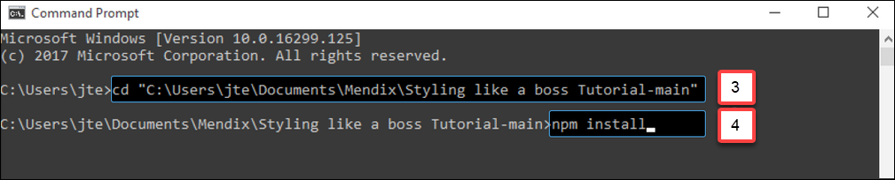
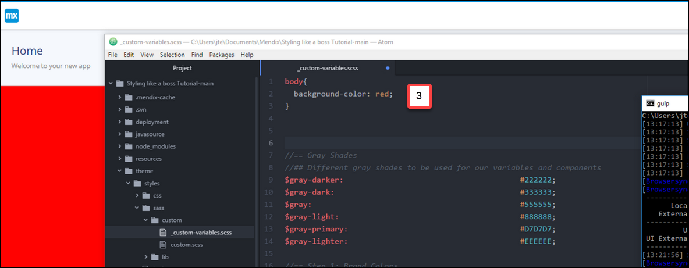
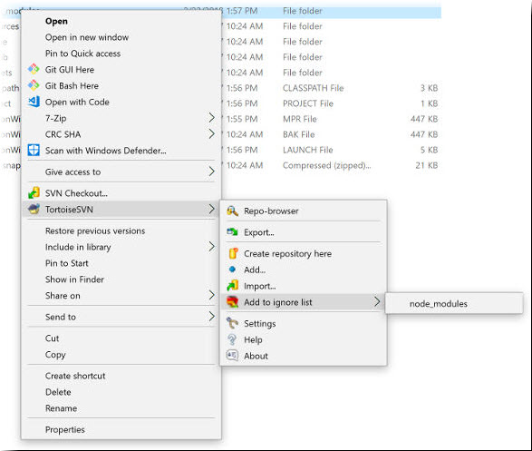

## 1 Introduction

You can use [Gulp](https://gulpjs.com/) to watch the files for any changes you make when styling with Sass. Gulp triggers auto-refresh by default so that your changes are immediately visible in the browser.

**This how-to will teach you how to do the following:**

* Install Gulp
* Set up the Gulp project
* Run Gulp
* Troubleshoot

## 2 Prerequisites

Before starting this how-to, make sure you have completed the following prerequisites:

* Install [nodeJS](https://nodejs.org/en/) – mmake sure you install the LTS version (**8.x.x**)
* Install Gulp by typing `npm install gulp-cli -g` in your terminal

## 3 Setting Up the Gulp Project

To set up the Gulp project, follow these steps:

1. Download *gulp.zip* from [mendix/ux-theming](https://github.com/mendix/ux-theming/releases).
2. Unzip the folder into your project's root folder.
3. In your terminal, go to your project root folder by typing `cd`, then drag your root file into the terminal. Please note that if you do this on Windows and you encounter errors with installing the dependencies, open your CMD or PowerShell as Administrator.
4. Install the dependencies by typing `npm install`.

## 4 Running Gulp

To run Gulp, follow these steps:

1. You should still be in your root if you just finished the installation, so type `gulp dev` in your root.
2. Make sure your Mendix project is running.
3. For a quick test to see if everything is working, open *theme/styles/sass/custom/_custom-variables.scss* and type `body{ background-color: red; }`. Your background will then be a beautiful red.

{}

If you are using Parallels on Mac, you can access your Mendix project on your Mac browser by going to your Parallels machine (for example, `http://10.211.55.3:30001` – this is different on each setup).

{}

And that's it! Now you are ready to start styling your Mendix app with Sass.

## 5 Development and Production

When running `gulp dev`, Sass will compile the CSS files unminified and with source-mapping. This helps in debugging the styling, as a modern browser will point to the *.scss* file where a rule is specified.

When using this in production, you should run `gulp build` before committing and deploying. This will disable source-mapping and will minify the CSS files to minimize the file size.

## 6 Developer Portal App Projects

When you use this setup in a collaborative app project, please note that you will need to add the **node_modules** folder to the **SVN ignore**. This folder is generated by running `npm install` (as described in section [3 Installing Gulp](#34)) and contains too many files. It is important not to forget this step!

If you have [TortoiseSVN](/refguide/version-control-scenarios#tortoisesvn-and-subclipse) installed, right-click the **node_modules** folder and select **TortoiseSVN** > **Add to ignore list**.

## 7 Troubleshooting

If you encounter issues using this setup, please read the [Troubleshooting](https://github.com/mendix/ux-theming#troubleshooting) section in the GitHub repo documentation. If this does not resolve your issue, please [create a new GitHub issue](https://github.com/mendix/ux-theming/issues/).

## 8 Related Content

* [mendix / ux-theming](https://github.com/mendix/ux-theming)
* [How to Create a Custom Theme with the Mendix UI Framework](create-a-custom-theme-with-the-mendix-ui-framework)
* [How to Extend Design Properties to Customize Your Web Modeler Experience](../atlasui/extend-design-properties-to-customize-the-web-modeler-experience)
