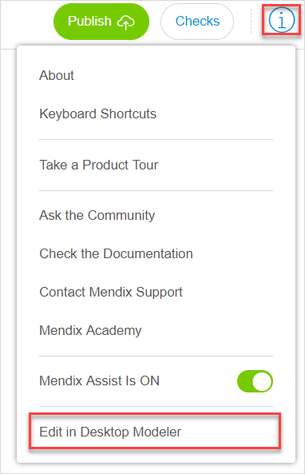
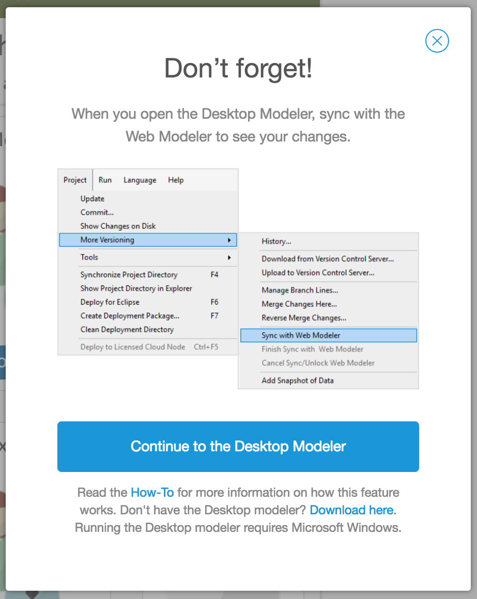
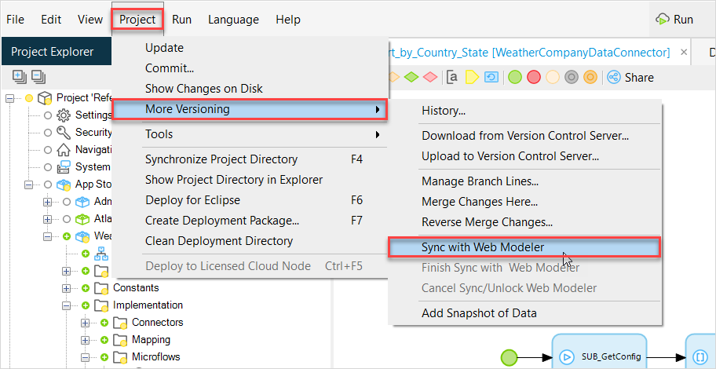
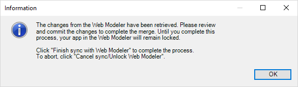
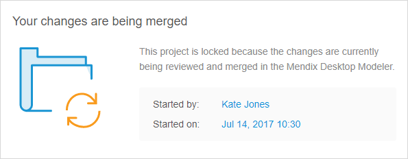
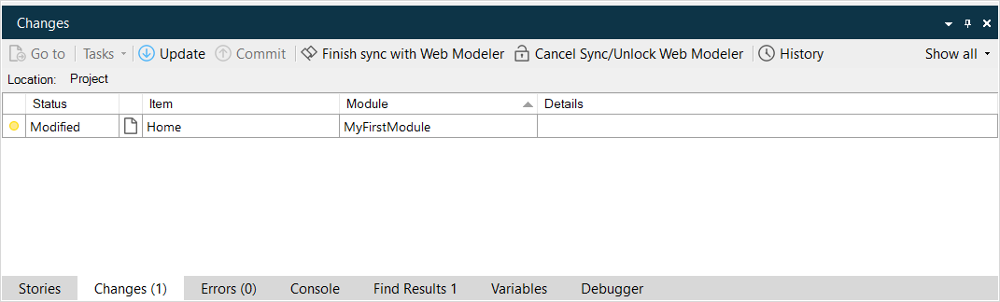
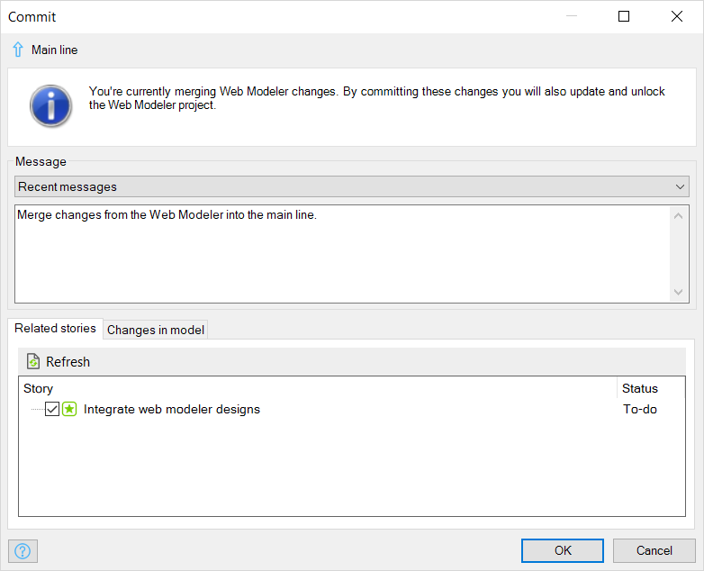

## 1 Introduction

If you have created your app in the Web Modeler, you can extend the functionalities of the app by modeling them in the Desktop Modeler.

To do that, you must sync the app from the Web Modeler with the Desktop Modeler. This document will explain the following:

* Downloading the app from the Web Modeler into the Desktop Modeler
* Syncing the Desktop Modeler with the Web Modeler
* Committing changes from the Desktop Modeler to the Web Modeler
* Locking/unlock the Web Modeler while the Desktop Modeler is working on the app

## 2 Prerequisites

To sync the Web Modeler with the Desktop Modeler, you must be using [Mendix Desktop Modeler 7.5](https://appstore.home.mendix.com) or higher.

## 3 Syncing the Web Modeler with the Desktop Modeler

To sync the Web Modeler with the Desktop Modeler, follow these steps:

1. Open the information menu in the Web Modeler and click **Edit in Desktop Modeler**:

    

2. In the pop-up window, click **Continue to the Desktop Modeler** to launch the Desktop Modeler. Optionally, click the **Download here** link to download and install the latest Desktop Modeler and retry afterwards.

    

3. When the Desktop Modeler has started, in the top menu, click **Project**, select **More Versioning**, and then click **Sync with Web Modeler**.  Note that if you have uncommited changes in the Desktop Modeler, click **Commit** before syncing with the Web Modeler.

    

4. The latest updates from the Web Modeler will now be retrieved and merged into your model. When there are no Web Modeler changes received, all changes from the Desktop Modeler will be synced to the Web Modeler. The sync process is then finished and both Modelers are ready to continue modeling.

When the progress is finished and there are changes received from the Web Modeler, you will receive an information pop-up message that the Web Modeler has been locked for the time that you are reviewing the changes.

If a user is working in the Web Modeler while another user is reviewing the changes in the Desktop Modeler, the user working in the Web Modeler will get a pop-up message saying that the Web Modeler has been locked for the time that the changes are being reviewed in the Desktop Modeler.

You can now review the changes and any merge conflicts in the **Changes** pane in the Desktop Modeler.

When you are done, click **Project**, select **More Versioning** and click **Finish sync with Web Modeler**.

A **Commit** dialog box will appear for you to commit the changes you have made. Enter the changes, and then click **Ok**.

{}

If you do not have anything to commit, you can also click **Cancel sync/Unlock Web Modeler** instead of **Finish sync with Web Modeler**. The Web Modeler will be unlocked.

{}

## 4 Related Content

* [How to Start with a Blank App](/howto/tutorials/start-with-a-blank-app)
