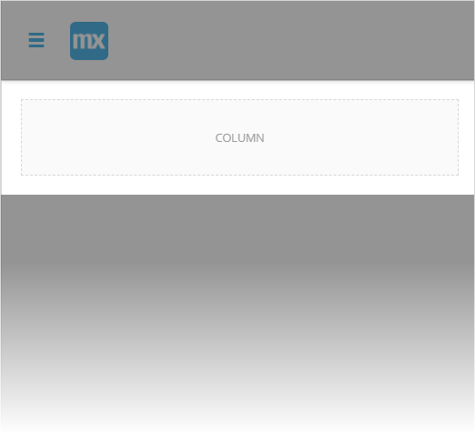
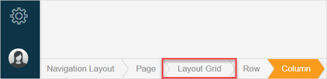

## 1 Introduction 

This how-to explains how you can configure a delete object action in the Mendix Web Modeler. 

**This how-to will teach you how to do the following:**

* configure the **Delete Object** action in a [list view](../../refguide/web-modeler/page-editor-data-view-list-view-wm#list-view-properties)
* configure the **Delete Object** action in a [data view](../../refguide/web-modeler/page-editor-data-view-list-view-wm#data-view-properties)

This how-to describes the following use case: 

You want to be able to delete the customer's name from the list of customers. 

{}

You can configure the **Delete Object** on click action for such widgets as buttons or a static image. In this how-to we use a **Delete** button as an example of widget with **Delete Object** on click action. For more information, see section [2.3 Delete Object Action](../../refguide/web-modeler/page-editor-widgets-events-section-wm#delete-object-action) in *Events Section in Widgets of the Web Modeler* in the *Web Modeler* category.

{}

## 2 Prerequisites

To start this tutorial, make sure you have completed the following prerequisites:

* Create a [Mendix account](https://www.mendix.com/try-now/?utm_source=documentation&utm_medium=community&utm_campaign=signup)
* [Create an app](../tutorials/start-with-a-blank-app-1-create-the-app)

## 3 Configuring the Domain Model and Creating a Page

To list customers' names and to show a more detailed information under the list, we need to create an entity *Customer*, add attributes *Name* and *Address* to it, and then create a page where we will list names of customers. 

To configure the domain model and create the page, do the following:

1. Open your [domain model](../../refguide/web-modeler/domain-models-wm).

2. Create entity *Customer*. For more information on how to create the entity, see section [3 Adding New Entities](../../refguide/web-modeler/domain-models-wm) in *Domain Models Overview in the Web Modeler*.

3.  For the **Customer** entity, create an attribute (for more information on how to create an attribute, see section [4 Adding New Attributes](../../refguide/web-modeler/domain-models-wm) in *Domain Models Overview in the Web Modeler*) and do the following: 

    a. Set the **Name** of the attribute to *Name*. 
    
    b. Set the [**Type**](../../refguide/web-modeler/domain-models-attributes-wm) to **String**. 

     
    
    c. Click **Create** to add the new attribute. 

     

4. Repeat step 3 to create an attribute *Address* of string type.

5.  Now we need a page where customers' names will be listed. Create a blank page and name it *Customers*. For more information on creating pages, see section [3.2 Creating a New Page](../../refguide/web-modeler/page-editor-wm) in the *Page Editor Overview in the Web Modeler*. 

    

A new page is created.

## 4 Configuring a Delete Object Action in a List View

Now we will configure a list view and will add a button with [**Delete Object** action](../../refguide/web-modeler/page-editor-widgets-events-section-wm#delete-object-action) that deletes the corresponding customer when a user clicks the button. Do the following:

1. Open the page *Customers* that you have created.

2.  In **Building Blocks** > **Lists** find **List 1**, drag and drop it to the page. This building block contains a list view in it by default.

    

3.  Now we need to configure the list view. Open the list view properties and do the following:  

    a.  Select **Database** as **Data Source**. 

    b.  Set **Entity** to **Customer**. 

      

    Now the list view is connected to the **Customer** entity.  

4.  Select the text *Name* and do the following in **Properties**: 

    a. In **Content**, delete the text *Name*. 

    b. Click **Add attribute** (or press <kbd>Ctrl</kbd> + <kbd>Space</kbd>) and select the **Name** attribute.  

     

    Now the text widget is connected to the **Name** attribute, and will show us the customers names in a list. 

5.  Click the button displayed as arrow and delete it.

    

6.  In **Toolbox** > **Widgets** > **Buttons** find **Delete Object**, drag and drop it inside the container that is left from the arrow button. 

    

7.  In **Properties** for the **Delete** button, you can see that the **On Click** action is set to **Delete Object** automatically, and caption is set to **Delete**, because the widget is preconfigured in the Web Modeler.

    

We have created the page that lists the customers names. If a user clicks **Delete** in one of the lines, the customer who is indicated in this line will be deleted from the app along with the customer's details. For more information, see section [2.3 Delete Object Action](../../refguide/web-modeler/page-editor-widgets-events-section-wm#delete-object-action) in *Events Section in Widgets of the Web Modeler* in the *Web Modeler* category.

## 5 Configuring a Delete Object Action in a Data View

We can also configure the [**Delete Object** action](../../refguide/web-modeler/page-editor-widgets-events-section-wm#delete-object-action) in a data view. In this case **Delete Object** will delete the connected object. To configure the data view and the **Delete** button on your page, do the following:

1.  On the page named *Customers*, open the **Layout Grid** properties (use a breadcrumb at the bottom of the screen to find the layout grid).

    

2.  In **Properties** > **Add Row**, click the button that adds a row below that we need to place the data view there. 

    

3. In **Toolbox** > **Widgets** > **Data Containers**, find data view, drag and drop it inside the column (that was added together with a new row).

4.  Now we need to configure the data view. In **Properties** of the data view, do the following:  

    a. Set **Data Source** to **List widget**. 

    b. Set **Widget** to **List View with entity Customer**. Now the data source for the data view is the list view that is placed on the same page. 

     

5. We need to fill the data view with data. In **Toolbox** >**Widgets** > **Typography**, select **Text**, drag and drop it inside data view content. 

6.  We will make a heading out of the **Text** widget we have just added. Open the **Properties** of the **Text** and do the following: 

    a. In **Content**, delete the word *Text* and type *Customer Details*. 

    b. Set **Render Mode** to **H4**.  

     

7. Now we will add a text box to display details of the selected customer. In **Widgets** > **Input Elements**, select **Text Box**, drag and drop it inside the data view content. 

8.  Open the **Properties** of the **Text Box**, and in **Data Source**, set **Attribute** to **Name** (the label for the text box will be changed to **Name** automatically).  

    

9. Repeat step 7 to add one more **Text Box** to the page.

10. Open the **Properties** of the **Text Box**, and in **Data Source**, set **Attribute** to **Address** (the label for the text box will be changed to **Address** automatically).

    

11. In **Toolbox** > **Widgets** > **Buttons** find **Delete Object**, drag and drop it inside the data view. 

12. The button is already preconfigured: its **On Click Action** is set to **Delete Object**, and **Caption** is set to **Delete**. But we will add some styling to it. Do the following: 

    a. In the **General** section, set **Style** to **Danger**. 

    b. In the **Design** section, set **Align Self** to **Right**. 

Now we have configured the data view that will show you the customer's name and address once you select this customer in a list. 

The workflow for the **Delete** button in the data view (the red **Delete** button) is the following:

1. A user selects a name of the customer in a list.

2. The customer's details (name and address) are shown in the data view below. 

3. The user clicks **Delete**.

4. Whole customer's record is deleted.

   

For more information, see section [2.3 Delete Object Action](../../refguide/web-modeler/page-editor-widgets-events-section-wm#delete-object-action) in *Events Section in Widgets of the Web Modeler* in the *Web Modeler* category.

Congratulations! You have configured **Delete** buttons in a list view and in a data view. 
