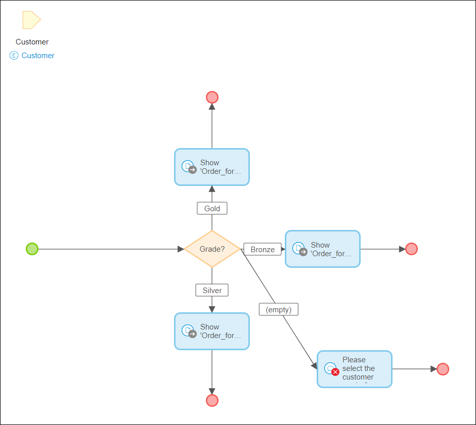
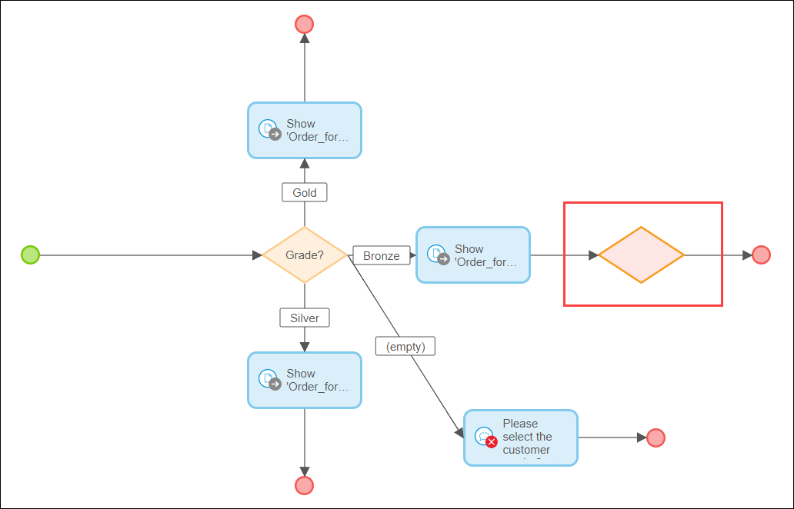
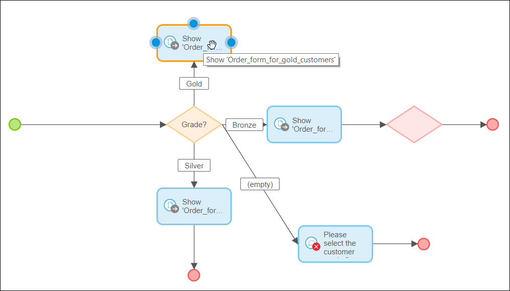
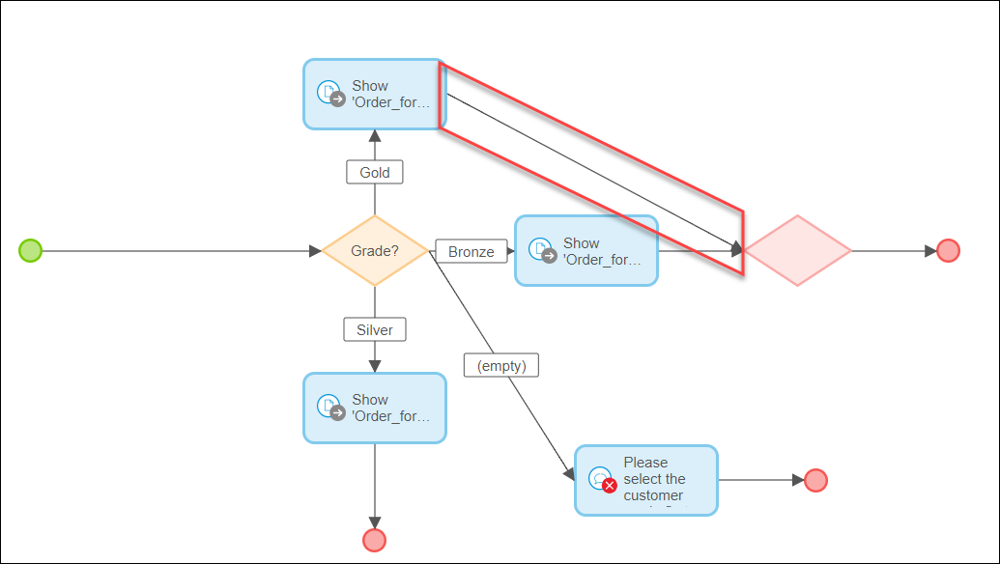
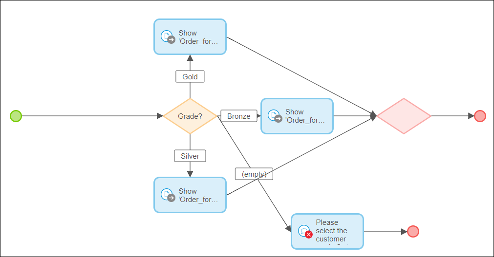
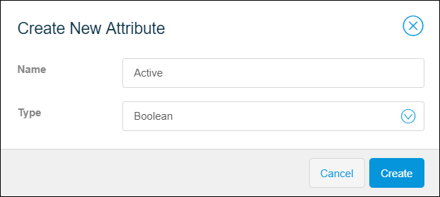
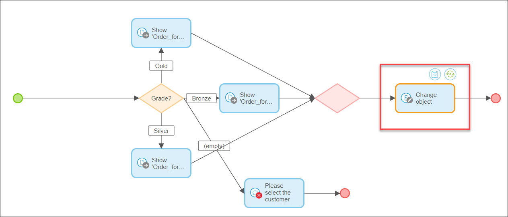
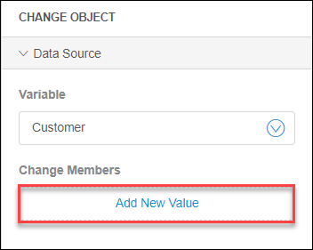
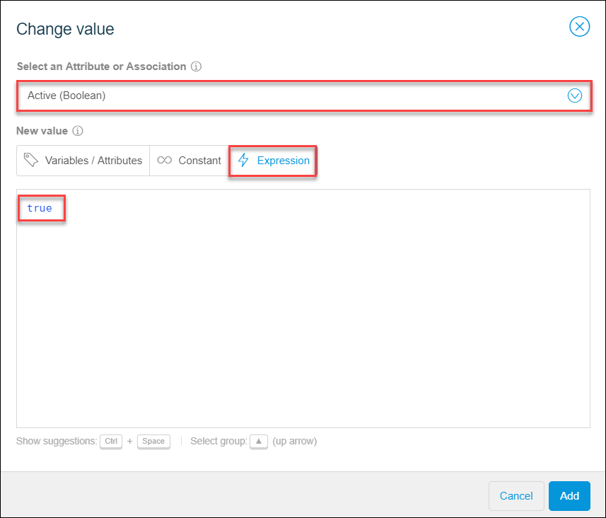
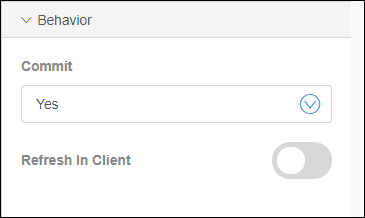

## 1 Introduction 

This how-to explains how you can add advanced logic to a microflow by configuring a merge and a change object activity in the Mendix Web Modeler. 

A merge is used to combine flows into one. If you split the microflow flow (with an exclusive split) and now one and the same action needs to be executed for these separated flows, you can combine the two (or more) flows using a merge. For more information on exclusive split, see [Exclusive Split in the Web Modeler](/refguide/web-modeler/microflows-exclusive-split-wm).

**This how-to will teach you how to do the following:**

* Configure the merge in the microflow that contains an exclusive split
* Configure the change object activity after the merge

This how-to describes the following use case: 

In  [How to Configure an Exclusive Split Step 1: Build the Domain Model and Configure a Microflow ](webmodeler-how-to-microflows-exclsplit-p1) we have configured the exclusive split to open a specific page depending on the customer's grade. In case the customer's grade is not indicated, the error message is shown. So we have four flows after the exclusive split: 

* Showing a page for bronze  grade customers
* Showing a page for silver grade customers
* Showing a page for gold grade customers
* Showing an error message if the customer's grade is not filled out

In this how-to we will merge flows for bronze, silver, and gold customer grades to set object (Customer) to active status when customers open their personal order form. 

## 2 Prerequisites

To start this tutorial, make sure you have completed the following prerequisites:

* Create the microflow with the exclusive split: [How to Configure an Exclusive Split Step 1: Build the Domain Model and Configure a Microflow](webmodeler-how-to-microflows-exclsplit-p1)

## 3 Creating a Merge

To create a merge for gold, silver, and bronze customer grades in a microflow, follow these steps:

1. Open the microflow named *Show_grade_specific_page*.

    

2. Open the **Toolbox** tab > the **General** section, drag and drop the **Merge** activity at the end event of the flow labelled **Bronze**. 

    

3. To merge the flow labelled **Gold** with the **Bronze** one, do the following: 

    a. Delete the **End** event of the flow labelled **Gold**. 

    b. Hover over the **Show Page** activity. 

     

    c. Click one of the dots that will turn into an arrow. 

    d. Drag the arrow to the merge. Now the **Show Page activity** is connected to the merge.

      

4. Repeat step 3 for the flow labelled **Silver**. 

As a result, we have three flows merged into one.

## 4 Configuring Change Object

Now we will add logic to the microflow. We have merged three flows into one, because we want to set customer's status to active irrespectively of their grades. Setting the status of the customers to active can be used, for example, to identify who of the customers are using their account, and who are not.

 Do the following:

1.  First of all, we need to add a new attribute to **Customer** entity in the domain model to indicate if customer is active or not. Click the domain model icon in the left menu bar to open the domain model and do the following: 

    a. Click the **Customer** entity > **New attribute**. 

    b. In the **Create New Attribute** dialog window, set **Name** to *Active* and **Type** to *Boolean*.  

     

    c. Click **Create**.

2. Now we will configure a new activity in the microflow. Open the microflow named *Show_grade_specific_page*.
3.  In the **Toolbox** > **Object Activities** select the **Change Object** activity, drag and drop it after the merge in the microflow.

     

4.  In the **Properties** tab for the **Change Object** activity, do the following: 

    a. Set **Variable** to **Customer** because we are going to edit **Customer**. 

    b. Click **Add New Value**. 

     

    c. In the **Change value** dialog window, select the attribute named **Active**, then click the **Expression** tab, and type *true*. This means that after the order form is opened for a specific customer, the customer's status is set to active (active=true), no matter what grade this customer has.  

     

    d. Click **Add** to finish setting the value for the **Active** attribute. 

    e. In the **Properties** tab > the **Behavior** section do the following: leave the **Commit** option set to **Yes**, since we are not planning to change the object further and want our changes to be saved (committed) to the database.   

    

Congratulations! Now we have the microflow that works the following way:

1. Analyzes if the customer has a grade, and does one of the following: 
   a. If the customer has a grade, it opens the order form for the corresponding customer grade. 
   b. If the customer does not have a grade, the error message pops up. 
2. If the customer has the grade, the customer's status is set to active irrespective of the grade once the order form is opened.

Now you can publish and view your app. For more information, see [How to Publish and View Your App](../tutorials/start-with-a-blank-app-3-publish-and-view-your-app).

 

