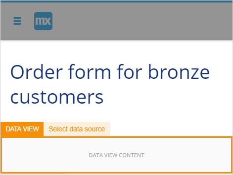

## 1 Introduction 

You have configured microflows and exclusive splits with enumeration attribute type and Boolean attribute type, now you can validate the microflows by adding them to pages. This how-to explains how you can add microflows with exclusive splits to pages in the Web Modeler. 

**This how-to will teach you how to do the following:**

* Embed the created microflows with exclusive splits to your page

## 2 Prerequisites 

To start this tutorial, make sure you have completed the following prerequisites:

* [Configure an Exclusive Split Step 1: Build the Domain Model and Configure a Microflow](webmodeler-how-to-microflows-exclsplit)

## 3 Embedding the Microflow to Pages   

After microflows are created, you can add them to pages to run them in your app. 

### 3.1 Embedding the Microflow Having an Exclusive Split with Attribute of the Enumeration Type {#embedding-exclusive-split-enumeration} 

To embed the microflow with an exclusive split (the attribute of the enumeration type) to pages, do the following:

1. Сreate a page for the existing customers details and name it *Customer_details*. For more information on creating pages, see section [3.2 Creating a New Page](../../refguide/web-modeler/page-editor-wm) in the *Page Editor Overview in the Web Modeler*.
2.  In **Toolbox**>**Widgets** >**Data Containers**, find **Data View**.

    

3. Drag and drop **Data View** to the page.
4.  In the **Properties** tab for the **DATA VIEW**, do the following:  
    a. Set **Data Source** to **Context.** 
    b. Set **Entity** to **Customer**.

    

5. In **Toolbox**>**Widgets** >**Buttons** find **Create Object**, drag and drop it inside the Data View container (it is named **New** by default).
6.  We are going to create a new page that will be opened when a user clicks the **New** button. Open the **Properties** tab for the created button and do the following: 
    a. Set **Customer** as **Data Source**>**Entity**. 
    b. Click **Select Page**. 

      

    c. In the **Select Page** dialog window, click **New** page. 
    d. In the **Create new page** dialog window, fill out the title of the page, for example, *New_customer*.  
    e. Tick **Pre-fill page contents based on the Customer entity** and click **Create**.

     

    The page with customer details is generated.
7. Return to the **Customer_details** page, and in **Toolbox**>**Widgets** >**Data Containers**, find **List View**, drag and drop it to the page.
8. Open **Properties** for the list view and set **Customer** as **Data Source**>**Entity**.
9.  In the **Toolbox**>**Building Blocks**>**Lists** select **List 4**, drag and drop it to the list view. 

     

10. Delete the following elements from the list view: 
    a. The **TEXT** widget with the subtitle.  
    b. The **IMAGE** widget. 
11. Open the **Properties** of the **Details** button, and do the following: 
    a. Set **Events**>**On Click Action** to **Microflow**. 
    b. Click **Select microflow** and set **Show_grade_specific_page**.

     

Congratulations! Now when the user clicks **Details**, the form for the corresponding customer grade will be opened. 

You can now publish and view your app. For more information, see [How to Publish and View Your App](../tutorials/start-with-a-blank-app-3-publish-and-view-your-app).

### 3.2 Embedding the Microflow Having an Exclusive Split with the Attribute of the Boolean Type 

To embed the microflow with an exclusive split (the attribute of the Boolean type), do the following:

1. We need to add an option to mark customer as blocked. To do this, open the **New_customer page** created in the previous section. For more information, see [Embedding the Microflow Having an Exclusive Split with Attribute of the Enumeration Type](#embedding-exclusive-split-enumeration).
2. In **Toolbox**>**Widgets** >**Input Elements** select **Radio Buttons**, drag and drop it into the **DATA VIEW** container.
3.  In the **Properties** for the radio buttons, click **Data Source**>**Attribute **and select **Blocked Boolean**. 

    

4. Now we will add the microflow to pages. Open the page **Order_form_for_bronze_customers.**
5.  In **Toolbox**>**Widgets** >**Data Containers**, find **Data View**. 

    

6.  Drag and drop **Data View** to the page.

    

7.  In the **Properties** of the **DATA VIEW**, do the following: 
    a. Set **Data Source** to **Context.** 
    b. Set **Entity** to **Customer**.

    

8.  In **Toolbox**>**Widgets**>**Buttons**, find the **Call Microflow** button, drag and drop it into the **DATA VIEW** container. 

    

9. Click the **Call Microflow** button to view its properties. 
10. In the **Properties** tab, select the **Customers_status_check microflow**. 

    

11. Change the **Caption** from **Microflow** to **Place Order**. 
12. Open the page **Order_form_for_silver_customers** and repeat steps 4-11.
13. Open the page **Order_form_for_gold_customers** and repeat steps 4-11.

Congratulations! Now when the user clicks **Place order**, only the customers who are not blocked will be able to proceed. If the user is blocked, he will get an error message. 

You can publish and view your app. For more information, see [How to Publish and View Your App](../tutorials/start-with-a-blank-app-3-publish-and-view-your-app).

 

