## 1 Introduction

This how-to explains how you can configure an exclusive split in the Microflow editor of the Web Modeler. 

An exclusive split is an activity which is used to model conditions or decisions in the logic of your app. For more information on the exclusive split, see [Exclusive Split](../../refguide/web-modeler/microflows-exclusive-split-wm). 

**This how-to will teach you how to do the following:**

* Add entities and attributes necessary to configure the exclusive split
* Configure the exclusive split with the boolean type of parameter or attribute
* Configure the exclusive split with the enumeration type of parameter or attribute

This how-to describes the following use case: 

You have an online shopping app. You will create a page where you can manage your customer's details, i.e, name, grade, and the customer's status (active or blocked). 

You will also create a page with the list of customers. Upon clicking a specific button on this page, different pages (order forms) will be shown to customers with different grades: Bronze, Silver, and Gold. 

Customers can make an order from this page. However, if the blocked user tries to make the order, the app will show them an error message and close the current page.  

## 2 Prerequisites 

To start this tutorial, make sure you have completed the following prerequisites:

* Create a [Mendix account](https://signup.mendix.com/link/signup/?source=direct)
* [Create an app](../tutorials/start-with-a-blank-app-1-create-the-app)

## 3 Configuring the Exclusive Split with the Attribute of the Enumeration Type  

In this example we will create a microflow and configure the exclusive split when you want to open different order forms depending on the customer grade. 

This use case will require an exclusive split with attribute of the enumeration type (list of predefined values). For more information on types of attributes, see [Attribute Types](../../refguide/web-modeler/domain-models-attributes-wm). 

### 3.1 Adding an Entity and an Attribute to the Domain Model 

The app will open the corresponding page depending on the grade of a customer, for this we need to create a new entity and a new attribute first. To create the new entity and attribute, do the following:

1. Open your [domain model](../../refguide/web-modeler/domain-models-wm).
2. Create entity *Customer*. For more information on how to create the entity, see section [3 Adding New Entities](../../refguide/web-modeler/domain-models-wm).
3. For the **Customer** entity, create attribute (for more information on how to create the attribute, see section [4 Adding New Attributes](../../refguide/web-modeler/domain-models-wm)) and do the following: 
  a. Set the attribute **Name** to *Grade*. 
  b. Set the [**Type**](../../refguide/web-modeler/domain-models-attributes-wm) to **Enumeration**. 
  c. Click **Select enumeration** to create a new enumeration. 

  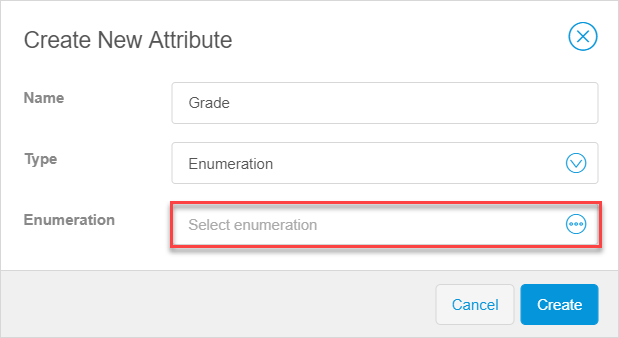

  d. In the **Select enumeration** dialog window, click **New**. 
  e. In the **Create new enumeration** dialog window, click **Add Item** (*Grade* is filled out automatically for the **Name**). 

  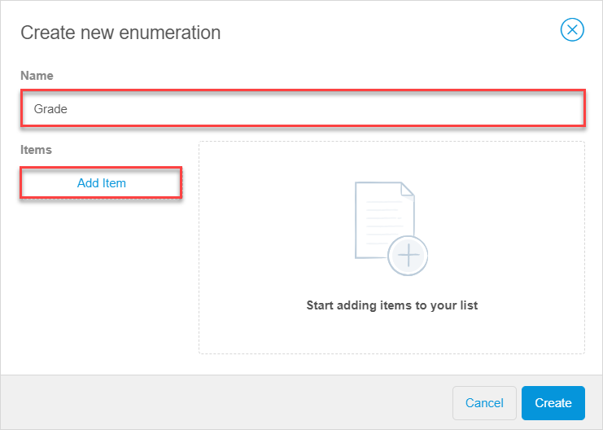

  f. Enter *Bronze* for the **Caption** (**Name** is filled out as *Bronze* automatically as well). 

  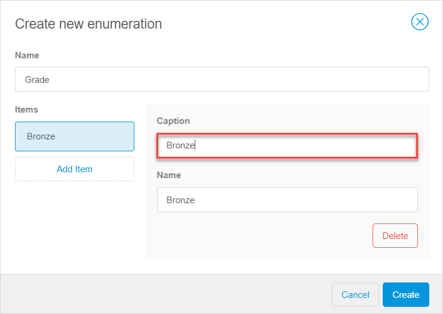

  g. Click **Add Item** and repeat the step above to create the **Silver** and **Gold** grades. 
  h. Click **Create** to close the dialog windows and create the new attribute.

  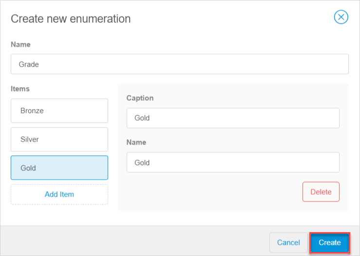

The new attribute is created.

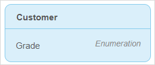

### 3.2 Configuring a Microflow 

To configure the exclusive split with the attribute or parameter of the enumeration type, follow these steps:

1. [Create a new microflow](../../refguide/web-modeler/microflows-wm) and name it, for example, *Show_grade_specific_page*.
2.  In the **Toolbox** tab, select the exclusive split, drag and drop it to the microflow. 

   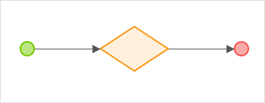

3.  We need to pass a parameter to configure the exclusive split correctly.  In the **Toolbox**, select **Parameter** and drag and drop it to the microflow.

   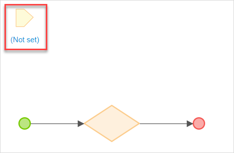

4. In our example the logic we are adding should apply to the single customer that is selected in the page. Hence, we need to add the customer as the parameter. Change the following properties of the **Parameter**: 

   a. Set **Data Type** to **Object**. 
   b. Set **Entity** to **Customer**. 

   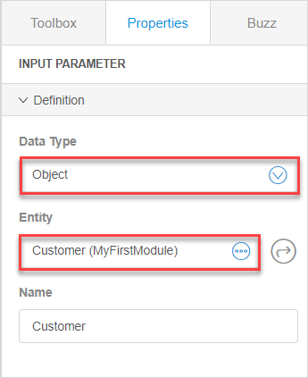

5.  In the **Properties** of the exclusive split, click the **Configure condition** field.

   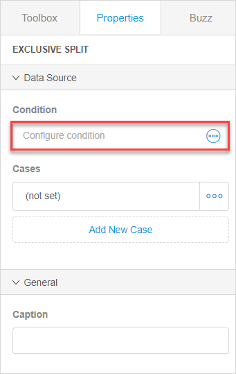

6.  In the **Configure condition** pop-up window, we need to select the attribute that the condition will be based on. So, click the **Variables/Attributes** tab, select the **Grade Customer_grade** condition, and click **Save**. 

   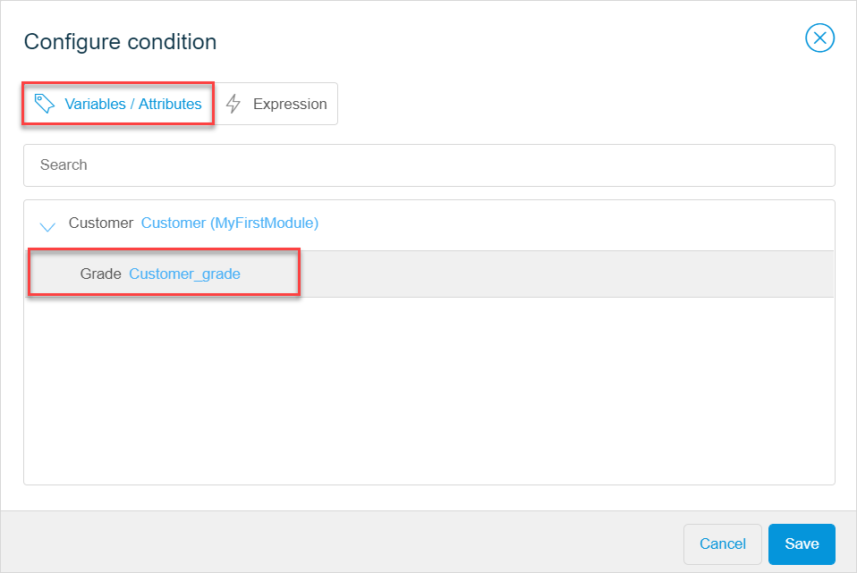

   Caption **Grade?** is added automatically to the exclusive split according to the attribute name to indicate which condition the exclusive split is based on. 

7. We need to add different logic for each value of the **Grade** attribute. To do this, in the **Properties** tab, set cases for the exclusive split doing the following: 

   a. Select **Edit** in the **(not set)** field. 

   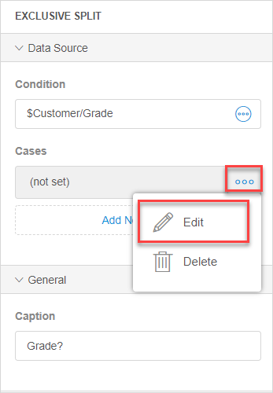
   b. Set **Bronze** in the **Select Value** drop-down menu. 
   c. Click the **Go back** icon to return to the exclusive split properties. 

   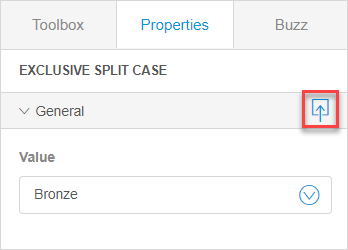
   d. Click **Add New Case** in the **Cases** section. 
   e. Repeat steps b-d to add all possible cases: **Silver**, **Gold** and **Empty** (a case when the customer's grade is not set). 

   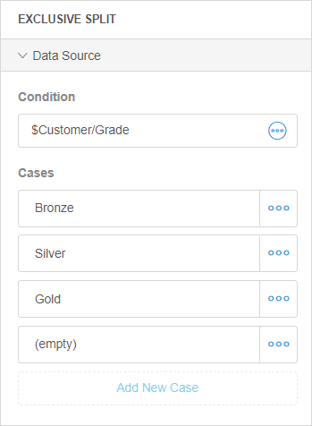

8.  To open a corresponding order form (page) for customers with the bronze grade, select **Show Page** in the **Toolbox**, drag and drop it to flow labelled **Bronze** in the microflow. 

   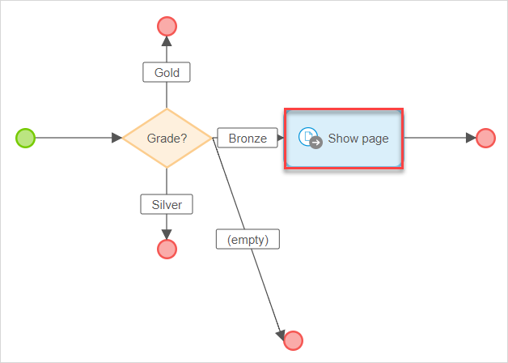

9. Open the properties for the **Show Page** activity and do the following:
   a. Click the **Select a page** field. 
   b. In the **Select Page** dialog window, click **New page**, and [create a page](../../refguide/web-modeler/page-editor-wm) for customer grade **Bronze**. 
   **Note** After you create a page, it will be added to the **Select field** automatically. 

   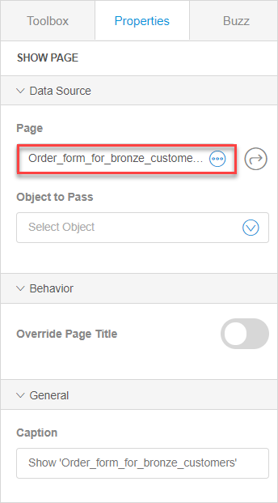
   c. In **Data Source**>**Object to Pass**, set **Customer** to get the data on customers and their grade. 

10. Repeat steps 8-9 for customers of Silver and Gold grades, creating the order form pages for silver and gold customers respectively.
11.  For the customers with no grade indicated we will show an error message. To do so, select **Show Message** in the **Toolbox**, and add it to the flow labelled **(empty)** in the microflow. 

    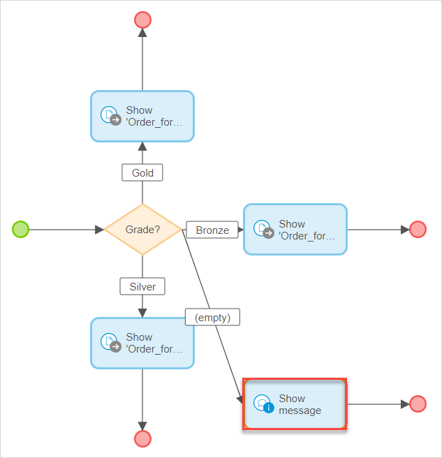

12. In the **Properties** tab for the **Show message** activity, do the following:
    a. Select **Error** as the message type. 
    b. Fill out the **Template** that will be shown to users when this message pops up (in our example: Please select the customer grade first). 
    c. Leave the **Blocking** property for the message enabled, which prevents the user continue work until the pop-up window is closed.  

    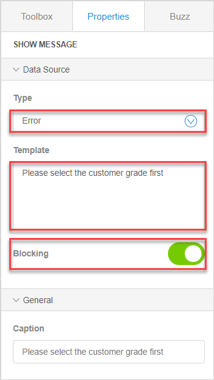

Congratulations! We have now created the microflow that will open different order forms for customers with different grades, or show an error message when the customer has no grade.

If you want to test your microflow by adding it to the pages, see [Configure an Exclusive Split in the Web Modeler Step 2: Embedding the Microflow to Your App](webmodeler-how-to-microflows-exclsplit-p2).

## 4 Configuring the Exclusive Split with Attribute of the Boolean Type  

In this example we will create a microflow and configure the exclusive split when you want to prevent a blocked customer from making an order. The reasons for blocking the customer can be that customer's credit score is too low, or password has expired. 

This use case will require an exclusive split with an attribute of the boolean type (true or false). For more information on the types of attributes, see [Attribute Types](../../refguide/web-modeler/domain-models-attributes-wm).

### 4.1 Adding an Entity and an Attribute to the Domain Model 

As we will verify customers by their statuses, we need to create a corresponding attribute for the entity first. For this, do the following:

1. Open your [domain model](../../refguide/web-modeler/domain-models-wm).
2. For the Customer entity, create attribute (for more information on how to create the attribute, see section [3 Adding New Attributes](../../refguide/web-modeler/domain-models-wm)),  and do the following:  
   a. Set name to *Blocked*.  
   b. Set the [**Type**](../../refguide/web-modeler/domain-models-attributes-wm) to **Boolean**.  
   c. Click **Create**.  

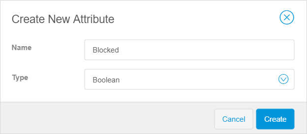

The new attribute for the **Customer** entity is created.

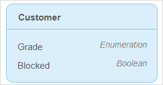

### 4.2 Configuring a Microflow

To configure the exclusive split with the attribute of the boolean type, follow these steps:

1. [Create a new microflow](../../refguide/web-modeler/microflows-wm) and name it, for example *Customer_status_check*.
2.  In the **Toolbox** tab, select the exclusive split, drag and drop it to the microflow. 

   

3.  We need to pass a parameter to configure the exclusive split. In the **Toolbox** tab, select **Parameter**, and drag and drop it to the microflow.

   

4. In our example the logic we are adding should apply to the status of the customer. Hence, we need to add the customer as the parameter. In the **Properties** tab for the **Parameter**, do the following:
   a. Set **Data Type** to **Object** 
   b. Set **Entity** to **Customer**.

   

5.  Click the exclusive split, and in the **Properties** tab, click the **Configure condition** field.

   

6.  In the **Configure condition** pop-up window, we need to select the attribute that the condition will be based on. So, in the **Configure condition** pop-up window, click  the **Variables/Attributes** tab, select **Blocked Boolean** attribute of the **Customer**, and click **Save**.

   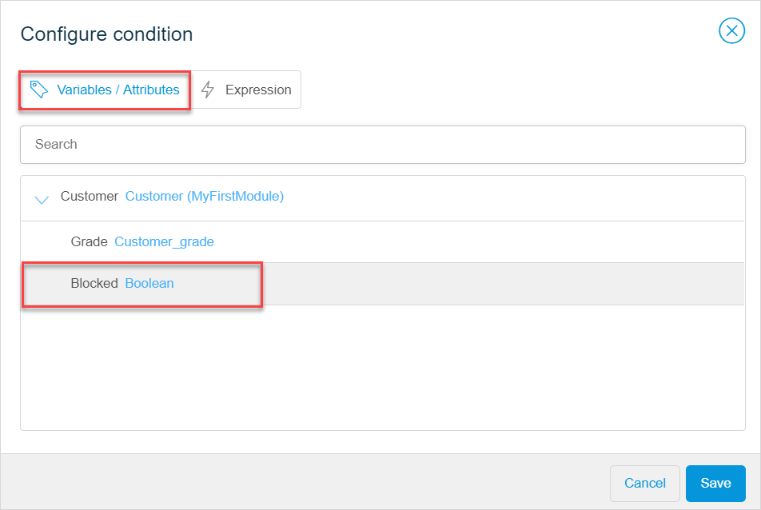

7.  Cases **true** and **false** are set automatically for properties of the exclusive split, and the corresponding flows are added to the microflow. Caption **Blocked?** is added automatically according to the attribute name. 

  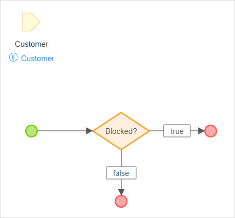

8.  To show an error message to the blocked customers, select **Show message** in the **Toolbox**, and add it to the **true** flow in the microflow. 

   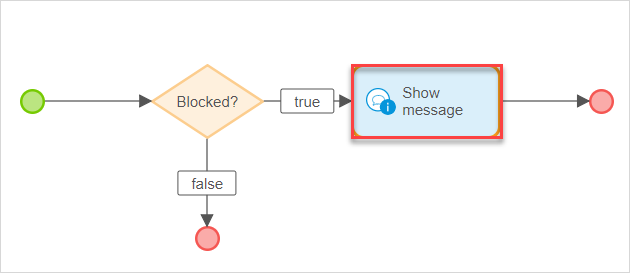

9. In the **Properties** tab for the **Show message** activity, do the following:
   a. Select **Error** as the message type.
   b. Fill out the **Template** that will be shown to users when this message pops up (In our example: Sorry, you can't proceed with the order). 
   c. Leave the **Blocking** property for the message enabled, which prevents the user continue work until the pop-up window is closed.

   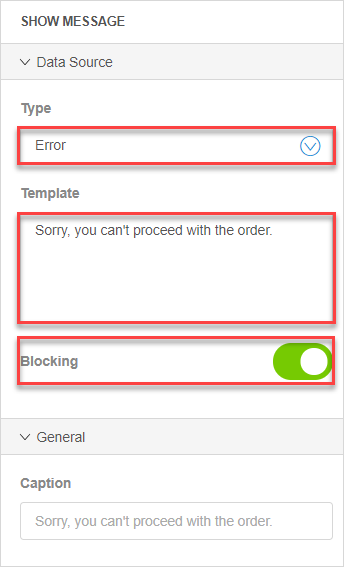

10.  In the **Toolbox** tab, select the **Close Page** activity, drag and drop it to the microflow.

  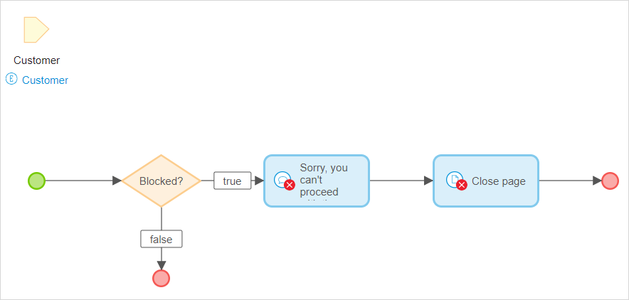

Congratulations! We have now created a microflow that will show an error message and close the current page if the customer is blocked.

If you want to embed your microflow to the pages, see [Configure an Exclusive Split Step 2: Embedding the Microflow to Your App](webmodeler-how-to-microflows-exclsplit-p2).

 

