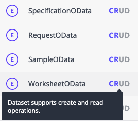
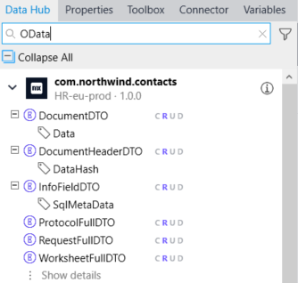

## 1 Introduction

This how-to will build on the guide about [sharing read-only data between Mendix apps](https://docs.mendix.com/data-hub/share-data/) to show you how OData annotations give you the power to create, update, and delete data too. 
**This how-to will teach you how to do the following:**

* Expose your OData entities, attributes, and associations with create, update, and delete options in Mendix Studio Pro.
* See which capabilities a particular entity, attribute, or association has in the Data Hub Catalog.
* Consume an insertable, updatable, or deletable OData resource in your Mendix app.

The OData protocol allows data to not only be read, but also created, updated, and deleted. Mendix Studio Pro version 9.6 takes advantage of this feature. The Data Hub Catalog uses the developer-familiar shorthand for these features, while Mendix Studio Pro sticks with the OData definitions: 

    | Data Hub    | Studio Pro |
    | :---------- | :--------- |
    | Create      | Creatable  |
    | Read        | Insertable |
    | Update      | Updatable  |
    | Delete      | Deletable  |

## 2 Prerequisites

Before starting this how-to, make sure you have completed the following prerequisites:

* Install Studio Pro version [9.6.0 or above](https://marketplace.mendix.com/link/studiopro/)
* Understand how read-only external entities behave by following [this how-to](https://docs.mendix.com/data-hub/share-data/)

## 3 Exposing OData contracts in Mendix Studio Pro

When you publish an entity in a published OData service, clients can read the data by default. In this step, we will allow clients to update the data as well.

1. Open the published OData service in **MyFirstModule** > **APIs** > **{yourname}CustomerODataService**
2. Select the **Customer** entity and click **Edit**
3. Check the box **Updatable (write)**

## 4 Viewing OData capabilities in Data Hub Catalog

The OData insertable, updatable, and deletable capabilities are all about the data in your application. The Data Hub Catalog provides an inventory of the metadata in your applications. You can see the capabilities of entities, attributes, and associations. Changes to the data itself occur in the Mendix app(s), not in the Catalog.

To see the capabilities of a particular OData entity, 

1. Go to the Data Hub Catalog and search for the name of an exposed OData service endpoint, entity, attribute, or association. You can find more details on searching [here](https://docs.mendix.com/data-hub/share-data/#5-using-the-data-hub-catalog-and-curating-your-own-service).

2. Select your entity from the search results pane on the left. If you're not seeing any or enough results, try removing the **Production** filter on your search.

3. Notice the highlighted **CRUD** letters next to the entity name in the search panel on the left and in the detailed information in the center. The purple letters indicate which operations are supported. The grey letters indicate which aren't. Hover over the letters to see which operations are supported.

## 5 Consuming OData resources in your Mendix app

Just like in the Catalog you can see the CRUD capabilities of entities, attributes, and associations inside the Data Hub pane of the Mendix Studio Pro.

 Version 1: The CRUD capabilities displayed in Studio Pro correspond to the values in the Catalog and also the support in Studio Pro.
 Version 2: If Studio Pro supports displaying CRUD capabilities, then the values correspond to the values in the Catalog
 

To consume an OData entity:
 1. Inside the Data Hub pane start typing in the search field
 2. Select your entity from the Data Hub pane. If you're not seeing any or enough results, try enabling the **Show development environment** filter on your search.
 3. Drag an entity to the Domain Model.
 4. Consume that entity anywhere in your module just like a local entity. This is based on the CRUD capabilities.
 
 Is this part necessary??: After dragging an entity to the Domain Model you are free to change the properties as you wish.
 Is this part necessary??: When consuming the resources inside Microflows, Pages, ... it acts the same as a local entity.
 Is this part necessary??: In the Domain Model external entities have a purple color so it is easy to distinguish between different types.
 Is this part necessary??: If this is the first entity from a Service inside the module, then this action will also add the Service to the module.

