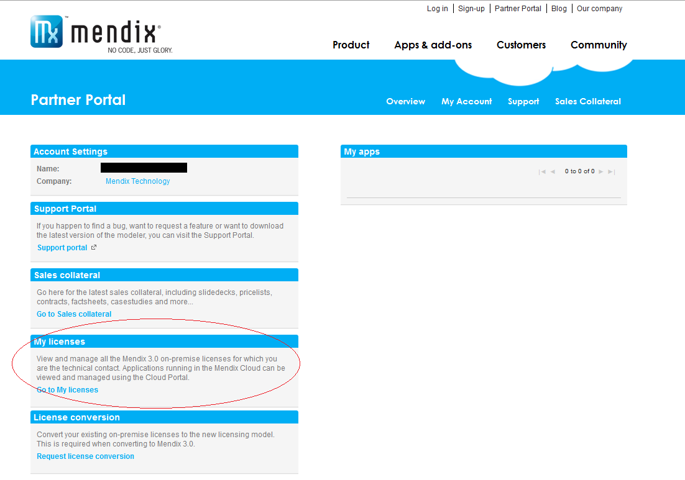
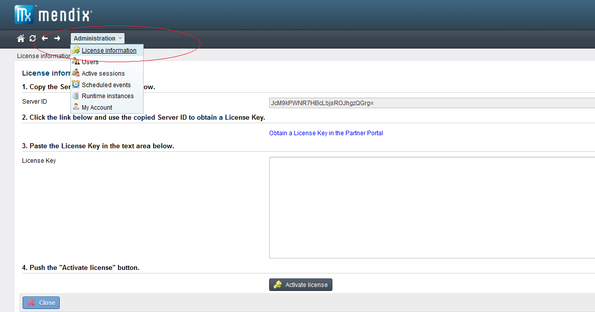
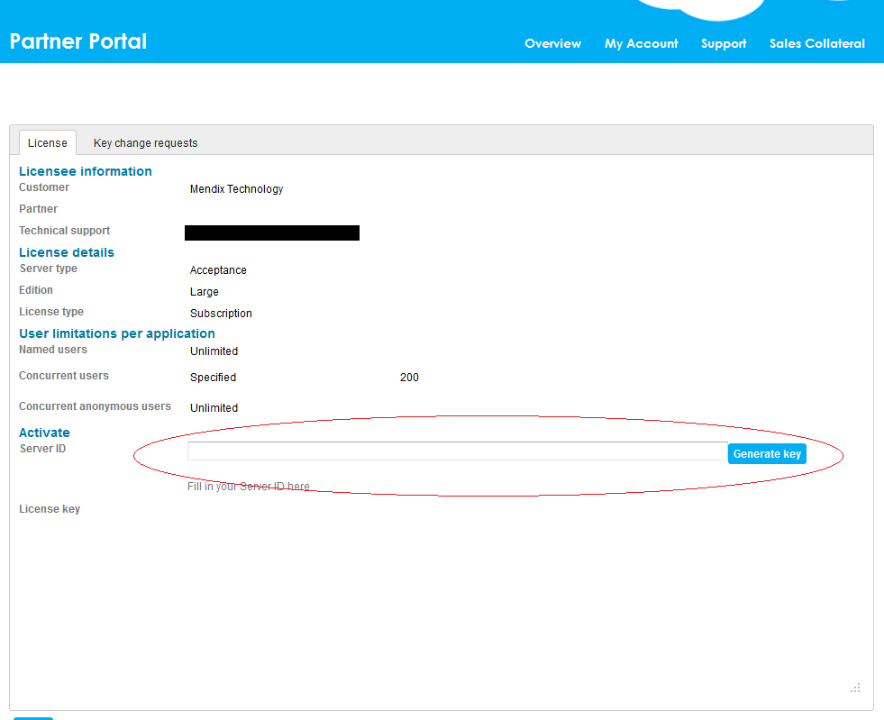
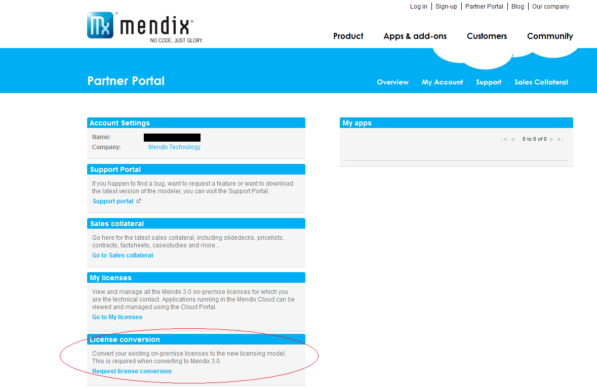
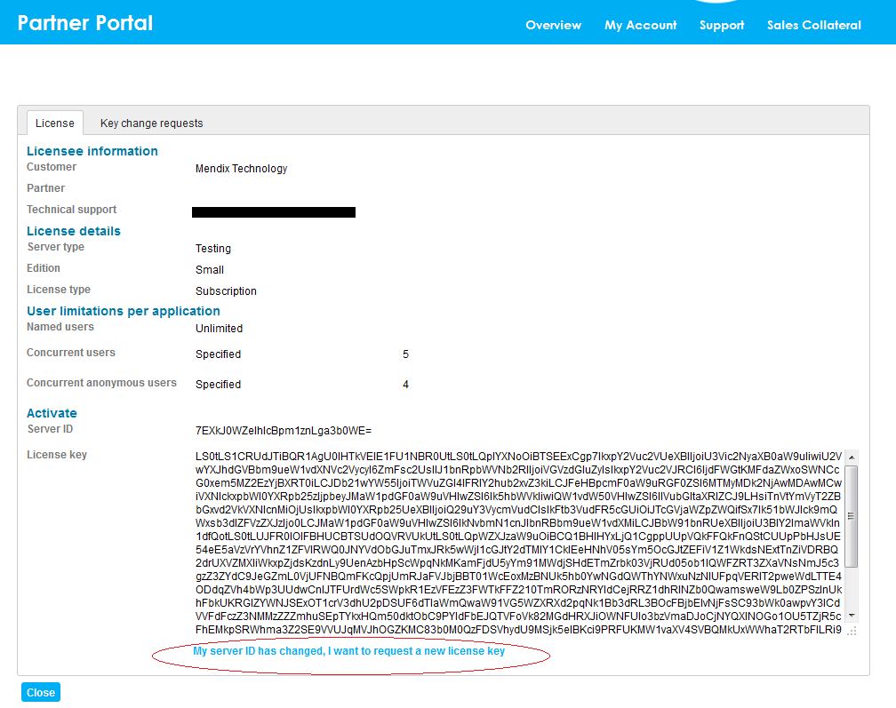

## Introduction

This section describes how to activate your 3.0 license for Mendix. The how-to has been split up in three subsections. We will explain here how to activate your license, how to request a conversion from 2.5 to 3.0 and requesting a new license key when you've moved servers.

## Activating your Mendix License

When you've purchased a Mendix 3.0 license, the technical contact of your license will be notified once your license becomes active. For activating your license we differentiate between licenses in the Mendix Cloud and licenses on-premises.

### Mendix Cloud License

If you bought a Mendix Cloud license, activation will be handled by Mendix. By default, you can login with your MxID at the [Cloud Portal](https://cloud.mendix.com/) and manage your application here. If specific requirements of your application prevent you from using the Cloud Portal for now, a custom cloud slot will be created for you.

### On-Premises License

If your license is on-premises you will receive an email directing you to the Partner Portal. In here you can find the details of your license and the means to activate it.

To generate the activation key you will need the server ID of your application. To acquire your Server ID you will first need to deploy your application. The application will be running in development mode now and will cease functioning every two hours. When logging in as the administrator, the server ID can be found under License Information, in the administration menu.

{}

The server ID is Windows user specific, so if you deploy under Windows please make sure you do so under the correct user.

{}{}

If you cannot find your License Information menu, locate the License information folder in the modeler, under the system module. Create a navigation item for the System.ShowActivateLicenseForm micoflow and redeploy the application.

{}

When you have retrieved your server ID you can enter this ID in the Partner Portal and generate your license key.

Copy this license key and enter it into your application and press activate license. Your mendix license is now active!

## Converting Your 2.5 License to 3.0

When converting your 2.5 application(s) to 3.0, we would like to ask you to make a conversion request for each of your applications in the Partner Portal. This conversion request should be done by the technical contact of the license and requires the old 2.5 key file for on-premises licenses.

Once you've filled in this request Mendix will take a few days to process the conversion. By default, an acceptance environment and production environment license will be granted for each application. If your license agreement entails additional environments, please mention this in the conversion request.

Mendix will contact you after the conversion request, so you can continue activating the license as explained above.

## Requesting a Key Change for an On-Premises License

If your server ID changes, you can request a new activation key by opening your license in the Partner Portal and requesting a key change. You will need to fill in the new server ID. If the key change is approved, a new license key will be automatically generated for the new server ID and will have replaced the old license key.

{}

Server ID change requests are never needed when using the Mendix Cloud.

{}{}

Server ID change requests will not be approved, unless a valid reason is provided.

{}{}

Your old license key becomes invalid once the server ID change has been granted.

{}

