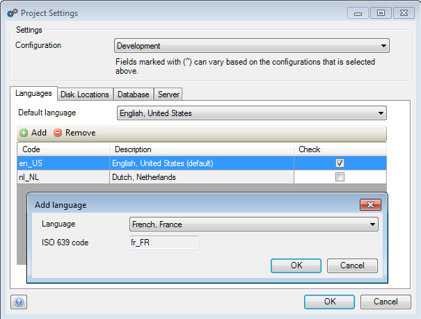

## Description

This section will explain how you can add a new language to your project.

## Instructions

 **Open the Project Settings by double-clicking on 'Settings' in the Project Explorer.**

 **In the 'Languages' tab, press the 'Add' button.**

 **Select the language you want to add in the new menu and press 'OK'.**
