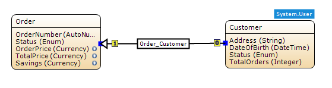
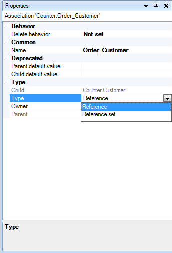
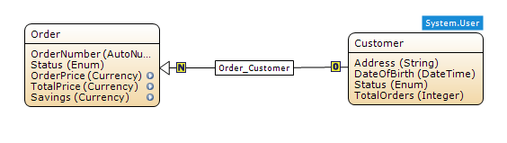
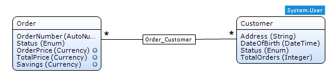

## Description

This section describes how to add an association of type reference set to your domain model. The related reference guide article can be found [here](/refguide4/reference-set-selector).

## Instructions

 **Create the association between the two entities, choosing parent and child as you wish. If you do not know how to do this, refer to [this](create-an-association) article.**

 **Select the association.**

 **In the Properties window, use the drop down menu next to 'Type', and choose 'Reference Set'.**

 **The association is now changed to be a reference set, instead of a reference.**

The above screenshots show the same association; the first shows it using hierarchical notation, whereas the second shows it using UML notation, which was added in version 2.5.1\. You can switch between these modes using the Edit > Preferences menu.
