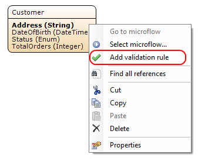
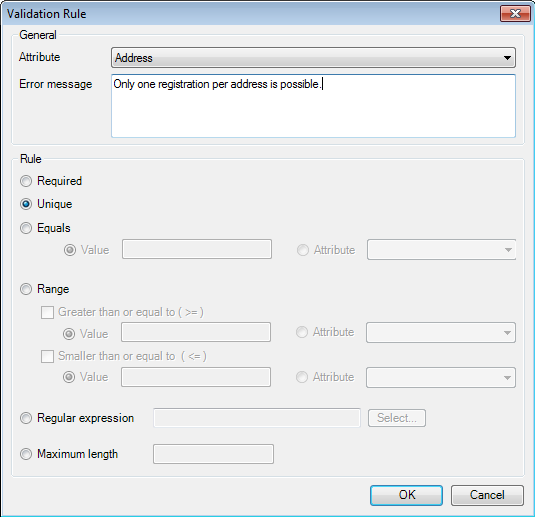
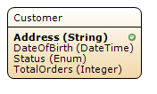
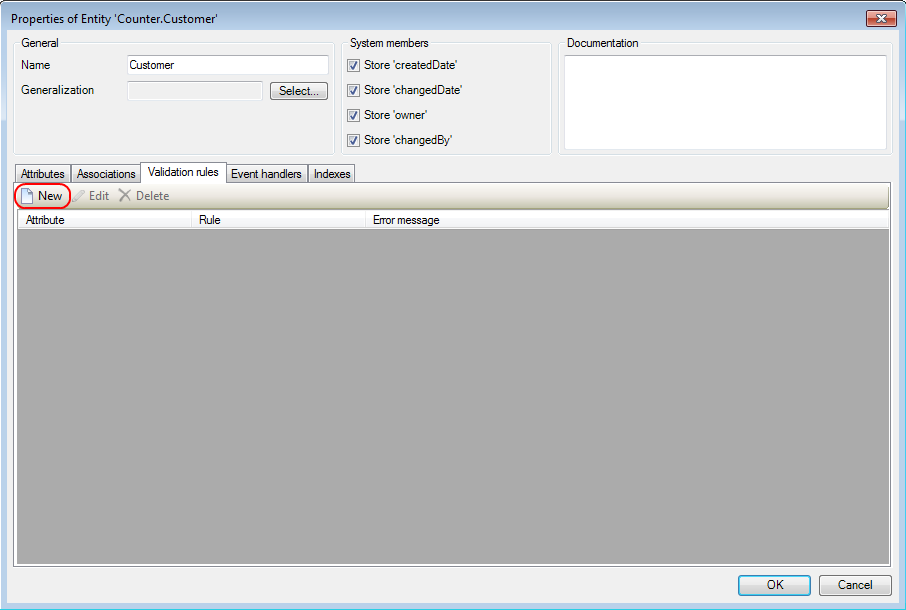

## Description

This section describes how to add a validation rule to an attribute.

## Instructions

 **If the attribute does not exist yet, create it. If you do not know how to do this, refer to [this](add-an-attribute) how-to.**

### Method 1

 **Right-click on the attribute and in the menu choose 'Add validation rule'.**

 **Under 'Error message', fill in the message you would like to have your application display if the validation rule is violated.**

 **In the 'Rule' section of the menu, choose the type of validation rule you would like to add and specify the parameters if necessary.**

For example if you choose 'Unique', your application will show the error message and refuse the input if the value for the attribute is equal to that of an existing object of the same entity. However you could also enter a regular expression the input value has to comply with to be accepted.

 **Finish by clicking on the 'OK' button. The domain model will now indicate that the attribute has a validation rule.**

### Method 2

 **Double click on the entity.**

 **Go to the 'Validation rules' tab and press the 'New' button.**

 **In the 'Attribute' drop down menu, choose the attribute for which you want to add a validation rule.**

 **Under 'Error message', fill in the message you would like to have your application display if the validation rule is violated.**

 **In the 'Rule' section of the menu, choose the type of validation rule you would like to add and specify the parameters if necessary.**

For example if you choose 'Unique', your application will show the error message and refuse the input if the value for the attribute is equal to that of an existing object of the same entity. However you could also enter a regular expression the input value has to comply with to be accepted.

 **Finish by clicking on the 'OK' button. The domain model will now indicate that the attribute has a validation rule.**

