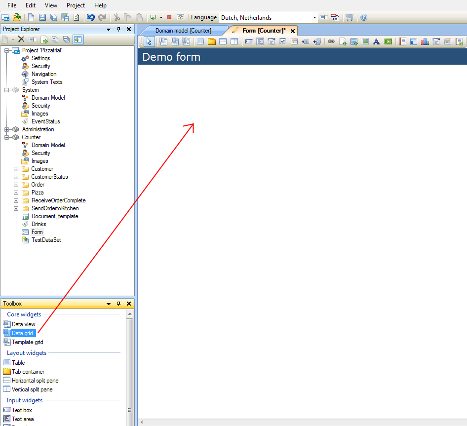
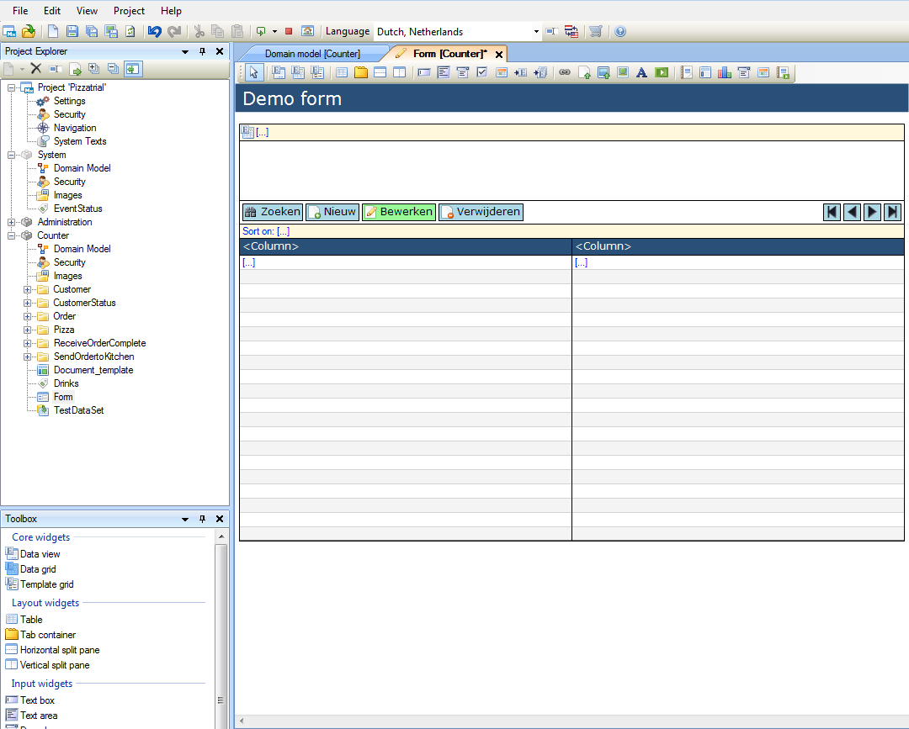
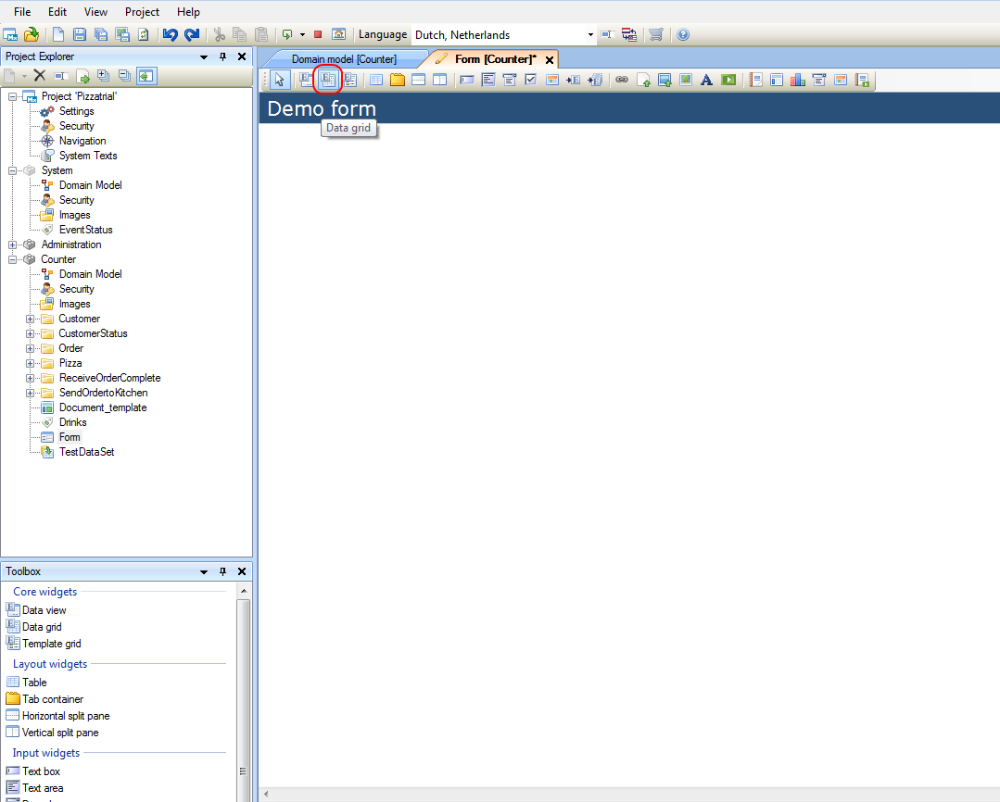

## Description

This section describes how to add a widget to a form.

## Instructions

### Method 1

 **Press the left mouse button while the pointer is positioned over the widget you would like to add in the Toolbox window.**

 **Hold the left mouse button, and drag the widget to the desired location in the form.**

 **Release the left mouse button. The widget will now be added to the form.**

### Method 2

 **Click on the widget you would like to add to the form in the toolbar.**

 **Click on the location in the form you would like to add the widget.**

