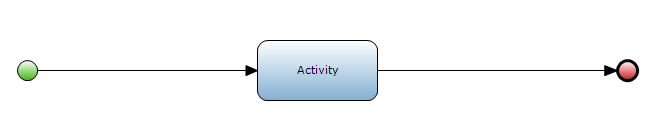

## Description

This section describes how to add an activity to a microflow; these steps can also be used to add gateways or events to a microflow.

## Instructions

 **Open the microflow you want to add an activity to.**

### Method 1

 **Look up the activity you want to add to the microflow. Select it, then press and hold the left mouse button.**

 **Drag the activity to the location in the microflow you want to place it, and release the left mouse button to place the activity.**

 **If the activity box overlapped the sequence flow during placement, it will automatically be connected by the sequence flow.**

 **You will be able to configure the activity by double-clicking on it.**

### Method 2

 **Click on the 'Action activity' button in the toolbar.**

 **Click on the location in the microflow you want to add the activity.**

 *If the activity box overlapped the sequence flow during placement, it will automatically be connected by the sequence flow.

 **Double-click on the activity to bring up a menu which allows you to choose the activity type.**

 **After choosing the activity type, the menu allowing you to configure the activity will automatically appear.**

