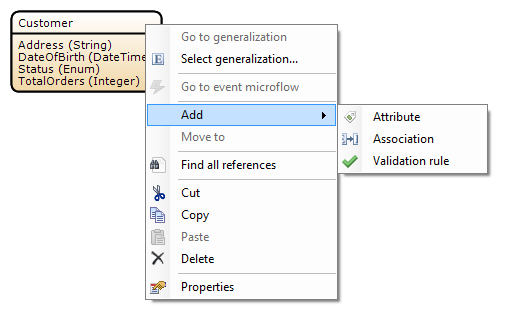
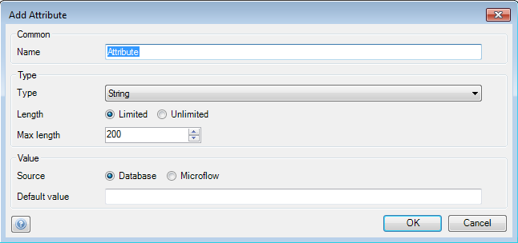
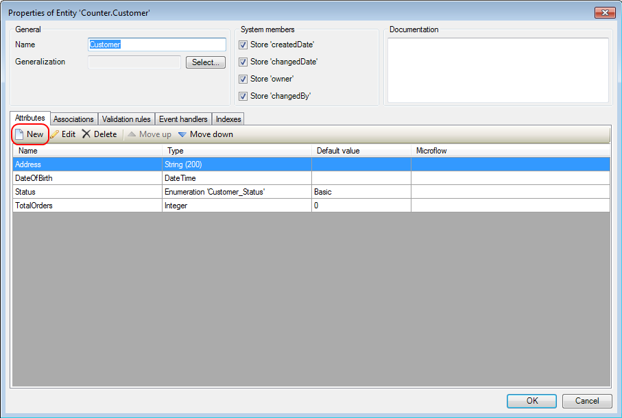

## Description

This section will describe how to add an attribute to an entity.

## Instructions

### Method 1

 **Right-click on the title field of the entity you want to add an attribute to, go to the 'Add' menu and choose 'Attribute'**

 **In the new menu you can choose the name and type, source and default value for the new attribute. Press 'OK' to finish.**

### Method 2

 **Double-click on the entity.**

 **In the menu that pops up, click the 'New' button in the 'Attributes' tab.**

 **In the new menu you can choose the name and type, source and default value for the new attribute. Press 'OK' to finish.**

