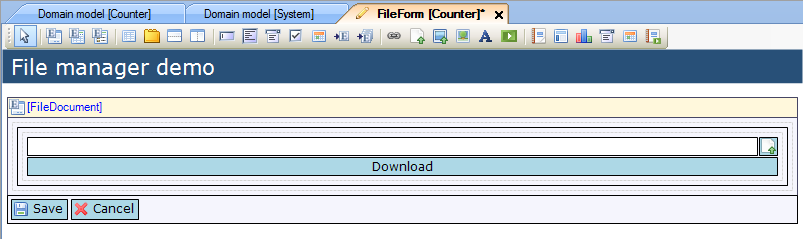
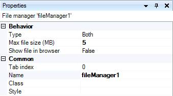

## Description

This section describes how to add a file manager to your project and configure it.

## Instructions

 **Create the data view and connect it to the 'System.FileDocument' entity or a specialization of it. If you do not know how to add widgets to a form please refer to [this](add-a-widget-to-a-form) article; if you do not know how to connect an entity to a data view, please refer to [this](connect-an-entity-to-a-data-view) article.**

 **Add a table to the data view to contain the file manager. It should be at least 1x1, but you can make it bigger if you want to add labels or additional widgets to the data view. After this, add the file manager to the data view.**

 **You can then configure the file manager using the Properties window while having it selected. This way you can set whether you want to allow the file manager to upload, download or both. You can also set the maximum file size in MB, as well as choose to have the file shown in the browser, rather than being downloaded.**

