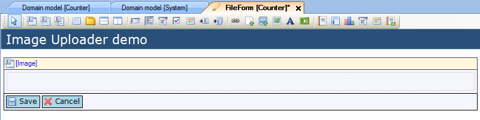
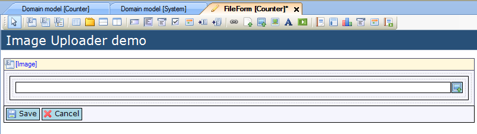
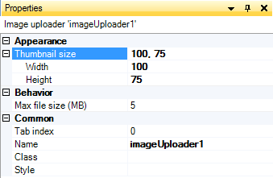

## Description

This section describes how to add an image uploader to your form and then configure it.

## Instructions

 **Create the data view and connect it to the 'System.Image' entity or a specialization of it. If you do not know how to add widgets to a form please refer to** **[this](add-a-widget-to-a-form)** **article; if you do not know how to connect an entity to a data view, please refer to** **[this](connect-an-entity-to-a-data-view)** **article.**

 **Add a table to the data view to contain the image uploader. It should be at least 1x1, but you can make it bigger if you want to add labels or additional widgets to the data view. After this, add the image uploader to the data view.**

 **You can then configure the image uploader using the Properties window while having it selected. This way you can set the thumbnail size for uploaded images, as well as changing the maximum file size in MB.**

