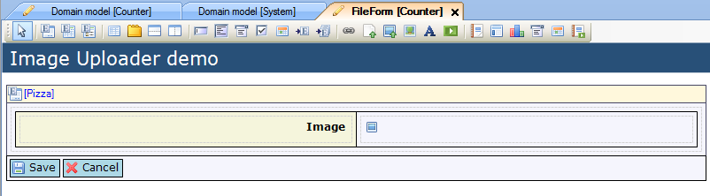
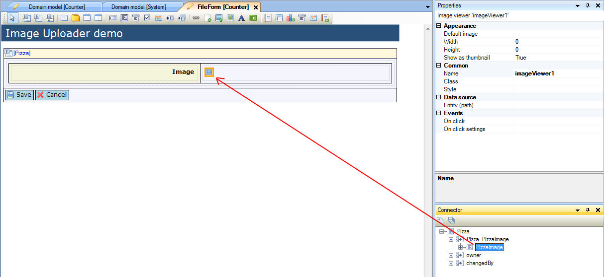
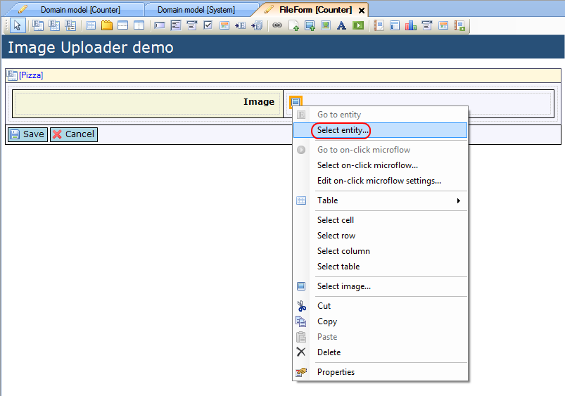
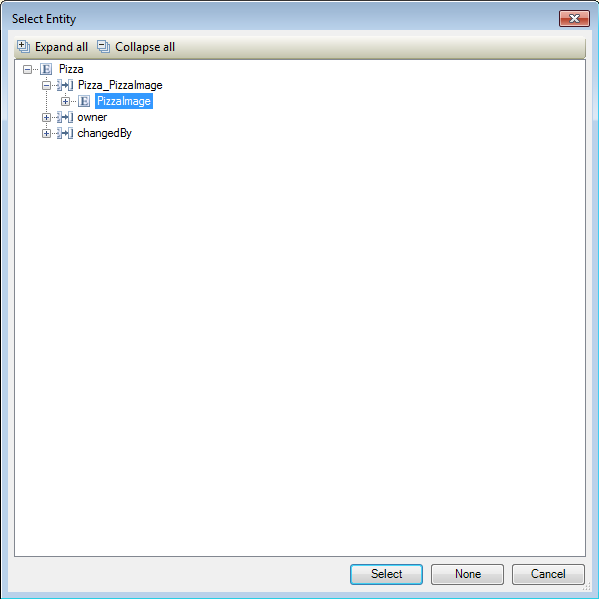

## Description

This section describes how to add an image viewer to your form and then configure it.

## Instructions

 **Create the data view or template grid. If you do not know how to add widgets to a form please refer to [this](add-a-widget-to-a-form) article.**

 **Add a table to contain widgets, including the image viewer. Then add the image viewer to the data view or template grid.**

 **Connect the image viewer to a System.Image object or a specialization of it. If the data view or template grid entity is (a specialization of) System.Image, you can use it for the image viewer as well. Otherwise the image viewer should be connected through an entity path which starts in the data view or template grid object, and ends in (a specialization of) System.Image. There are two ways to do this.**

### Method 1

 **Select the image viewer, then look up the entity you want to connect to it in the Connector window.**

 **Drag the entity from the Connector window to the image viewer.**

In this example, PizzaImage is a specialization of System.Image, associated to the 'Pizza' entity.

 **If necessary you can use the Properties window to configure the image viewer, setting the default image to be displayed if no image is found, the image size, and whether or not to display a thumbnail of the image rather than the full version.**

### Method 2

 **Right-click on the image viewer and click 'Select entity...'. Alternatively you could click on the '...' button next to 'Entity (path)' in the Properties window.**

 **In the new menu select the entity you want to connect to the image viewer.**

In this example, PizzaImage is a specialization of System.Image, associated to the 'Pizza' entity.

 **If necessary you can use the Properties window to configure the image viewer, setting the default image to be displayed if no image is found, the image size, and whether or not to display a thumbnail of the image rather than the full version.**
