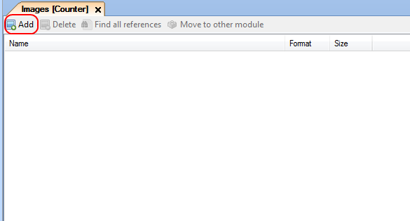

## Description

This section describes how to add custom images to your modules.

## Instructions

 **In the Project Explorer, double-click on 'Images' under the module you would like to add images to.**

 **Press the 'Add' button in the Images menu.**

 **Select the image you would like to add to the project. Note that your image should have png, gif, jpeg or bmp as format.**
