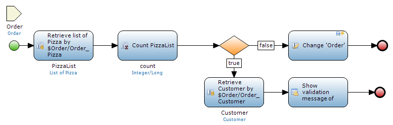
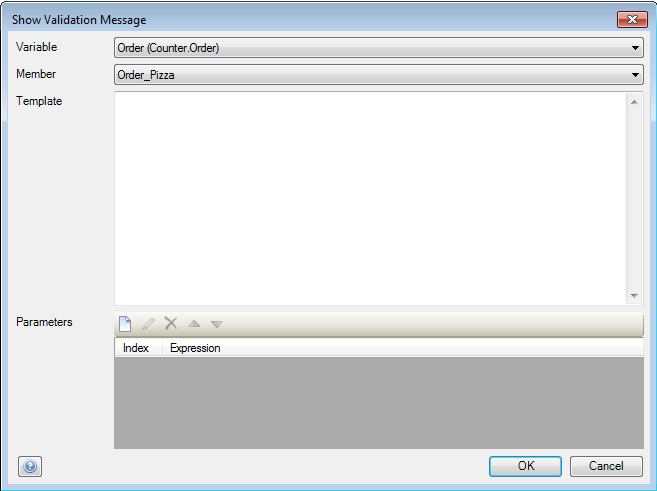
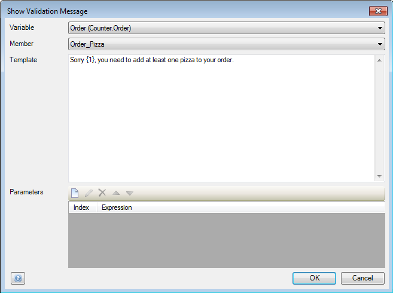
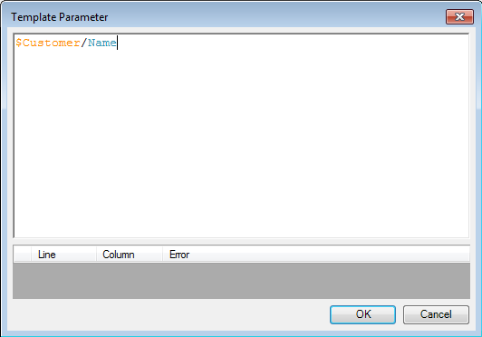
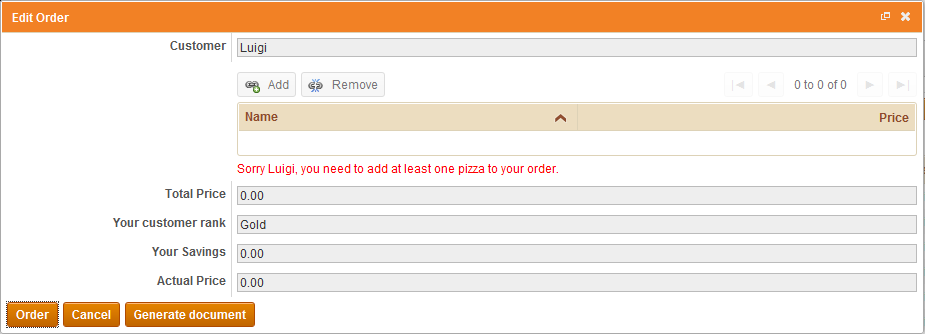

## Description

This section describes how to add validation feedback to your forms with the use of a microflow.

## Instructions

 **Create the form you want to add validation feedback to. If you do not know how to build forms, please refer to [this](create-and-build-a-form) article.**

 **Create the microflow and add the activities to it, including the 'Validation feedback' activity. If you do not know how to add documents to your project, please refer to [this](add-documents-to-a-module) article; if you do not know how to add activities to a microflow, please refer to [this](add-an-activity-to-a-microflow) article.**

In the above microflow, an 'Order' object is passed to the microflow. A 'Retrieve' action is used to return a list of the 'Pizza' objects associated with the 'Order', followed by an 'Aggregate list' action to count how many 'Pizza' objects the list contains. In the exclusive split a check is made if the number of pizzas ordered is equal to zero. If this is not the case, the order is committed to the database; if the number of pizzas ordered is zero validation feedback will be shown telling the customer to order at least one pizza.

 **Connect the microflow to a widget event. If you do not know how to do this, please refer to [this](connect-a-microflow-to-a-widget-event) article.**

 **Open the microflow and double-click on the 'Validation feedback' activity to start configuring it.**

 **Use the drop-down menus at 'Variable' and 'Member' to choose the attribute or association of a variable in the microflow for which you want to display validation feedback.**

Note that if you want to add validation feedback for a reference selector or reference set selector, you need to choose the association these widgets edit as member.

 **You can enter the validation feedback message template with parameters in the 'Template' area.**

You can enter parameters in the template with the use of braces; these will be filled in by the microflow when it generates the message.

 **You can add new parameters to the message using the 'New' button in the 'Parameters' area. Pressing this button will bring up a new window which lets you enter the microflow expression, of which the value will be inserted into the message at the parameter position.**

If you have variables or attributes which are not strings, you can use the 'toString' expression to convert them.

 [(Back to Top)](add-validation-feedback-to-forms)
