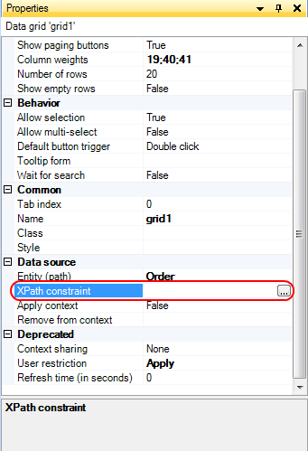

## Description

This section describes how you can put constraints on the objects being shown in a data grid, reference selector and reference set selector with the use of XPath.

## Instructions

 **Select the widget you want to apply XPath to.**

 **In the Properties window, press the '...' button next to 'XPath constraint'.**

 **In the menu that appears, enter the XPath constraint you want to use.**

For example in the picture, the XPath constraint constrains the display of orders in a data grid so that a customer is only able to see his own orders.
