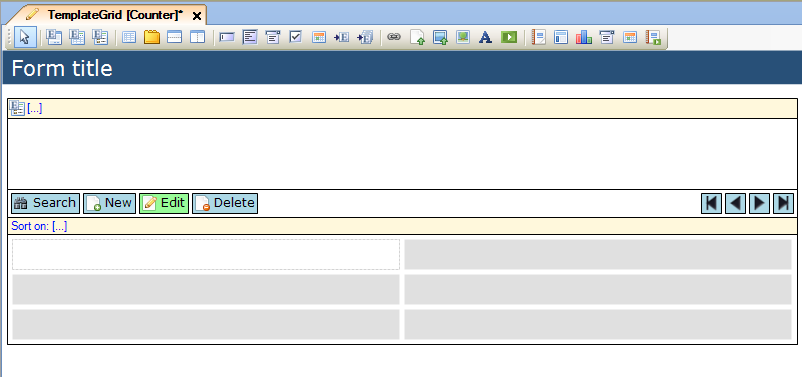
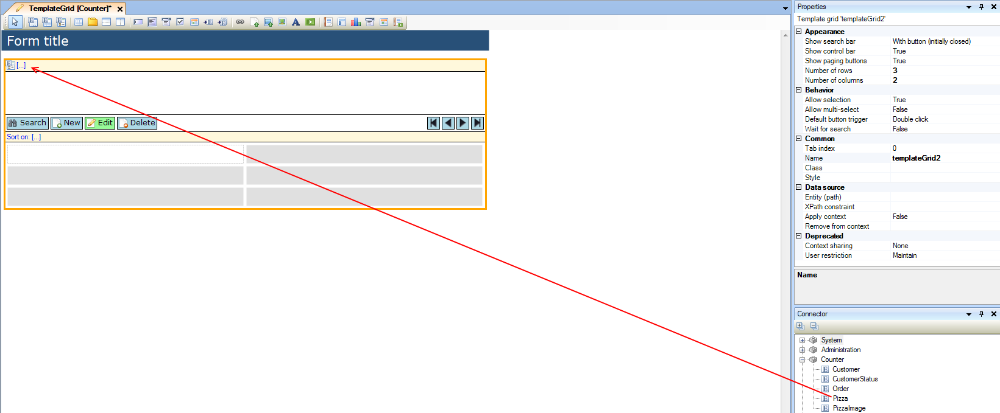
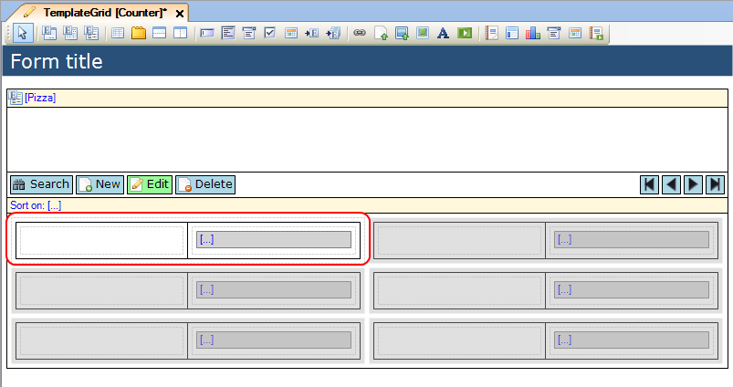
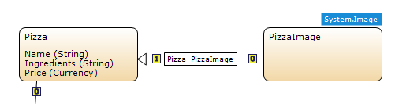
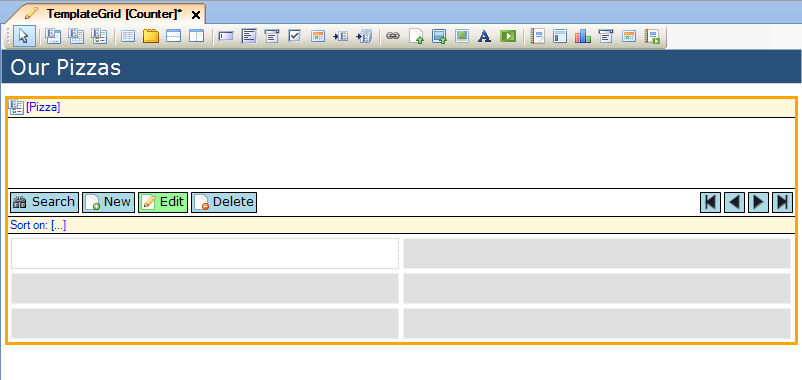
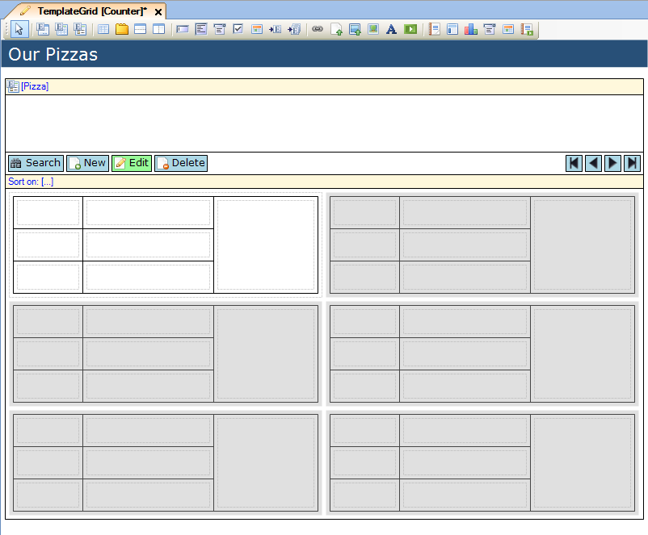
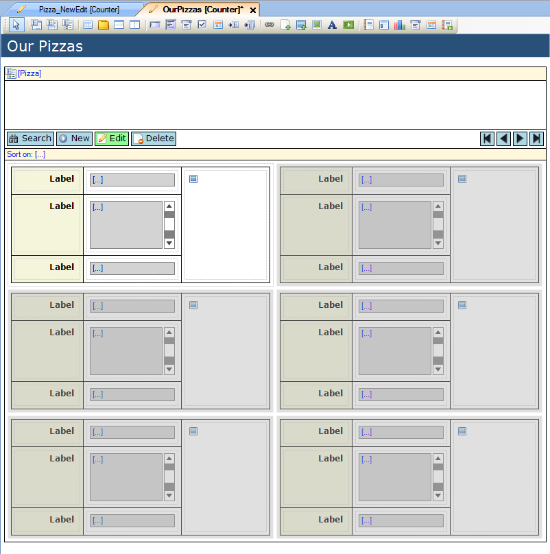
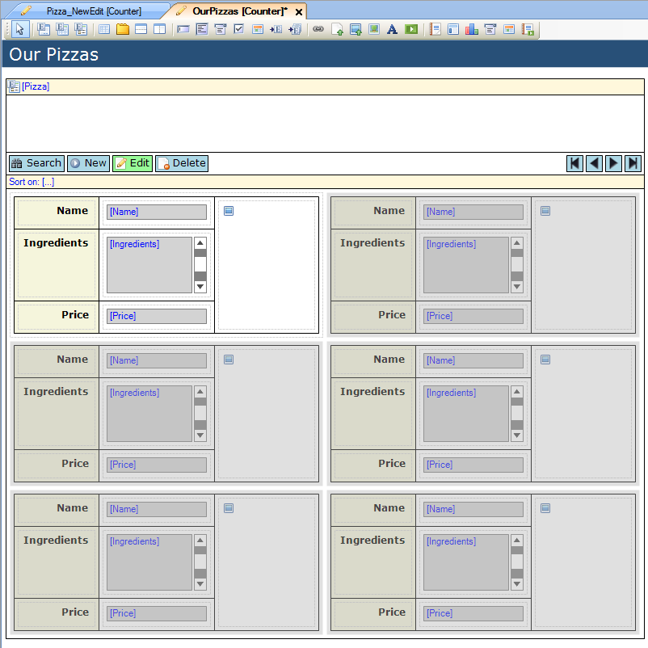
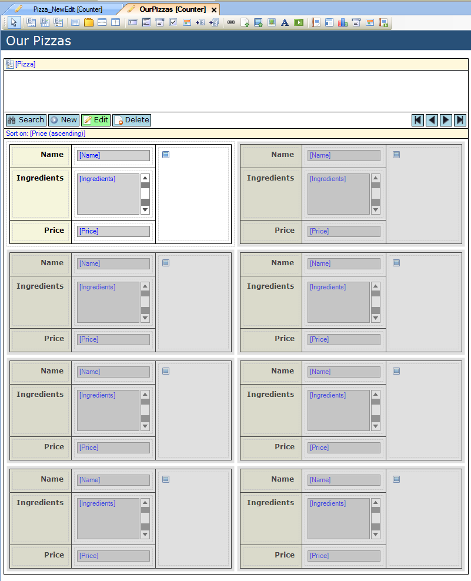
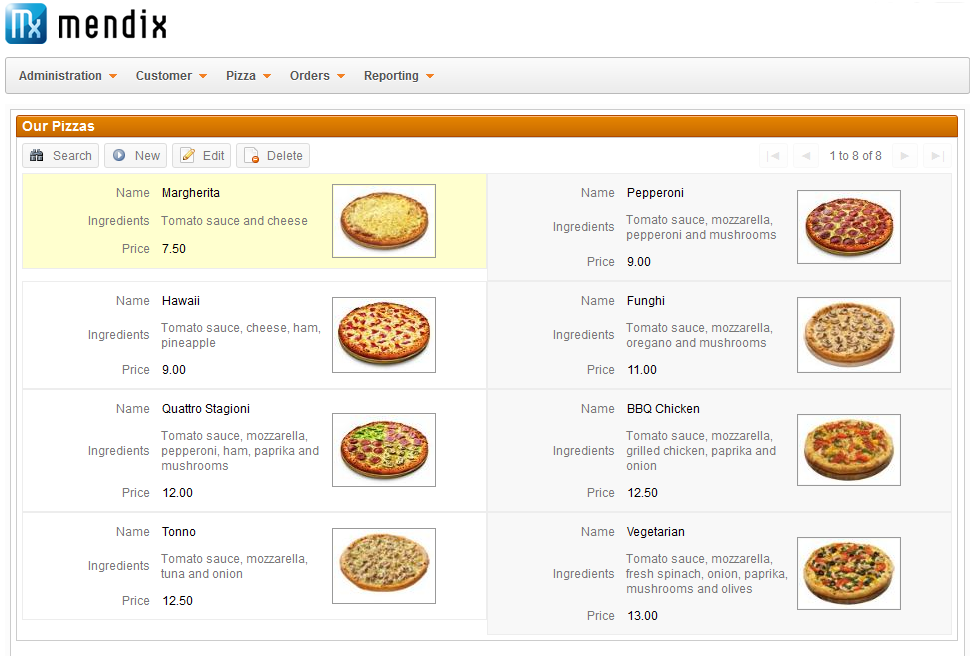

## Description

This section describes how to build a template form with the use of widgets. An example will be given in which a template grid with different pizzas will be built.

## Instructions

 **Create the form and add the template grid to it. If you do not know how to add documents to a project please refer to [this](add-documents-to-a-module) article; if you do not know how to add widgets to a form, please refer to [this](add-a-widget-to-a-form) article.**

 **Connect the template grid to an entity. You can do this by dragging the entity you want to connect to the template grid from the Connector window to the grid's yellow header. Alternatively you can right-click on the template grid and choose 'Select entity...' or click on the '...' button next to 'Entity (path)' in the Properties window. This will bring up a menu in which you can select the entity to connect to the template grid.**

 **After connecting the template grid to an entity, you get a prompt asking if you want the template grid to be filled with automatically generated labels and widgets. If you choose this option, the template grid will be automatically filled based on the entity's attributes.**

 **If you do not choose this option, you have to add the labels and widgets yourself. You can do this by adding a table with labels and widgets in it to the white area of the template grid.**

As you are adding widgets, you will notice that the changes you make will also be applied to the grey areas of the template grid. Each of these areas will display one object of the connected entity using the same format; in the white area you are designing this format in which the objects are shown.

 **You can change the number of objects being shown on one page of the template grid by editing the 'Number of rows' and 'Number of columns' properties in the Properties window.**

## Example: Pizza template grid

 **In this example, we'll build a template grid to display the different kinds of pizza our fictional store has available; each pizza will be shown with a name, price, ingredients and picture.**

The domain model for this can be seen above. The Pizza entity has 'Name', 'Ingredients' and 'Price' as attributes. Additionally, it is associated to PizzaImage, a specialization of System.Image.

 **Our first step is to create the template grid, rename it, and then connect the Pizza entity to it. We decide to not have the template grid be automatically filled by labels and widgets.**

 **After this, we add a table to the white area of the template grid. This table is 3x3, but after creating it the right column is merged into one cell, which we will use to add the picture.**

 **The next step is to add labels and widgets. The first column is filled with labels whereas the second column is filled with text boxes aside from the second row, where a text area is used. Finally we add an image viewer to the right column.**

 **We then change the labels to reflect the contents of the content widgets in the second column. These widgets are connected to the 'Name', "Ingredients' and 'Price' attributes of Pizza. The text area widget is connected to the 'Ingredients' attribute, since its contents may exceed the length of a single line. The image viewer finally is connected to 'PizzaImage', through the 'Pizza_PizzaImage' association.**

 **As final step, we change the 'Number of rows' property to 4, so a total of 8 pizzas are displayed on one page, and the sort bar is set to sort based on 'Price'.**

 **Our form is now configured to display the available Pizzas, as can be seen below.**

