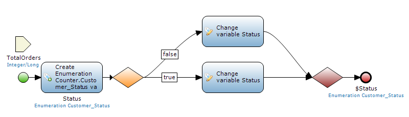
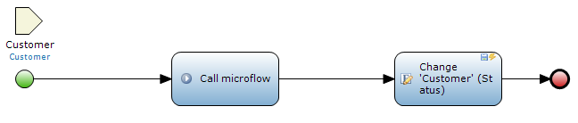
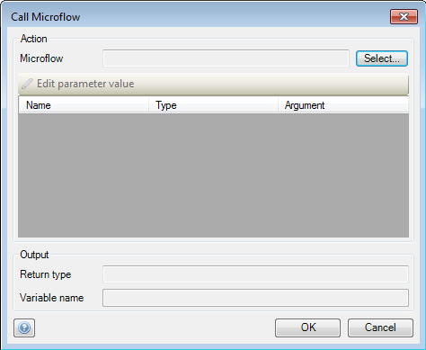
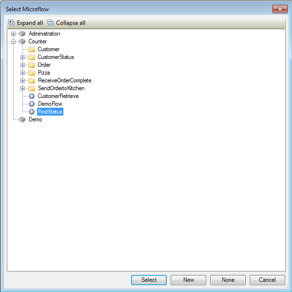
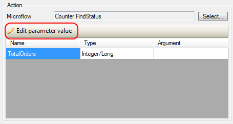
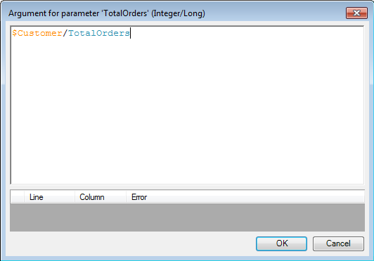
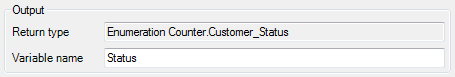

## Description

This section describes how to call a microflow inside another microflow. The related reference guide article can be found [here](/refguide4/microflow-call).

## Instructions

 **Create and configure the microflow you want to use in the microflow call. If you do not know how to add documents to your project, please refer to [this](add-documents-to-a-module) article; if you do not know how to add activities to a microflow please refer to [this](add-an-activity-to-a-microflow) article.**

The microflow in the screenshot above will receive the amount of orders a customer placed as integer, and using an exclusive split will return the status a customer should have as either 'Basic' or 'VIP' based on this number of orders.

 **Create the microflow you want to use to call the other microflow and open it.**

The purpose of the microflow in the screenshot is to send the amount of orders the customer has placed (an attribute of 'Customer') to the other microflow which will return the status the customer should have, after which this microflow changes the 'Status' attribute of 'Customer'. For these activities, a 'Customer' object has to be passed to the microflow.

 **Add a 'Call microflow' activity and double-click on it.**

 **Press the 'Select' button next to 'Microflow' to bring up a new menu in which you choose the microflow you want to call.**

 **The parameter area will now list the names and types of the parameters which have to be passed to the microflow. Select a parameter and click on the 'Edit parameter value' button to set the variable you want to use.**

 **This will bring up a new window which will allow you to enter the parameter value as microflow expression.**

 **At 'Variable name', fill in the name you want to use for the variable that the microflow will return.**

