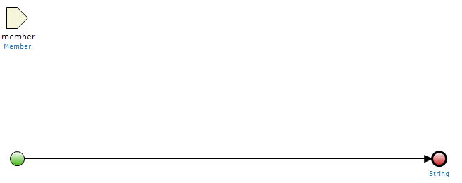
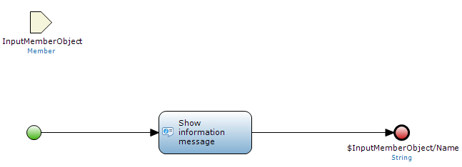

## Description

This section describes how to call a microflow from a Mendix JavaScript widget. Tutorials related to this subject can be found [here](custom-widgets).

## Instructions

 **Set up your widget XML.**

In order to call a microflow from our widget, we first need to assign it to the widget in the Modeler. This can be achieved by including a microflow property in your widget.xml.

```xml
<property key="executeMicroflow" type="microflow">
      <caption>Execute microflow</caption>
      <category>Widget</category>
      <description>This requires a microflow.</description>
	  <returnType type="String"></returnType>
</property>

```

In this example, our microflow will use the entity context from the Dataview our widget is in and return a string variable. To learn how to retrieve the context object in JavaScript, read this how-to: [Use the Data View context object](use-the-data-view-context-object).

{}

You can use a _entityProperty="MyEntity"_ argument to have your microflow require a different entity.

{}

 **Create your microflow.**

Insert your widget into a Dataview and select the microflow. If you create a new one, it should automatically be assigned the entity of your Data view and return a string variable.



For this example we will have it show an information message with the Member's Name as well as return the Name attribute as string.



 **Call your microflow.**

Calling the microflow is done using **mx.processor.xasAction**. You can see an example of this below.

```javascript
		mx.processor.xasAction({
			error       : function() {
				logger.error(this.id + "error: XAS error executing microflow");
			},
			actionname  : this.executeMicroflow,
			guids       : [this.dataobject.getGUID()],
			callback		: dojo.hitch(this, this.processOutput)
		});

```

The **error** parameter defines the message that is send to the log. The **actionname** in this case is the **this.executeMicroflow** input argument we were passed from the Modeler. The object we retrieved from our context is inserted in to the **guids** parameter, using the **getGUID()** function which all Mendix objects have. We use **callback** to receive the string that the microflow returns, in this case we are sending it into a separate function using **dojo.hitch**.

```javascript
	processOutput : function(output) {
		logger.debug(this.id + ".processOutput");

		processedOutput = dojo.fromJson(output.xhr.responseText);
		alert(processedOutput['actionResult']);

	}

```

The microflow returns a JSON object with our string variable in it. The object is basically the XMLHttpRequest we get back, we can call on this using **xhr**; our string variable can be found under **responseText**. We convert this using **dojo.fromJson** into a JavaScript object we can use. After converting our string is located under **['actionResult']**.
