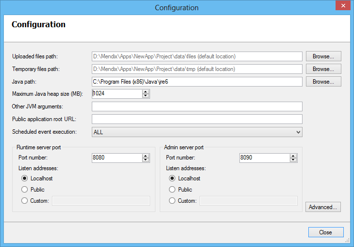
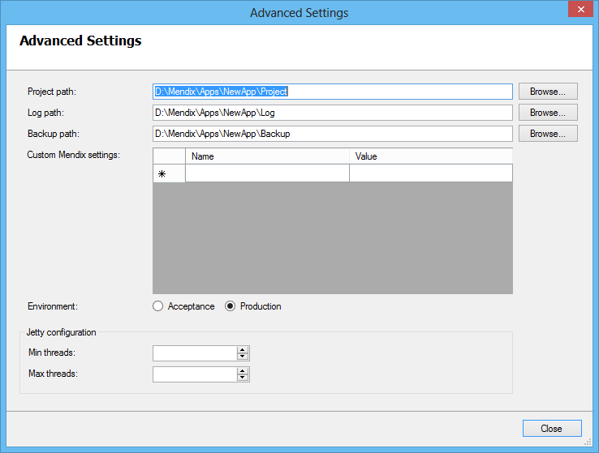

This preliminary documentation is subject to change. It will be finished as soon as possible.

Several fields are already pre-filled, but they can be changed.
The first three settings define the locations of the folders that we created in the first step of this how-to. The following is a short list of some items together with their meaning.

| Setting | Meaning |
| --- | --- |
| Uploaded files path | The location of the uploaded files. A valid path can be: \\FileServer\CustomerPortalFiles. The default path is ../applicationFolder/Project/data/files |
| Temporary files path | The location of the temporary files. The default path is ../applicationFolder/Project/data/tmp |
| Java path | This is the path to Java. The JRE edition is sufficient. The JDK edition is not necessary for the Mendix Windows service. You can find the Java Path under Project Settings in the Modeler. |
| Maximum Java heap size (MD)  | Configure the amount of memory assigned to the JVM process |
| Other JVM arguments | When you want to influence you JVM with additional arguments you can add them here. These arguments will be added to the arguments in the start-up command. |
| Public application root URL  | Here you must specify the web address where users access the application. |
| Scheduled event execution | Here you can specify whether scheduled events must be executed or not. The option SPECIFIED can be used to specify the events that must be executed. Use in that case the custom setting 'MyScheduledEvents', as described below. |

Port Configuration

| Setting |   | Meaning |
| --- | --- | --- |
| Port Number | Runtime | This port is used to access the application. When you are using a webserver in front of the application (such as IIS), you'll need to use this port in the configuration. |
| | Admin | Choose a free port, this port is used by the Service Console to interact with the application |
| Listen Address | Runtime  | When you install the Mendix software you should always use a webserver or proxy in front of the application. If the webserver is installed on the localserver you should only allow connections from localhost. When the webserver is located on a different server you should specify that server address in the custom field. We discourage the option 'Public' since this can be considered a security risk. Default: Localhost |
| | Admin | Which source can access the admin port, should the admin port listen to any other locations that localhost. We discourage the use of any other option besides 'Localhost' since this can be considered a security risk. Default: Localhost |

**Jetty Settings**
Use the following Jetty settings to configure some performance properties:

| Name | Value | Default value |
| --- | --- | --- |
| runtime_min_threads | The minimum number of threads the Jetty server of the Mendix Runtime can have. | 8 |
| runtime_max_threads | The maximum number of threads the Jetty server of the Mendix Runtime can have. | 256 |
| Custom Mendix Settings | See [this page](/refguide4/custom-settings) for an overview of settings. Here you can define advanced settings of the Mendix server, such as specific folder locations or advanced database settings. The simple database settings (same as in the Modeler) can be put in place via the option 'Database Configuration' on the navigation pane. |_|
