## Description

This section describes how to add a Domain-to-XML mapping to your project and then configure it.

## Instructions

 **Add a new Domain-to-XML mapping to your project. If you do not know how to add documents to your project, please refer to [this](add-documents-to-a-module) article.**

 **Double-click on the Domain-to-XML mapping in the Project Explorer, then click on the 'Select elements...' button.**

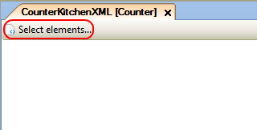

 **In the menu that appears, you can use the radio buttons to choose if you want the XSD source to be an XML Schema (from a previously imported XSD file) or a Web service operation.**

 **If you chose XML schema as source, press the 'Select' button, choose the XML schema in the menu that appears, and then use the drop-down menu at 'Start at' to choose the starting point in the XML schema for the mapping.**

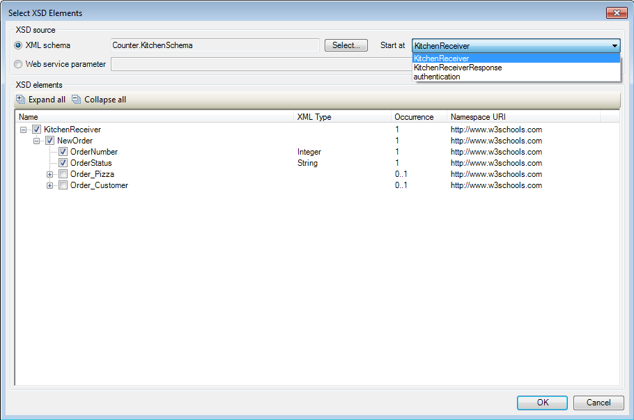

 **If you chose 'Web service operation' as source, click on the 'Select' button and in the menu that appears choose a Web Service operation from the menu.**

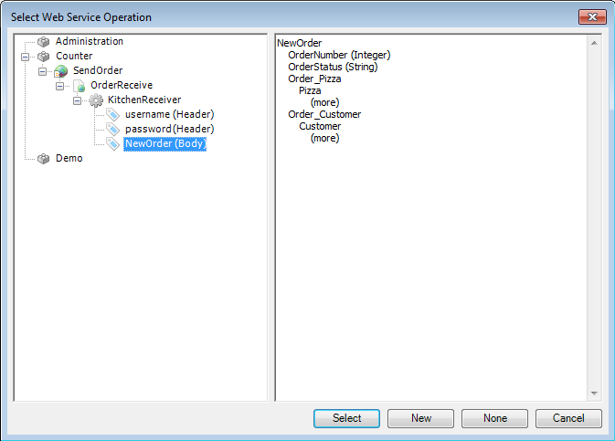

 **The 'XSD elements' section will now fill up with elements from the XML schema. Place check marks next to the entries you want to be available for mapping in the Domain-to-XML mapping.**

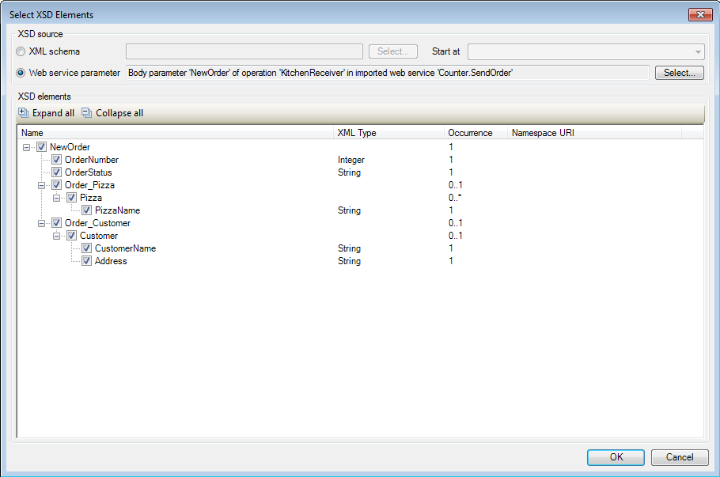

 **The workspace will now fill with the XML elements, and locations to place the domain model entities from which you want to map the XML elements.**

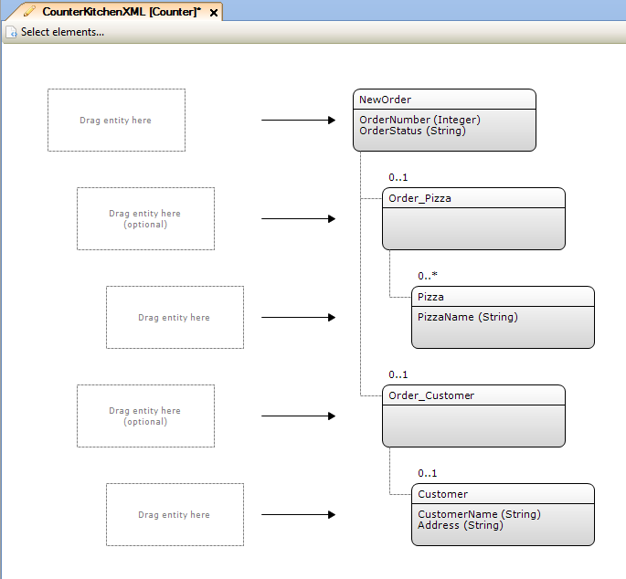

 **Drag the domain model entities from the Connector window to the positions opposite to the XML elements you want to map them to.**

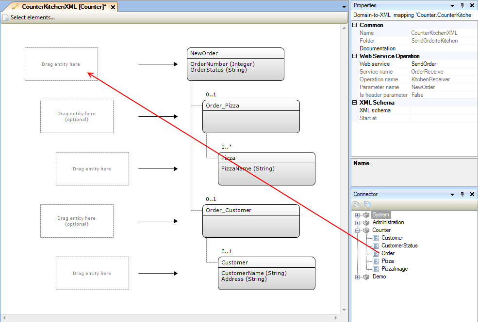

In this example case the entities to which the XML elements are being mapped have the same name as the XML elements.

 **Double-click on an entity to bring up the menu allowing you to configure the mapping from the domain model entity to the corresponding complex XML element.**

 **In the 'Obtain the object(s) by' section of the menu you can select how the object which are not at the top of the hierarchy should be retrieved.**

 **If you want to obtain the object(s) using an association to an entity higher up in the hierarchy, you can use the drop-down menu at 'Retrieving associated object(s)' to choose the association that should be used.**

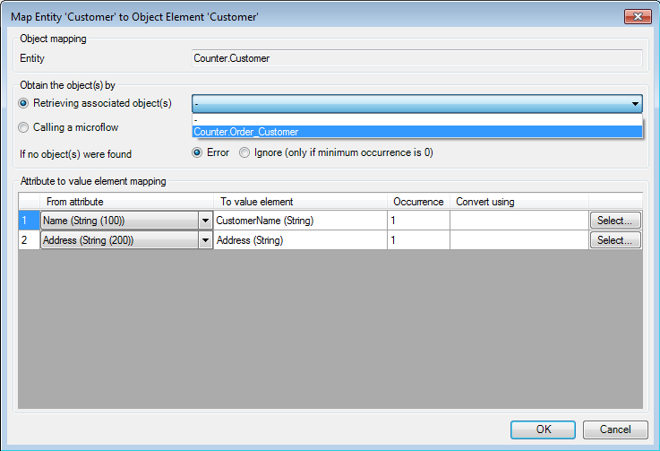

 **Alternatively if you chose the 'Calling a microflow' option, press the 'Select...' button to bring up a menu which allows you to choose the microflow that should retrieve the object, as well as the parameter(s) to be passed to it if necessary.**

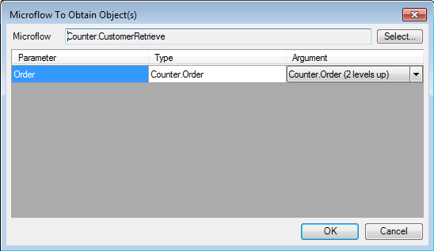

You can use any domain entity higher up in the hierarchy as parameter for such a microflow.

 **For either method of retrieving objects, you need to choose what should happen if no object can be found, using the radio buttons at 'If no object(s) were found'.**

Choosing 'Error' will result in the mapping being aborted and an error being thrown that has to be handled by the calling microflow. Choosing 'Ignore' on the other hand will result in the element being ignored and mapping being continued with the other elements. However this option is only available if the minimum required occurrence of the element is zero.

 **Choose which attributes of the domain model entity you want to map to the XML elements using the drop-down menus in the bottom section of the window.**

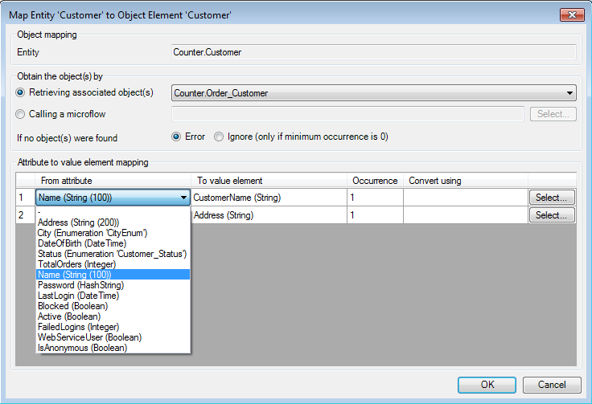

 **In some cases you may need to convert an attribute value before mapping it to the XML element. To configure this, press the 'Select...' button in the attribute row, and then in the window that appears select the microflow and, if necessary, the parameters that should be passed to it.**

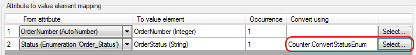

For example, it's not possible to map an enumeration value to an XML element, so the enumeration value first needs to be converted to a string.

 **Configure the mapping for all XML elements to complete the Domain-to-XML mapping.**

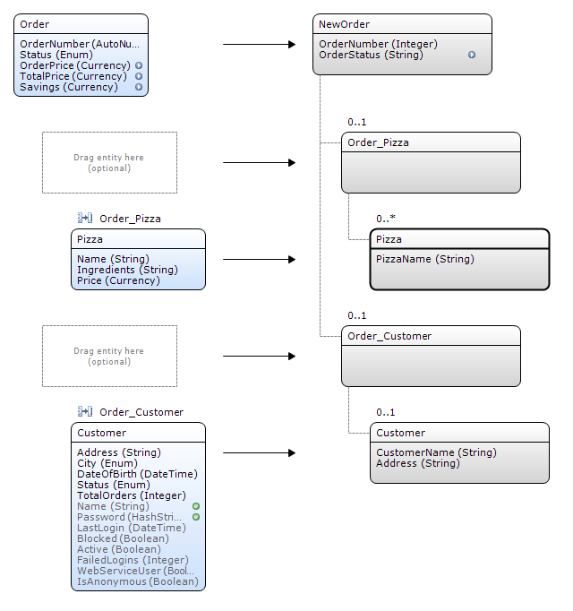
