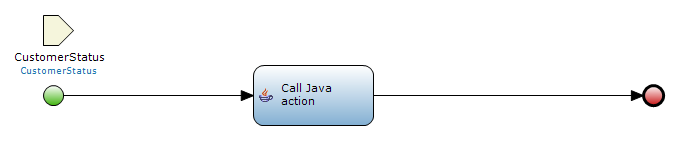
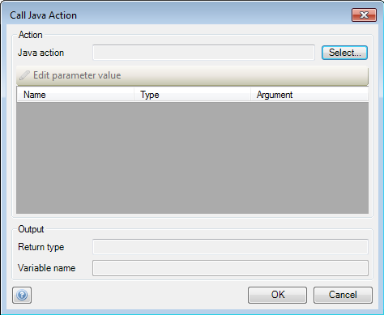
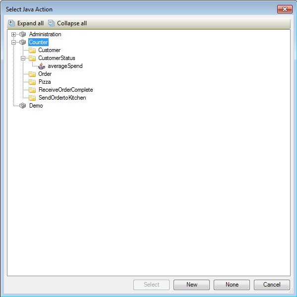
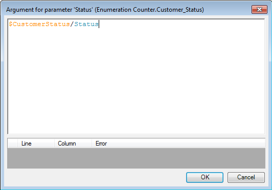
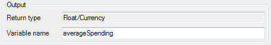

## Description

This section describes how to configure a Java action call in a microflow. The related reference guide article can be found [here](/refguide4/java-action-call).

## Instructions

 **Create the Java action. If you do not know how to do this, please refer to [this](add-and-configure-a-java-action) article.**

 **Open the microflow, or if necessary create a new one. If you do not know how to add documents to your project, please refer to [this](add-documents-to-a-module) article.**

Make sure the variables needed for the Java action are either created in the microflow or passed to it. For example the microflow in the screenshot has a CustomerStatus object passed to it for this reason.

 **Add a 'Java action call' activity to the microflow and double-click on it. If you do not know how to add activities to a microflow please refer to [this](add-an-activity-to-a-microflow) article.**

 **Press the 'Select' button next to 'Java action' to bring up a new menu in which you choose the Java action you want to call with the microflow.**

 **The parameter area will now list the names and types of the parameters which have to be passed to the Java action. Select a parameter and click on the 'Edit parameter value' button to set the variable you want to use.**

 **This will bring up a new window which will allow you to enter the parameter value as microflow expression.**

 **At 'Variable name', fill in the name you want to use for the variable that the Java action will return.**

