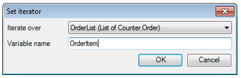

## Description

This section describes how to configure a loop in a microflow.

## Instructions

 **Open the microflow, or if necessary create a new one. If you do not know how to add documents to your project, please refer to [this](add-documents-to-a-module) article.**

Since the iterator of the loop will need a list of objects, make sure this list is created in the microflow. For example in the microflow in the screenshot, a retrieve activity is used to create a list of all the 'Order' objects of which the status attribute is 'Paid'.

 **Add a loop to the microflow. If you do not know how to do this, please refer to [this](add-an-activity-to-a-microflow) article.**

 **Double-click on the loop and select list you want the loop to iterate over using the drop-down menu at 'Iterate over'. You can edit the name for the variable holding the object from the list for which the flow inside the loop is being executed at 'Variable name'.**

 **Add the sequence flow inside the loop which is to be executed for every object on the list.**

This generally works the same as sequence flow outside the loop with a few exceptions. Rather than having a start event, the iterator will automatically start at the first activity of the sequence flow. End events on the other hand are replaced by Continue events, which are used when the sequence flow has been executed and the iterator should move to the next object on the list, and Break events, which are used to stop iterating and continue with the rest of the microflow.
