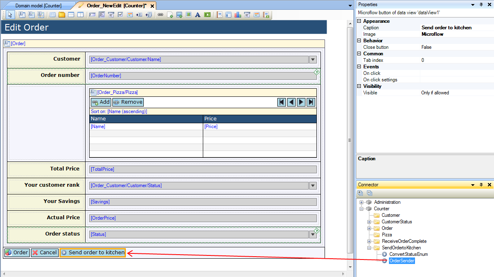
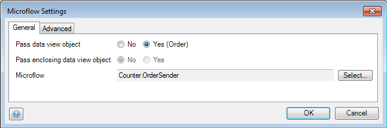
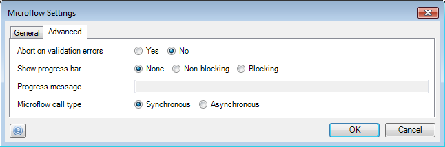
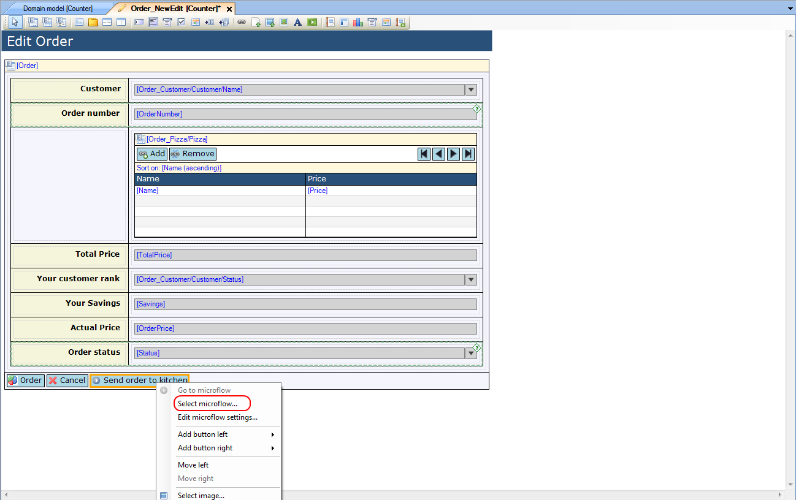
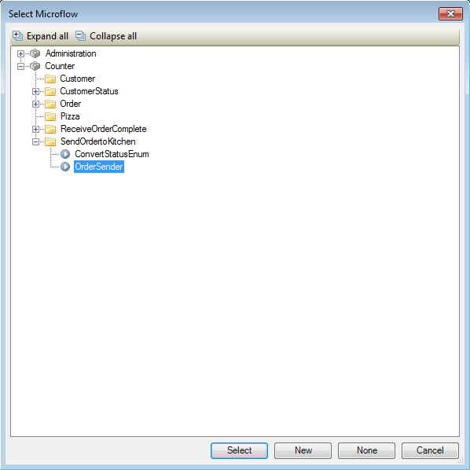

## Description

This section describes how to configure a microflow button in a form.

## Instructions

 **Create the button by right-clicking on an existing button, choosing 'Add button left' or 'Add button right' and then choosing 'Microflow'.**

### Method 1

 **Select the button. Then look up the microflow you want to connect to it in the Toolbox, click on it and drag it to the button.**

 **If you want to change properties of the button, click on the '...' button next to 'On click settings' in the Properties window. In the 'General' tab of the menu that pops up you can choose which object to pass to the microflow (options vary depending on which widget is being used), and whether the enclosing data view object should be passed (if applicable).**

 **The 'Advanced' tab allows you to configure what should happen if the microflow encounters validation errors, choose if a progress bar should be displayed, enter a progress message to display along with the bar, as well as choose if the client should wait for the microflow to finish.**

### Method 2

 **Right-click the button. In the menu choose 'Select microflow...'. Alternatively you can press the '...' button next to the 'Microflow' property in the Properties window.**

 **In the window that pops up, highlight the microflow you want to connect to the button, and press 'Select'**

 **If you want to change properties of the button, click on the '...' button next to 'On click settings' in the Properties window. In the 'General' tab of the menu that pops up you can choose which object to pass to the microflow (options vary depending on which widget is being used), and whether the enclosing data view object should be passed (if applicable).**

 **The 'Advanced' tab allows you to configure what should happen if the microflow encounters validation errors, choose if a progress bar should be displayed, enter a progress message to display along with the bar, as well as choose if the client should wait for the microflow to finish.**

