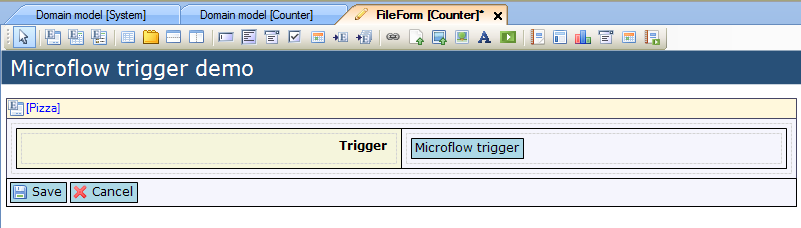
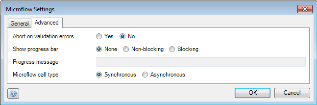

## Description

This section describes how to configure a microflow trigger.

## Instructions

 **Create the form and add the microflow trigger to it. If you do not know how to add documents to a project please refer to [this](add-documents-to-a-module) article; if you do not know how to add widgets to a form, please refer to [this](add-a-widget-to-a-form) article.**

 **Connect the microflow trigger to a microflow. There are 2 methods to do this.**

### Method 1

 **Select the microflow trigger, and lookup the microflow you would like to connect it to in the Connector window.**

 **Drag this microflow from the Connector window to the microflow trigger to connect it.**

 **By right-clicking on the microflow trigger and choosing 'Edit microflow settings...' or clicking on '...' next to 'On click settings' in the Properties window, you can bring up a menu in which you can configure which objects should be passed to the microflow when the microflow trigger is clicked. Using this menu it is also possible to configure behavior in the case of validation errors, whether or not to show a progress bar for the microflow, and if the client should wait for the microflow to finish. Additionally you can use the Properties window to change the appearance and caption of the microflow trigger.**

### Method 2

 **Right-click on the microflow trigger and choose 'Select microflow...'. Alternatively you could click on the '...' button next to 'On click' in the Properties window.**

 **In the new menu, choose the microflow you want to connect to the microflow trigger and click on 'Select'.**

 **By right-clicking on the microflow trigger and choosing 'Edit microflow settings...' or clicking on '...' next to 'On click settings' in the Properties window, you can bring up a menu in which you can configure which objects should be passed to the microflow when the microflow trigger is clicked. Using this menu it is also possible to configure behavior in the case of validation errors, whether or not to show a progress bar for the microflow, and if the client should wait for the microflow to finish. Additionally you can use the Properties window to change the appearance and caption of the microflow trigger.**

