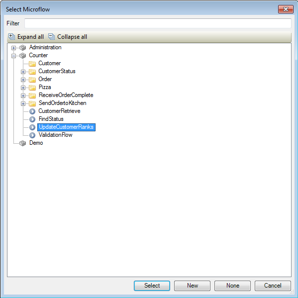
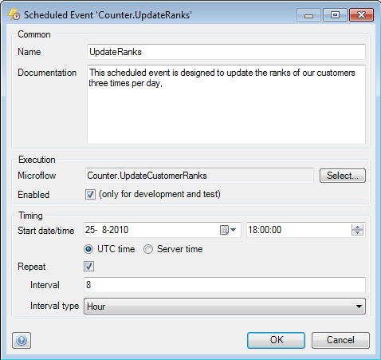

## Description

This section describes how to configure a scheduled event.

## Instructions

 **Add a new scheduled event to your project. If you do not know how to add documents to your project, please refer to [this](add-documents-to-a-module) article.**

 **Double-click on the scheduled event in the Project Explorer to begin configuring it.**

 **In the menu that appears you can change the name of the scheduled event at 'Name'. You can optionally add text explaining what the scheduled event is designed to do at 'Documentation'.**

 **Press the 'Select' button next to 'Microflow' to bring up a menu allowing you to choose the microflow the scheduled event should execute.**

 **Place a check mark next to 'Enabled' to enable to scheduled event and have it carried out at the configured time.**

 **In the 'Timing' section you can set the starting time and date for the scheduled event.**

You can use the radio buttons to choose if these variables are defined as server time or Universal Coordinated Time (UTC).

 **If you want the scheduled event to be executed at regular intervals instead of just once, place a check mark at 'Repeat'. After this you can use the drop-down menus at 'Interval' and 'Interval type' to define the interval between repetitions.**

