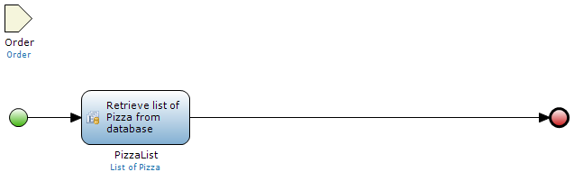
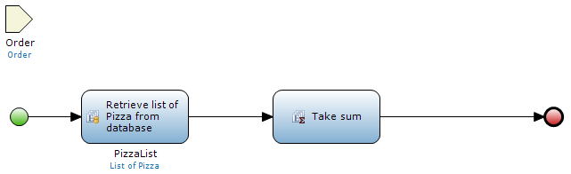
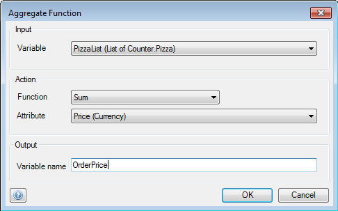

## Description

This section describes how to use the 'Aggregate list' activity in a microflow. The related reference guide article can be found [here](/refguide4/aggregate-list).

## Instructions

 **Open the microflow, or if necessary create a new one. If you do not know how to add documents to your project, please refer to [this](add-documents-to-a-module) article.**

A list should be created in this microflow; 'Create list' and 'Retrieve' are activities that can do this.

 **Add a 'Aggregate list' activity to the microflow. If you do not know how to add activities to a microflow please refer to [this](add-an-activity-to-a-microflow) article.**

 **Double-click on the 'Aggregate list' activity to start configuring it.**

 **Under 'Input', use the drop-down menu to choose the list you want to perform the aggregate activity on.**

 **Under 'Action', choose the aggregation function and the attribute to perform it on using the drop-down menus.**

In the screenshot 'PizzaList' is a list of 'Pizza' objects associated to an 'Order' object passed to the microflow. We could use the 'Sum' function on the 'Price' attribute to compute a sum of the prices of all the 'Pizza' objects associated with the 'Order' object, resulting in the total order price. On the other hand we could use the 'Maximum' function to find the price of the most expensive pizza in the order.

 **Enter the name you want to use for the variable in the microflow under 'Output'.**
