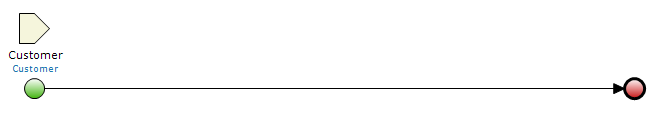
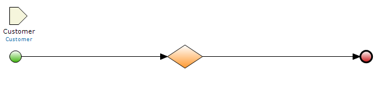
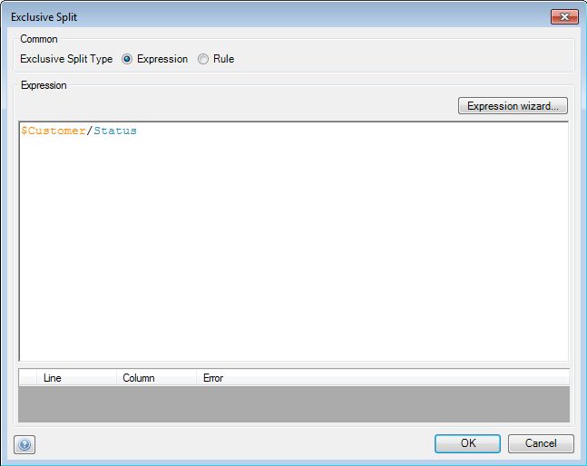
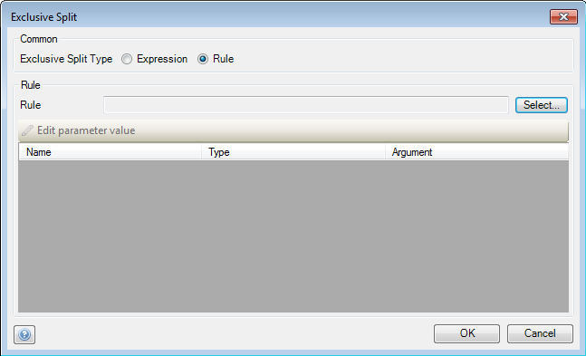
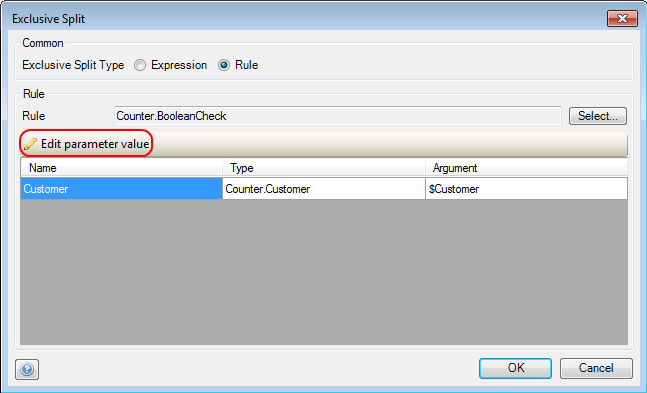
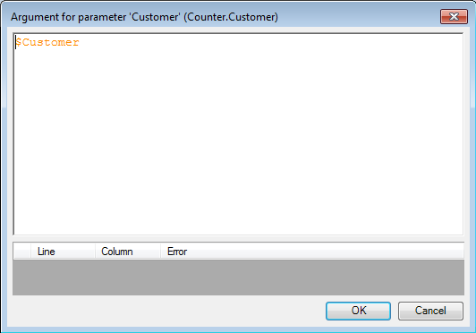
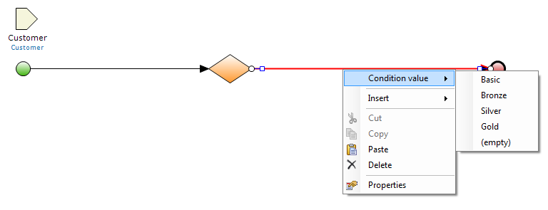
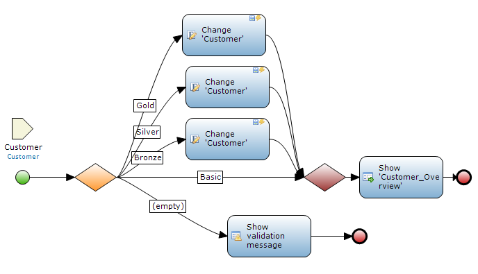
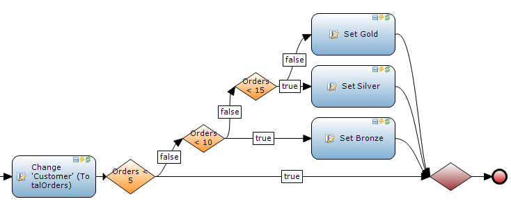

## Description

This section describes how to split the sequence flow in a microflow with the help of an exclusive split.

## Instructions

 **Open the microflow, or if necessary create a new one. If you do not know how to add documents to your project, please refer to [this](add-documents-to-a-module) article.**

If your exclusive split is intended to use an enumeration, make sure it is either created by the microflow or passed to it.

 **Add an 'Exclusive split' to the microflow and double click on it. If you do not know how to do this, please refer to [this](add-an-activity-to-a-microflow) article.**

 **In the menu that pops-up, you can choose the 'Exclusive split type' using the radio buttons.**

 **If you choose 'Expression', you can enter a microflow expression the exclusive split should check for, with boolean or enumeration value as result.**

 **If you choose 'Rule', you can press the 'Select' button to select the rule you want to use in the new menu that appears.**

 **After this the parameter area will be filled with parameters that have to be passed to the rule. Select a parameter and press the 'Edit parameter value' button to bring up menu where you can enter the value for the parameter.**

 **In the new pop-up window you can enter a microflow expression for the variable or value you want to pass to the rule.**

 **Now that the exclusive split has been configured, you will notice that the sequence flow paths leading out of it have turned red. Right-click on such a path and then under 'Condition value' choose the boolean or enumeration value for which this path should be executed.**

 **Create additional paths for every possible boolean or enumeration result from the expression or rule you entered for the exclusive split.**

 **Add activities and, if necessary, end events to these paths to finish the microflow.**

### Exclusive splits and numerical ranges

 **Exclusive splits will split the sequence flow based on the result of their expression or rule, which is either a boolean or enumeration value. As a result, if you want to split the sequence flow according to numerical ranges of a variable, this is not possible to achieve with a single exclusive split.**

 **However, it is still possible to do this by using several exclusive splits to check at the boundaries of the numerical ranges.**

For example in the above microflow customer ranks are based on the number orders placed, with the ranges being 0-5, 5-10, 10-15 and greater than 15\. To split the sequence flow into these ranges, multiple exclusive splits are used which test whether or not the number of orders placed exceeds a boundary of a range, with boolean as result. The first exclusive split for example checks if the number of orders placed is greater than 5; if this is not the case the customer is assigned 'Basic' rank, whereas if this is the case the sequence flow leads to a new exclusive split checking if the customer ordered more than 10 times. If this is not the case, the customer falls in the 5-10 range and is assigned 'Bronze' rank.
