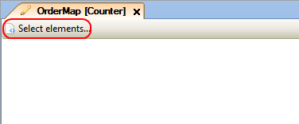
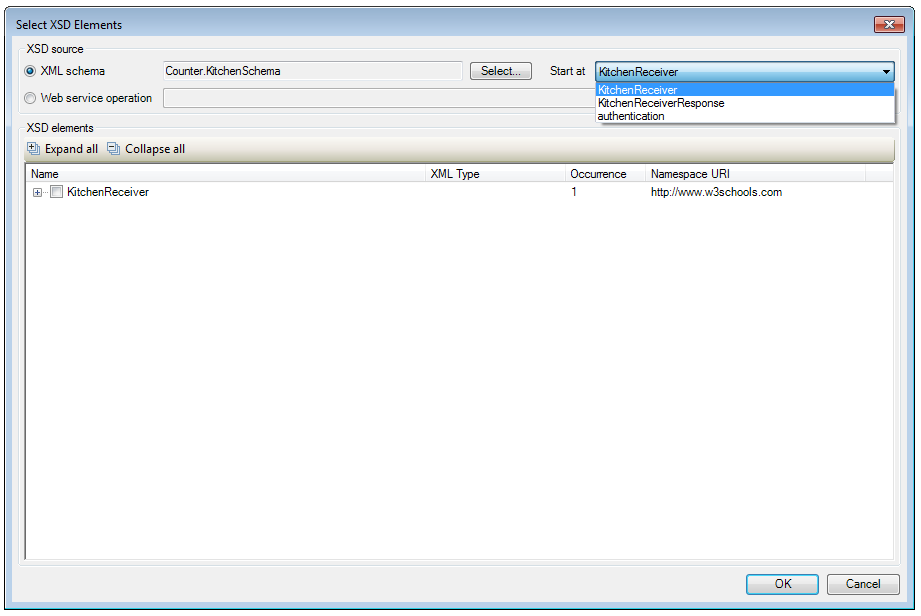
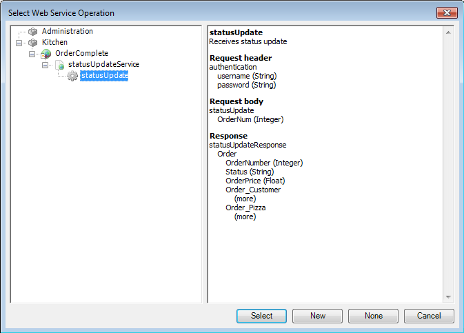
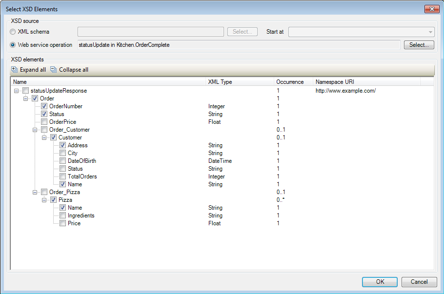
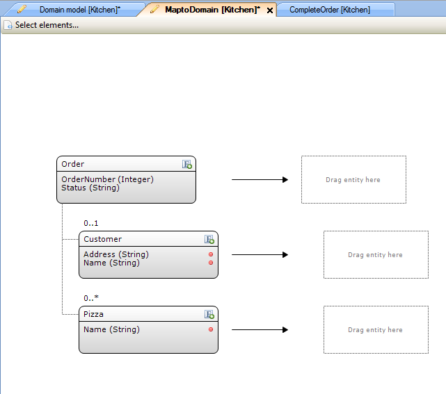
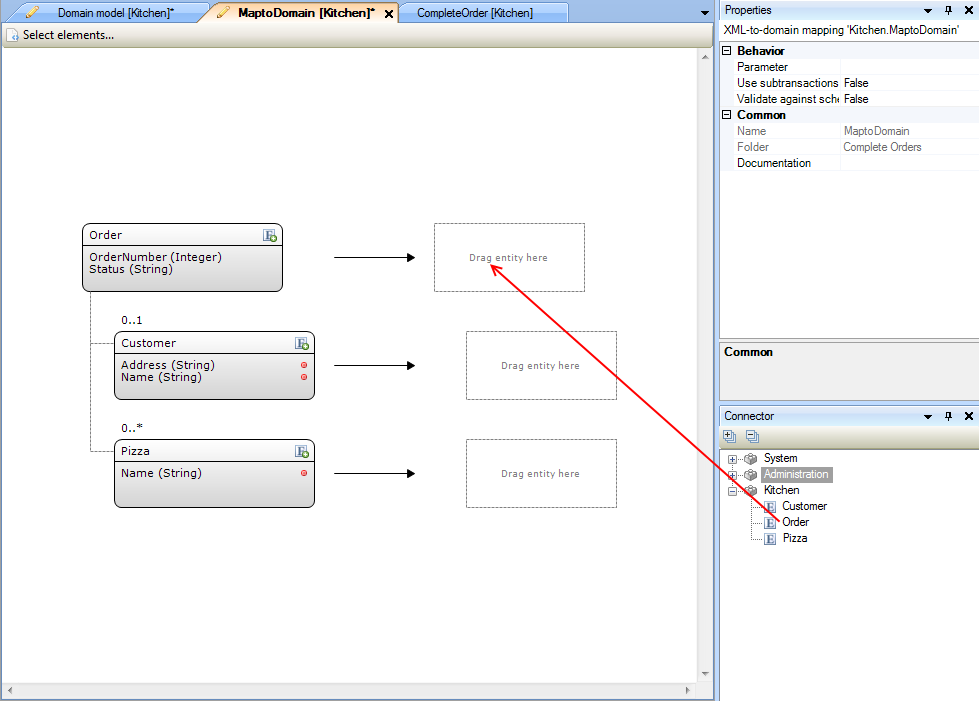
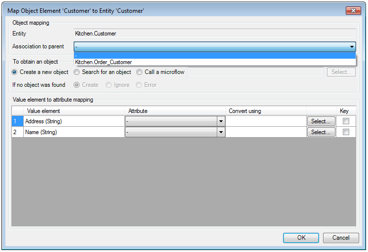
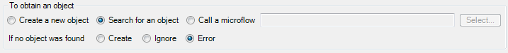
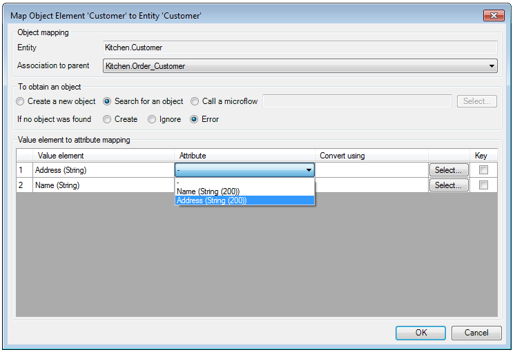
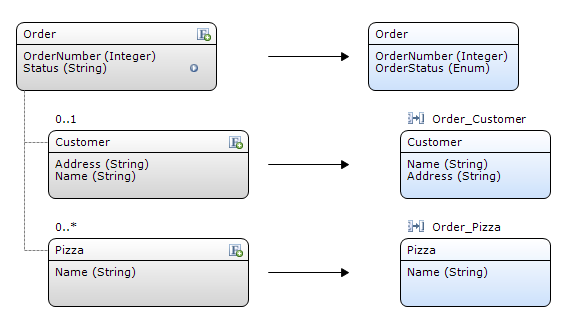

## Description

This section describes how to create and configure an XML-to-Domain mapping.

## Instructions

 **Add a new XML-to-Domain mapping to your project. If you do not know how to add documents to your project, please refer to [this](add-documents-to-a-module) article.**

 **Double-click on the XML-to-Domain mapping in the Project Explorer, then click on the 'Select elements...' button.**

 **In the menu that appears, you can use the radio buttons to choose if you want the XSD source to be an XML Schema (from a previously imported XSD file) or a Web service operation.**

 **If you chose XML schema as source, press the 'Select' button, choose the XML schema in the menu that appears, and then use the drop-down menu at 'Start at' to choose the starting point in the XML schema for the mapping.**

 **If you chose 'Web service operation' as source, click on the 'Select' button and in the menu that appears choose a Web Service operation from the menu.**

 **The 'XSD elements' section will now fill up with elements from the XML schema. Place check marks next to the entries you want to be available for mapping in the XML-to-Domain mapping.**

Only select elements you want to map to attributes of a domain model entity. Also when communicating between two Mendix applications using Web Service, do not select the elements describing the association between the complex elements. (As the modeler will expect you to map an entity to these if selected.)

 **The workspace will now fill with the XML elements, and locations to place the domain model entities to which you want to map the XML elements.**

In this screenshot, the XML schema consists of an 'Order' element, with associated 'Customer' and 'Pizza' elements which are to be mapped to entities from the domain model.

 **Drag the domain model entities from the Connector window to the positions opposite to the XML elements which should be mapped to them.**

In this example case the entities which the XML elements are mapped to have the same name as the XML elements.

 **Double-click on an entity to bring up the menu allowing you to configure the mapping between a complex XML element and the corresponding domain model entity.**

 **Use the drop-down menu at 'Association to parent' to set an association between the domain model entities which are being mapped, based on the associations between the XML elements.**

 **At 'To obtain an object', you can use the radio buttons to choose if you want the XML element to be mapped to a newly created object, to an object which should be searched for, or to an object being returned by a microflow. If you choose to have an object returned by microflow, press the 'Select...' button and choose the microflow and, if necessary, input parameters in the menu that appears.**

If you chose to search for an object or have it returned by microflow, you can use the second row of radio buttons to decide what should happen if no object is found. You can either have a new object created in this case, ignore the problem and continue parsing (not mapping this object) or have the parsing stopped and throw an error which should be handled by the calling microflow.

 **Use the drop-down menus in the 'Attribute' column to choose the attributes of the domain model entity to which the XML elements should be mapped.**

 **In some cases conversion of the XML element may be needed. Enumeration values cannot be mapped to an XML element (they have to be converted to a string), so if you want to map an element to an enumeration attribute, you will have to convert it from string back to enumeration.**

To do this, click on the 'Select...' button on the attribute's row and select the microflow which takes the XML element as parameter and returns an enumeration value.

 **If you chose 'Search for an object' in the 'To obtain an object' section, you can use an attribute as key for a search by placing a check mark in the 'Key' column.**

When searching for the object, the attributes marked as key will be taken and converted into an XPath query which should return one object. If more than one object is returned, an error will be thrown.

 **Configure the mapping for all entities to complete the XML-to-Domain mapping.**

