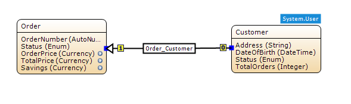
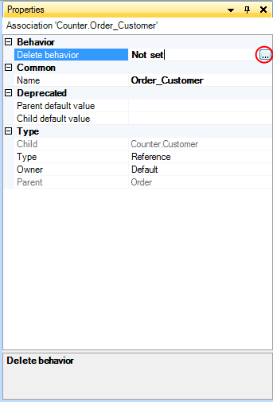
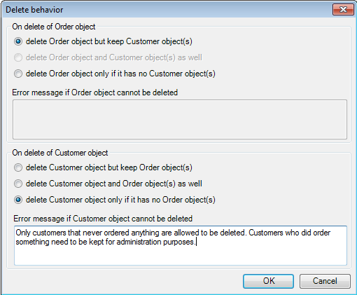

## Description

This section describes how to configure delete behavior for entities when they are connected by an association.

## Instructions

 **Create the association between the two entities if it does not exist yet. If you do not know how to do this, refer to [this](create-an-association) article.**

 **Select the association.**

 **In the Properties window, click the '...' button next to 'Delete behavior'.**

 **In the window that opens, you can now select what will happen to associated objects if a parent or child object is deleted.**

Note that not all combinations are possible. For example if you set the child delete behavior to only allow deletion if it has no associated parent objects, you can no longer configure child objects to be deleted when the associated parent object is deleted. If you set one of the delete behaviors to only allow deletion if the object has no associated objects, you can also enter an error message which will be shown if this is attempted.
