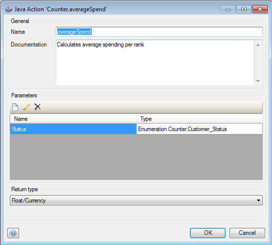
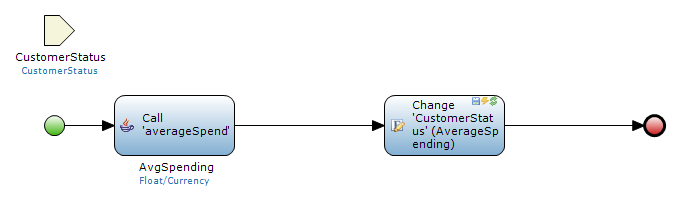
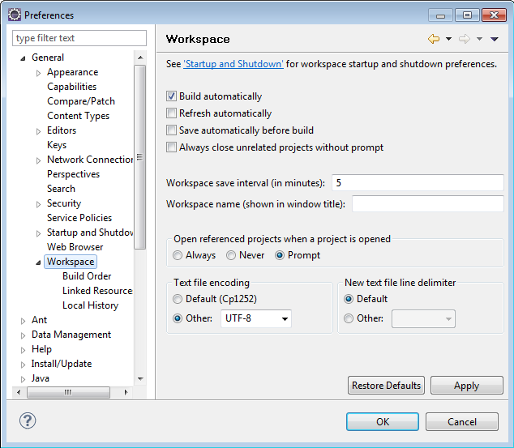
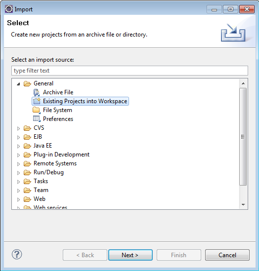
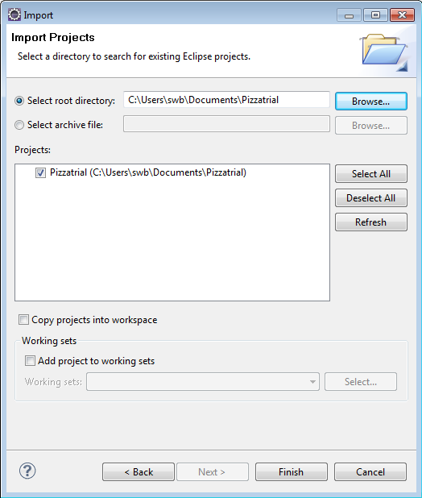
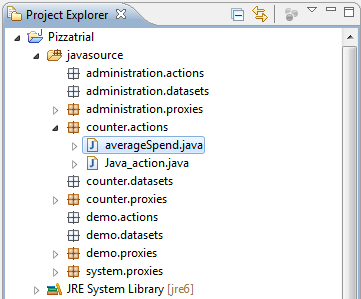
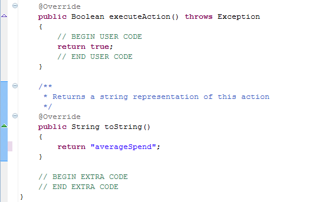
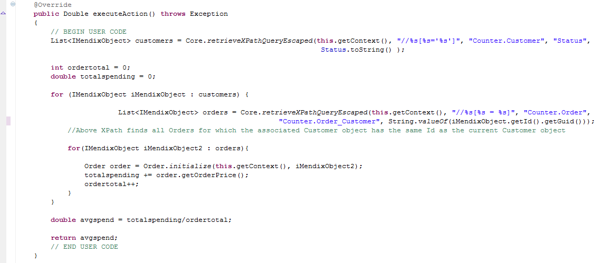
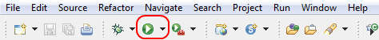

## Description

This section describes how to configure a Java action for your project using Eclipse.

## Instructions

 **Add the Java action to your project and configure it. If you do not know how to do this, please refer to [this](add-and-configure-a-java-action) article.**

The Java action in the screenshot is intended to compute the average spending per order by users of a certain user rank. It requires a user status as parameter, and will return the average spending per order of that user status.

 **Create the microflow which will call the Java action. If you do not know how to do this, please refer to [this](add-an-activity-to-a-microflow) article.**

In the above picture, the microflow receives a 'CustomerStatus' object, of which the 'Status' attribute is passed to the Java action. The return from the Java action is the average spending per order for the customer status requested, which is then stored in the 'CustomerStatus' object.

 **Press the F6 button or choose 'Deploy for Eclipse' in the 'Project' menu.**

 **Start Eclipse. Open the 'Preferences' menu, and navigate to the 'Workspace' section under 'General'. Check if 'Text file encoding' is set to 'UTF-8'.**

 **Open the 'File' menu and choose 'Import...'. In the window that opens, navigate to the 'General' section, choose 'Existing Projects into Workspace' and then click on the 'Next' button.**

 **In the next screen, choose 'Select root directory:', click on 'Browse...', and choose your Mendix project directory. The 'Projects:' section should now list your project. Put a check mark next to it, and click on 'Finish'**

Your Mendix project should now be imported into the Eclipse workspace.

 **Use the Project Explorer to find the Java action. It should be under 'javasource' and then '<ModuleName>.actions'.**

 **You can now start to add code to the Java action. There are two locations for this: Between the 'BEGIN/END USER CODE' and the 'BEGIN/END EXTRA CODE'.**

All the code outside these markers is automatically regenerated each time the project is deployed.

 **You can add any helper methods you need in the 'EXTRA CODE' section.**

Many of the methods you need, including performing XPath queries, are provided by the Core class. Additionally you can initialize proxy objects to manipulate objects. These proxy objects may need to be imported into the Java action in the 'import' section. The proxy classes are generated in the <ModuleName>.proxies namespace.

 **Add the code the Java action needs to obtain the return value in the 'USER CODE' section.**

The code in the screenshot above first uses an XPath query to find a list of customers of the customer status that was passed to the Java action. It then finds all orders these customers placed using another XPath query. Using two loops, it computes the total spending across all orders by customers of the chosen rank, as well as counting the number of orders these customers placed in total. Finally it calculates the average spending per order by dividing the total spending by the total number of orders, and returns this value as a double.

 **After finishing creating the code, you can run your application to test if your Java action works correctly. If you press the 'Run' button in the toolbar, your application will start and a Mendix Console will open.**

If you are working on multiple applications in Eclipse, you can use the downward pointing arrow to bring up a menu where you can select which application you want to run. If you want to debug your application, you can press the 'Debug' button to the left of the 'Run' button instead.
