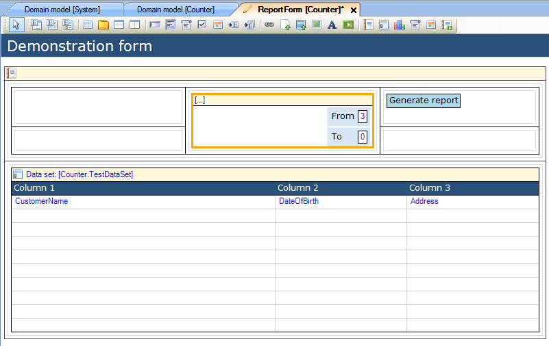
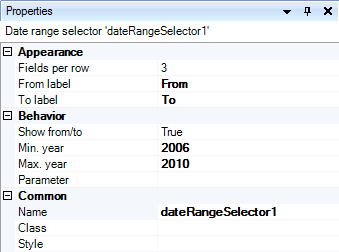
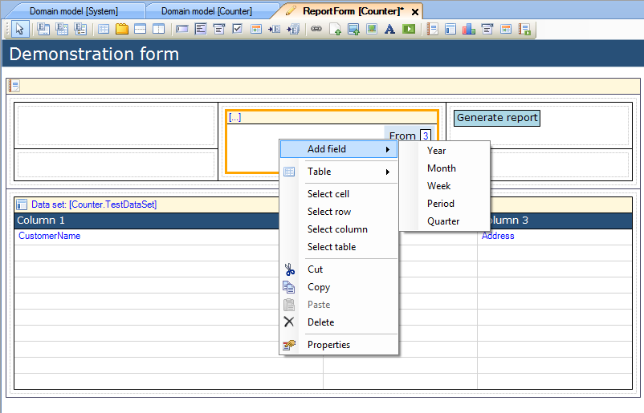

## Description

This section describes how to configure the date range selector in a report pane.

## Instructions

 **Open the form containing the report pane and select the date range selector.**

 **You can now use the Properties window to change its appearance and behavior. You can change the appearance by changing the number of fields per row, as well as changing the captions used for the from/to fields.**

 **You can change the behavior by choosing whether or not the from/to fields should be shown, as well as the minimum and maximum years that can be entered.**

 **Finally you can add additional fields to the date range selector by right-clicking on it, choosing 'Add Field' and then choosing the type of field you would like to add.**

You can choose to add fields allowing users to choose year, quarter, month and week, or add a period field which lets users choose from several predefined periods.
