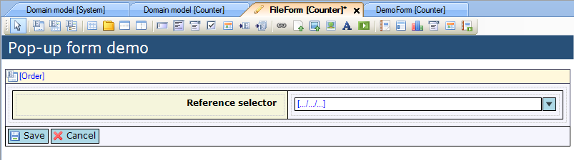
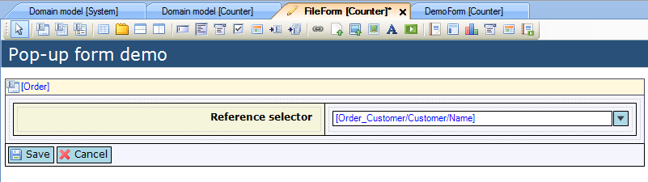
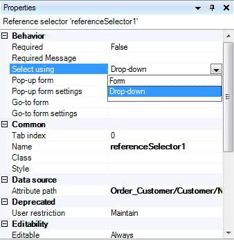
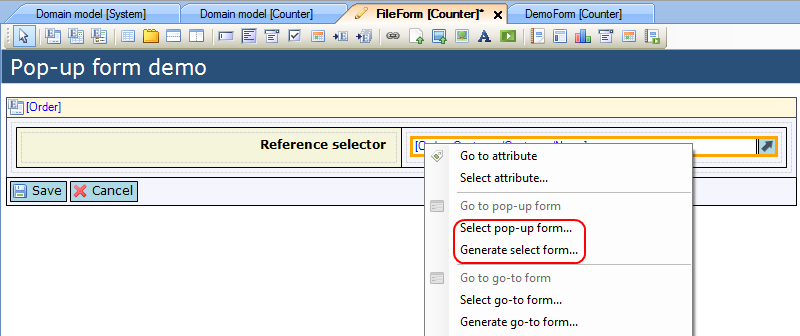
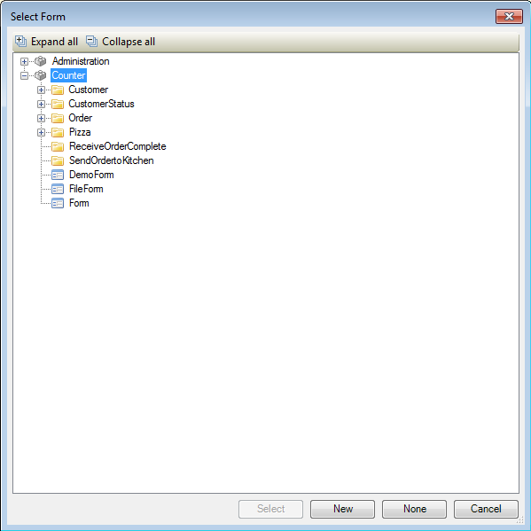
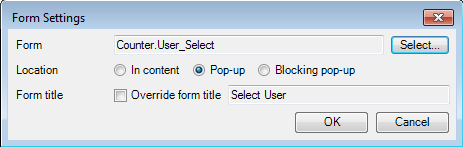

## Description

This section describes how to configure the pop-up form.

## Instructions

 **Create the form and add the reference selector. If you do not know how to add documents to a project please refer to [this](add-documents-to-a-module) article; if you do not know how to add widgets to a form, please refer to [this](add-a-widget-to-a-form) article.**

 **Connect an attribute of an entity which is associated with the data view or template grid entity to the reference selector . You can do this by selecting the reference selector and then dragging this attribute from the Connector window to the reference selector. Another option is to right-click on the reference selector and choose 'Select attribute...' or click the '...' button next to 'Attribute path' in the Properties window, and then in the menu that appears select the attribute.**

 **To use the pop-up form, set the 'Select using' property in the Properties window to 'Form' using the drop-down menu.**

 **You can now select the pop-up form by right-clicking on the reference selector and choosing 'Select pop-up form...' or by clicking on the '...' button next to 'Pop-up form' in the Properties window. Alternatively you can right-click on the reference selector and choose 'Generate select form...' if you do not have a pop-up form yet and want the modeler to automatically generate a form containing a data grid and 'Select' button. You will be prompted to enter a name for the form, which will subsequently be generated.**

 **If you chose to select an existing form, you will now get a new menu in which you can select the pop-up form. Note that the form should contain a data grid with the same entity as the one being selected in the reference selector, as well as a 'Select' button.**

 **After selecting the pop-up form you can configure its behavior by clicking on the '...' button next to 'Pop-up form settings' in the Properties window. This will bring up a new menu in which you can choose whether the pop-up form should open as a (blocking) pop up or not, and if the form should have a custom title.**

