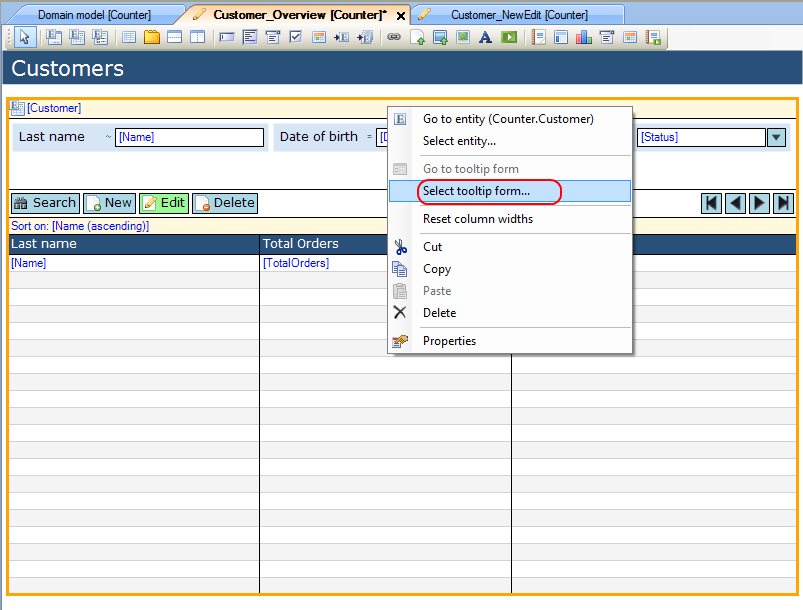
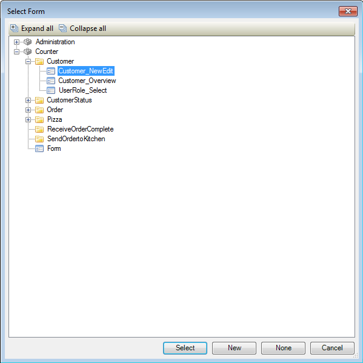
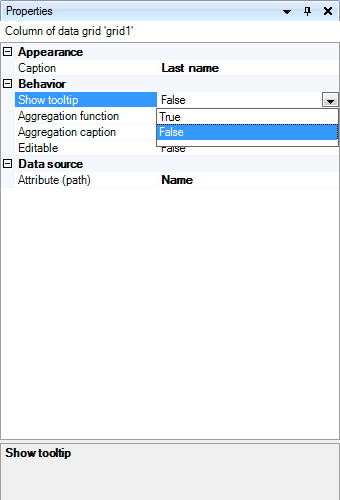
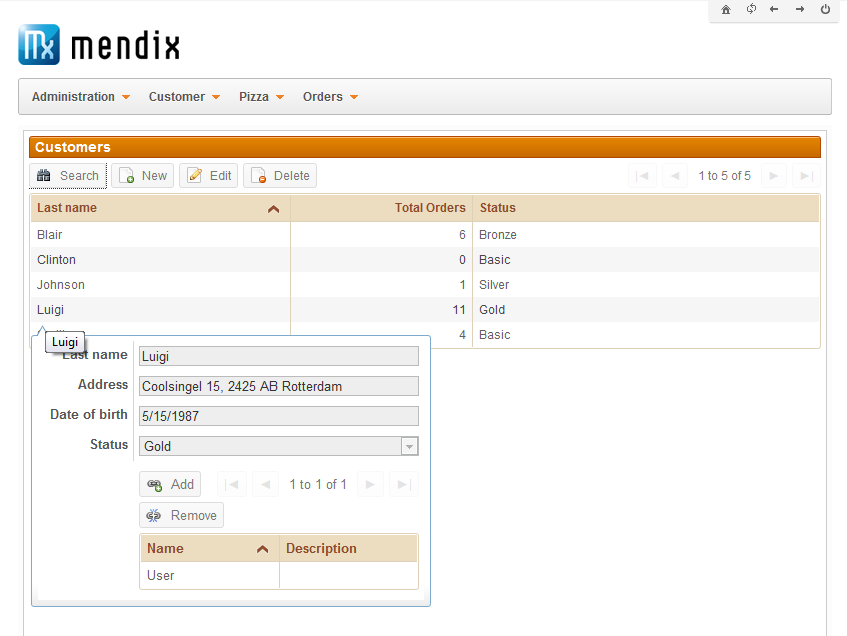

## Description

This section describes how to configure a tooltip form for a data grid.

## Instructions

 **Create the form containing the data grid, as well as the form with data view you want to use as tooltip form. If you do not know how to add documents to a project please refer to [this](add-documents-to-a-module) article; if you do not know how to add widgets to a form, please refer to [this](add-a-widget-to-a-form) article.**

 **Open the form containing the data grid, and select the data grid.**

 **Right-click on the data grid and choose 'Select tooltip form...'. Alternatively you could click on the '...' button next to 'Tooltip form' in the Properties window.**

 **In the menu that pops up, select the form you want to use as tooltip form and press 'Select'.**

This form should be a data view on the same entity as the reference set selector.

 **Finally, the columns for which the tooltip form appears when the mouse hovers over them have to be configured. To do this, select a column you want to tooltip form to appear for, and in the Properties window use the drop down menu to set 'Show tooltip' to 'True'.**

 **The tooltip form will now be displayed when hovering over the columns for which it was turned on.**

