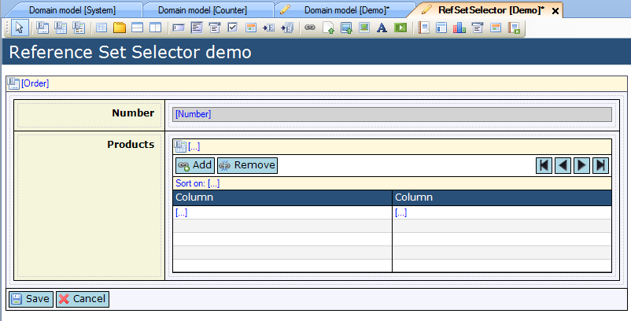
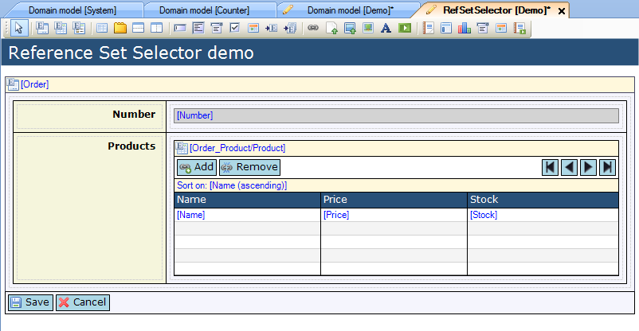
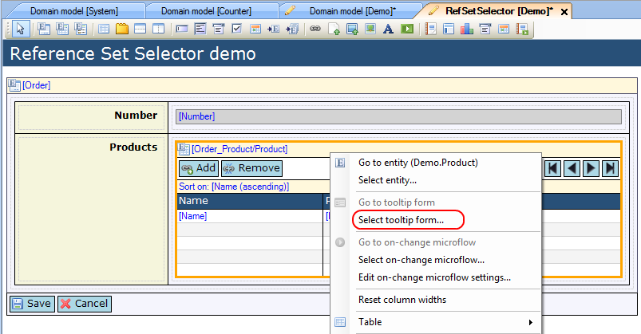
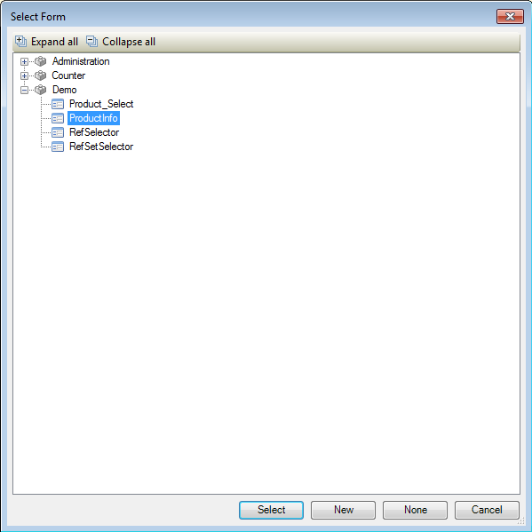
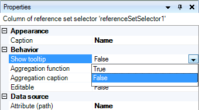

## Description

This section describes how to configure the tooltip form for a reference set selector.

## Instructions

 **Create the form containing the reference set selector, as well as the form with data view you want to use as tooltip form. If you do not know how to add documents to a project please refer to [this](add-documents-to-a-module) article; if you do not know how to add widgets to a form, please refer to [this](add-a-widget-to-a-form) article.**

 **Connect an attribute of an entity which is associated with the data view or template grid entity to the reference selector . You can do this by selecting the reference selector and then dragging this attribute from the Connector window to the reference selector. Another option is to right-click on the reference selector and choose 'Select attribute...' or click the '...' button next to 'Attribute path' in the Properties window, and then in the menu that appears select the attribute.**

 **Select the reference set selector. Right-click on it and choose 'Select tooltip form...'. Alternatively you could click on the '...' button next to 'Tooltip form' in the Properties window.**

 **In the menu that pops up, select the form you want to use as tooltip form and press 'Select'.**

This form should be a data view on the same entity as the reference set selector.

 **Finally, the columns for which the tooltip form appears when the mouse hovers over them have to be configured. To do this, select a column you want to tooltip form to appear for, and in the Properties window use the drop down menu to set 'Show tooltip' to 'True'.**

