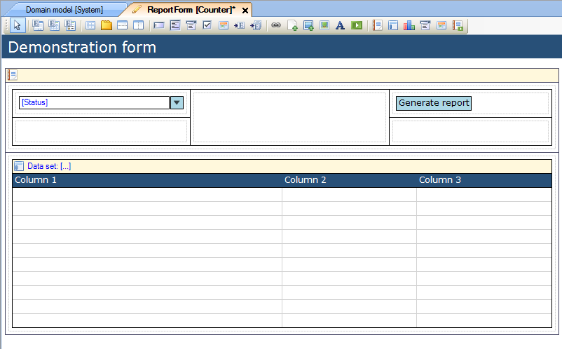
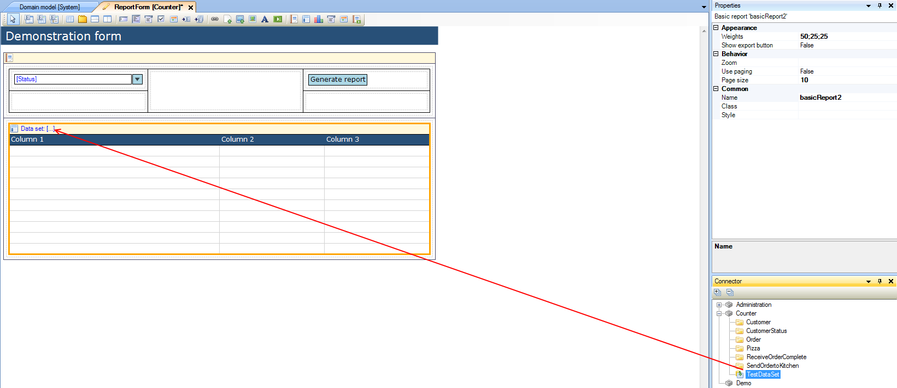
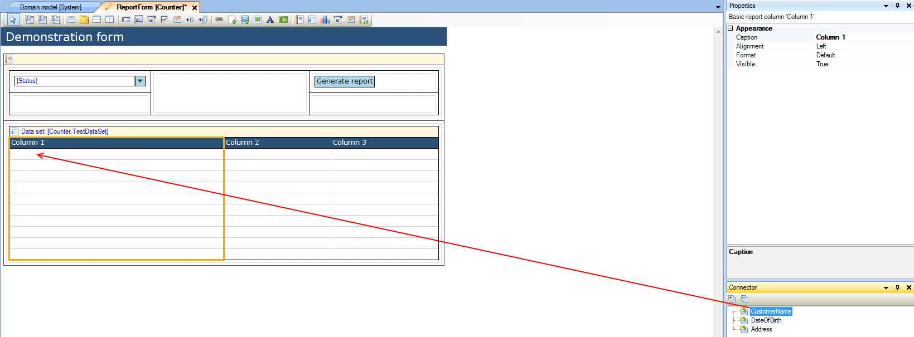
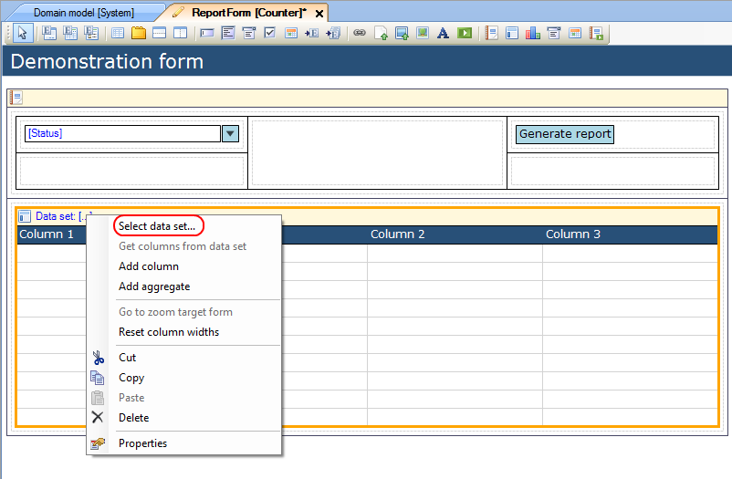
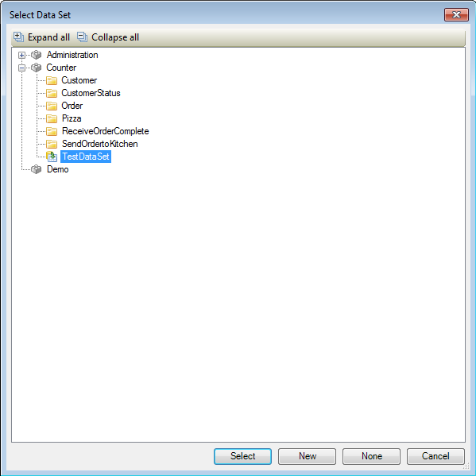
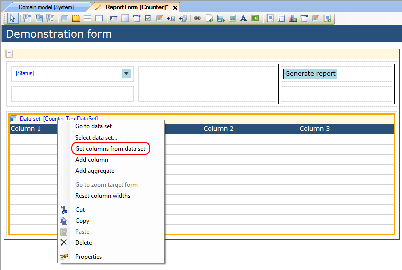

## Description

This section describes how to connect a basic report in a report pane to a data set.

## Instructions

 **Open the form with reporting pane containing the basic report.**

### Method 1

 **Select the basic report, and look up the data set you want to connect to it in the Connector window.**

 **Click and drag this data set to the yellow header of the basic report.**

 **Assign columns of the data set to columns of the basic report. You can do this by selecting the column, looking up the corresponding data set column in the Connector window, and then drag it to the basic report column.**

### Method 2

 **Select the basic report, then right-click on it and choose 'Select data set...'.**

 **In the menu that appears, choose the data set and press 'Select'**

 **Right-click on the basic report again, and choose 'Get columns from data set'.**

The columns of the basic report will now be automatically filled with the columns of the data set, in the order of appearance in the OQL query.
