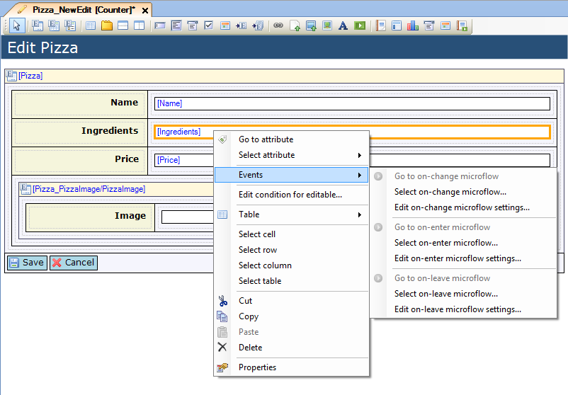
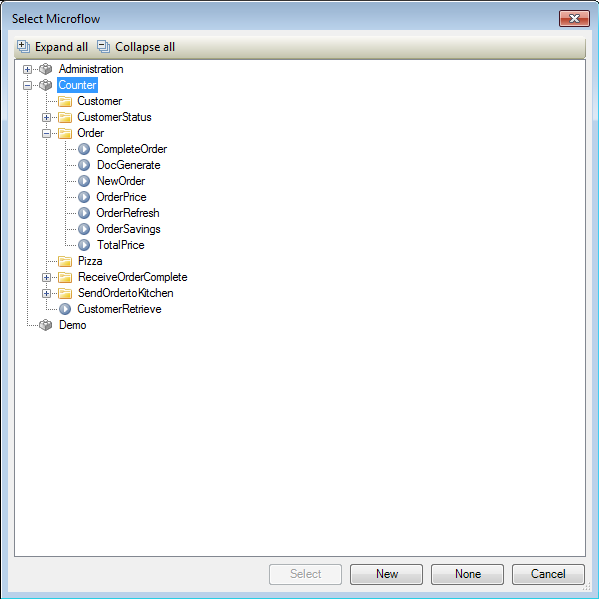
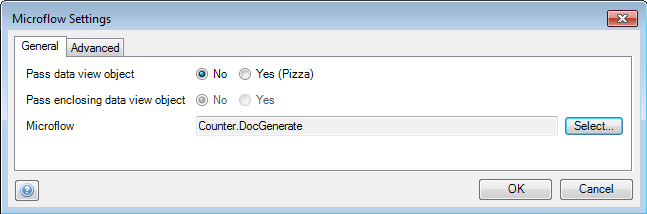

## Description

This section describes how to configure a microflow to trigger based on a widget event.

## Instructions

 **Select the widget to an event of which you want to connect a microflow.**

 **Right-click on the widget, go to the 'Events' submenu and choose the 'Select <event> microflow...' corresponding with the event you want to connect the microflow for. Additionally you can click the '...' button next to the corresponding event in the Properties window.**

 **In the menu that appears, select the microflow you want to connect.**

 **You can change the settings for the connected microflow by right-clicking on the widget again, going to the 'Event' submenu and choosing 'Edit <event> microflow settings...'. Alternatively you can click on the '...' button next to '<Event> settings' in the Properties window.**

In the menu that appears you can configure which objects should be passed to the microflow, if it should abort on validation errors, if a progress bar should be shown and if the client should wait for the microflow to finish.*
