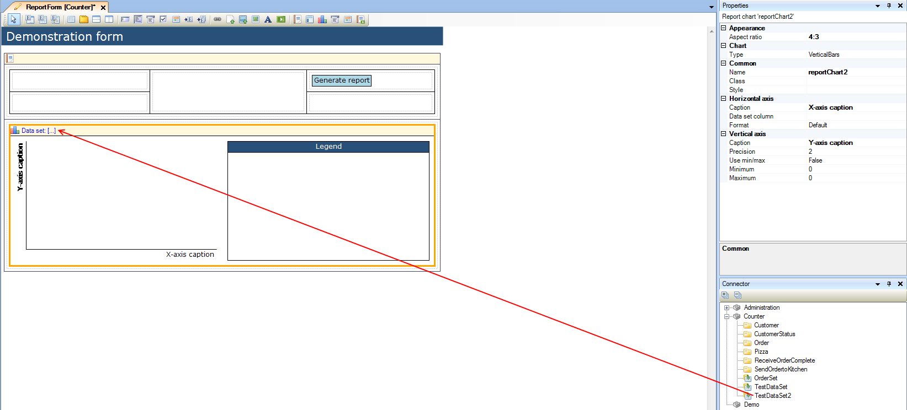
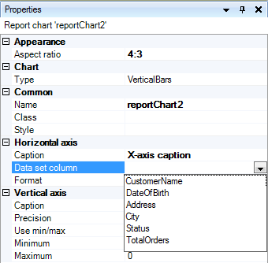
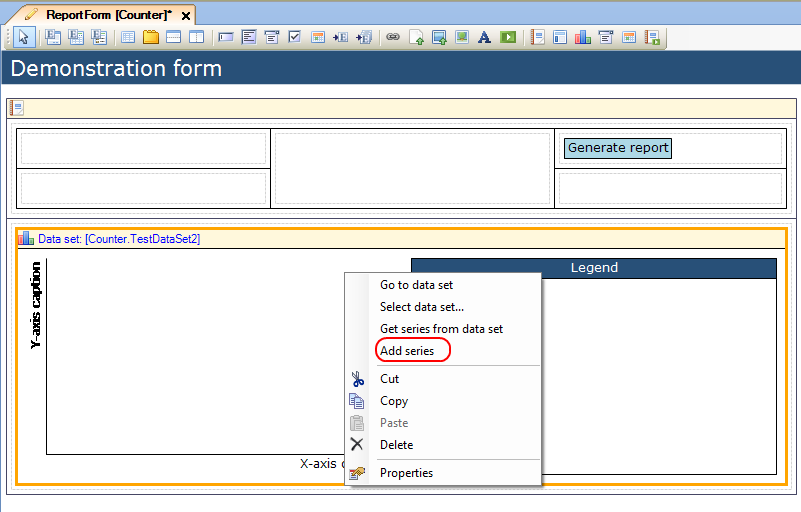
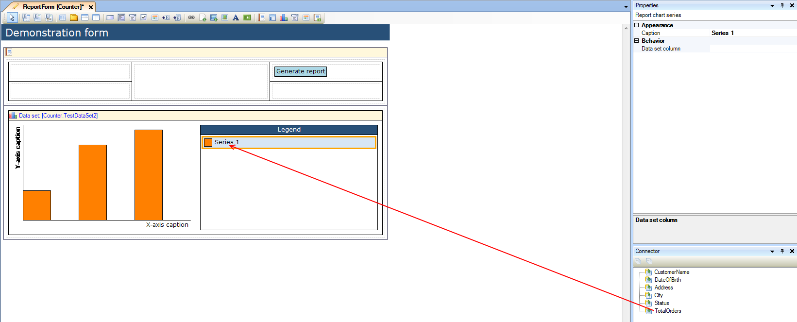
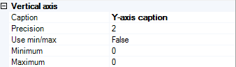

## Description

This section describes how to configure a report chart and connect it to a data set.

## Instructions

 **Open the form containing the report pane with report chart.**

 **Select the report chart. If you want, you can change the chart type by using the drop-down next to 'Type' in the Properties window.**

 **Look up the data set you want to connect to the report chart in the Connector window and drag it to the yellow header of the report chart.**

 **Choose the column of the data set you want to use for the X-axis using the drop-down next to 'Data set column' in the Properties window.**

 **Right-click on the report chart and choose 'Add series' to add a series to the chart.**

 **Connect a column of the data set to the series. You can do this by selecting the series, and then dragging the data set column from the Connector window to the series. Alternatively you can use the drop-down next to 'Data set column' in the Properties window to select the data set column.**

 **If you want to use every data set column as series, you can also choose 'Get series from data set' when right-clicking the report chart. If you choose this option, these series will then automatically be created.**

 **Using the Properties window, you can configure the Y-axis. Choices include its precision (ie, how many decimals are used), and whether the Y-axis should be determined automatically or if you want to enter its minimum and maximum yourself.**

 **You can change the captions for the X and Y-axis by changing the 'Caption' property for both the 'Horizontal Axis' and 'Vertical Axis' in the Properties window.**
