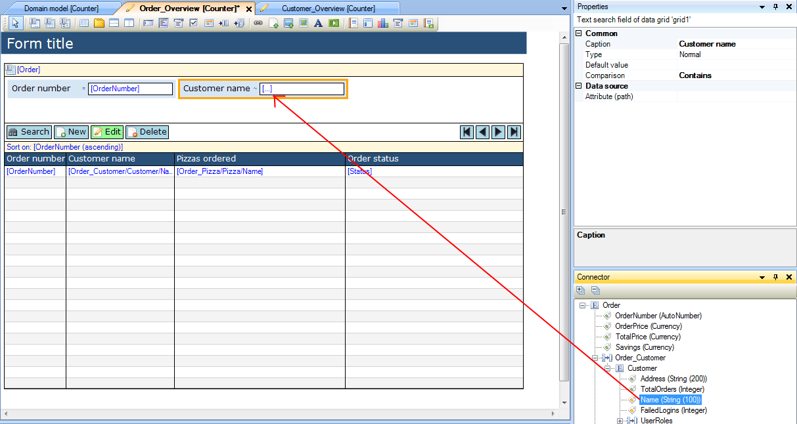

## Description

This section describes how to connect an attribute of an entity to a search field of a data grid.

## Instructions

 **Open the form containing the data grid.**

 **Create the search field you want to connect the attribute to. Do this by right-clicking in the search area, choosing 'Add search field' and then choosing the search field type corresponding to the attribute you want to connect to it. You can change its caption in the Properties window.**

### Method 1

 **Look up the attribute of the grid entity or of an associate entity of the grid entity in the Connector window.**

 **Click on the attribute and drag it to the search field.**

### Method 2

 **Select the search field and right-click on it. Choose the 'Select attribute' menu, and from it select the attribute you want to link to the search field. If the attribute you are looking for is not listed, choose 'Other...'. Alternatively you can click on the '...' button next to 'Attribute (path)' in the Properties window.**

 **If the attribute was not listed in the right-click menu or you used the '...' button from the Properties window, you can use the new menu to select the attribute you would like to connect to the search field.**

