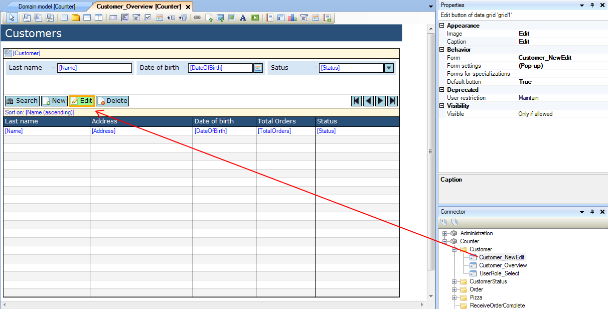
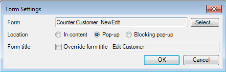
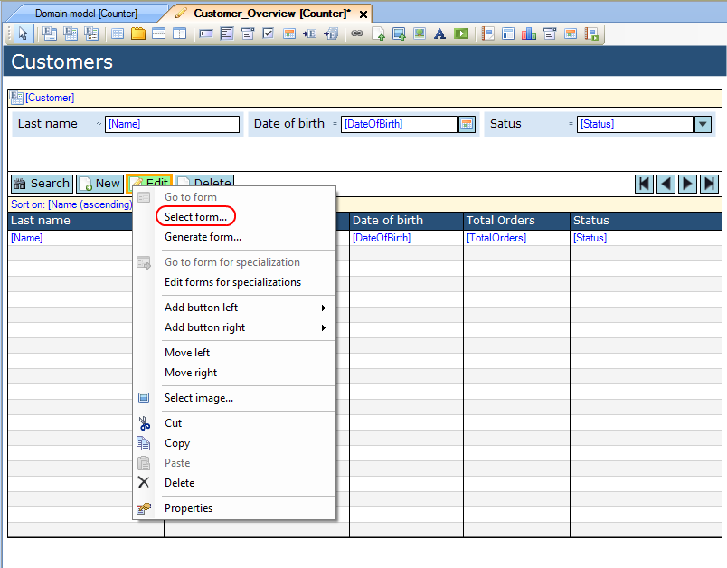
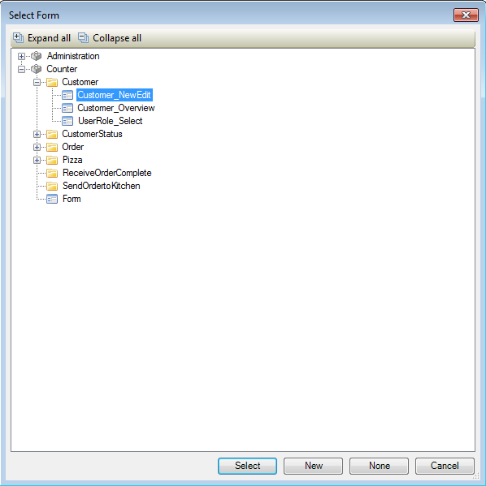

## Description

This section describes how to connect forms using buttons.

## Instructions

 **Open the form from which you want to open the other form.**

### Method 1

 **Select the button you want to use to open the other form.**

 **Look up the other form in the Connector window, click on it and drag it to the button.**

 **If you want to edit how the form is displayed, press the '...' next to 'Form settings' in the Properties window. In the menu that pops up you can choose the how to display the new form, as well as select if you want to override the form's title.**

### Method 2

 **Right-click on the button you want to use to open the other form and choose 'Select form...'. Alternatively you can also click on the '...' button next to the 'Form' property in the Properties window.**

 **In the menu that pops up, select the form you want to open with the button and press 'Select'.**

 **In the next menu, you can choose the how to display the new form, as well as select if you want to override the form's title.**

