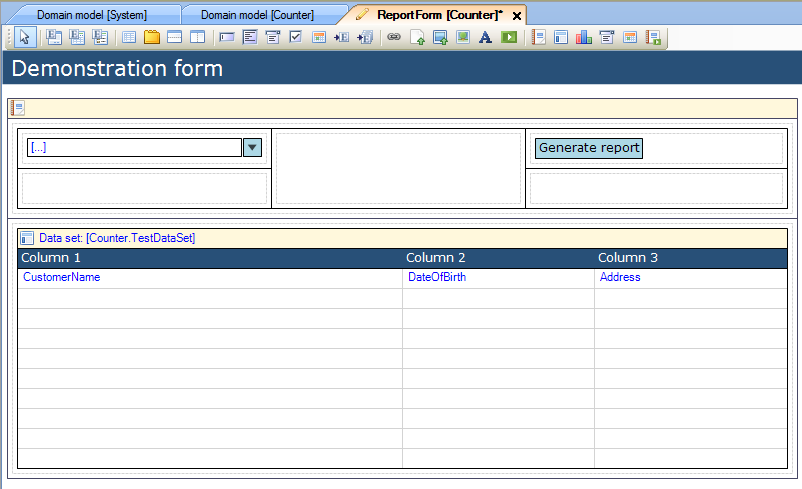
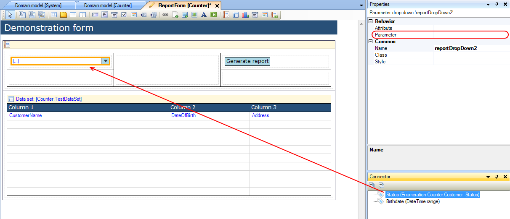

## Description

This section describes how to connect the parameter widgets in the top half of the report pane to parameters from a data set. The related reference guide article can be found [here](/refguide4/report-pane).

## Instructions

 **Open the form with the report pane.**

 **Select the parameter widget, and look up the parameter you want to link to it in the Connector window. If the parameter is an object, choose the attribute you want it to be identified with in the parameter widget.**

 **Click and drag the parameter (or attribute) from the Connector window to the parameter widget. Alternatively you could use the drop-down menu next to 'Parameter' in the Properties window to select the parameter which you want to connect to the widget.**

